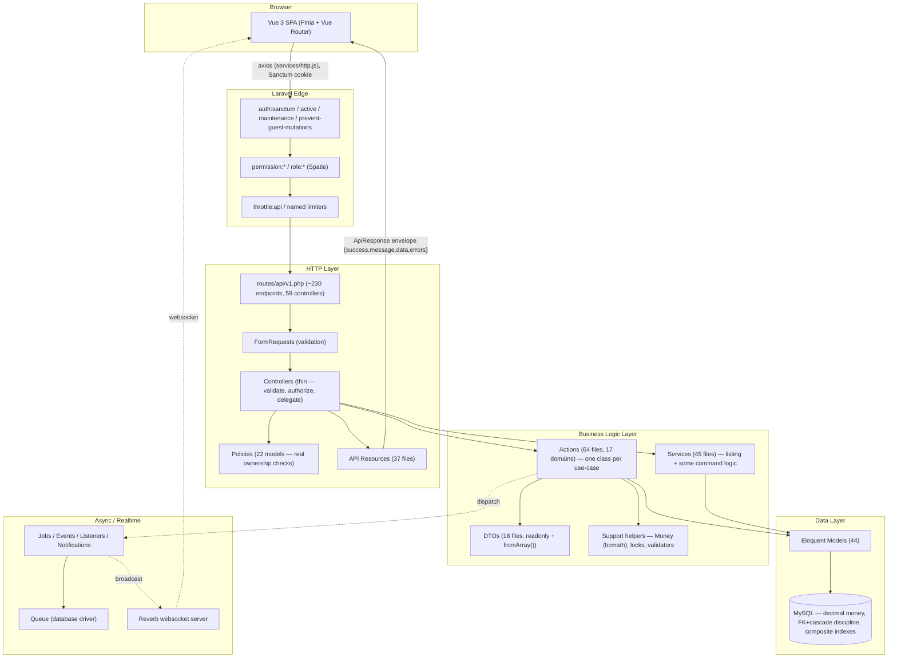
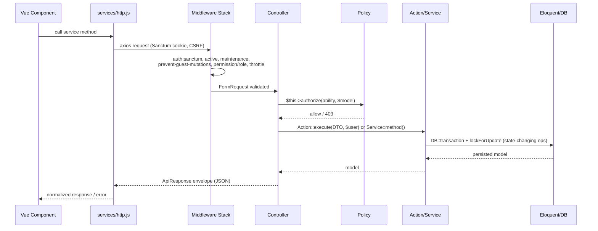
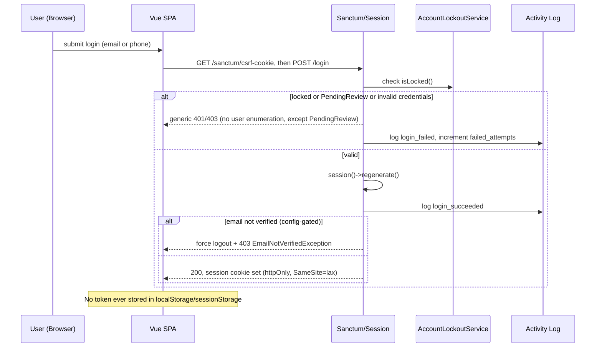
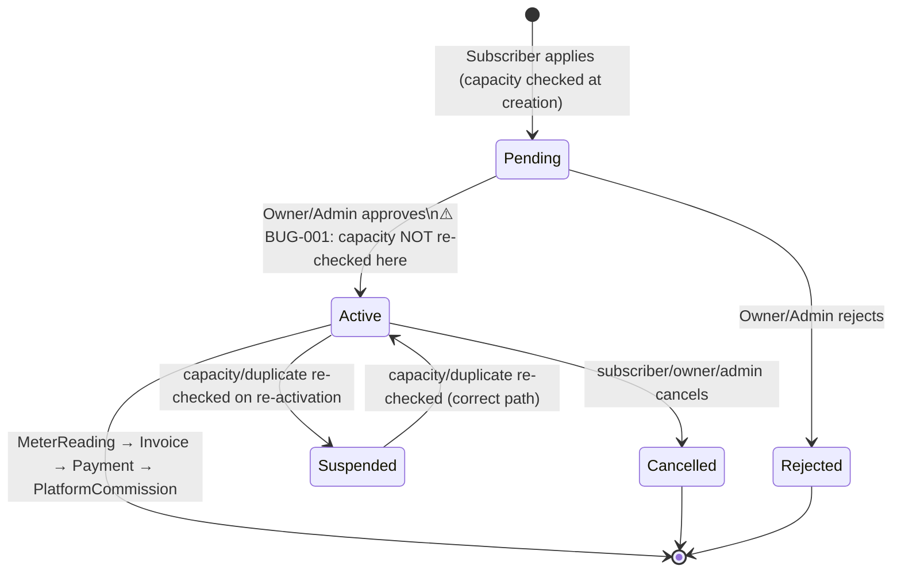

# Full Project Audit Report

> Comprehensive End-to-End Technical Audit

**Project:** Ampere (Ampare-Project) — Diesel-Generator Electricity Subscription Marketplace
**Repository root (git):** `Ampare-management2027/` — the entire application (Laravel API + Vue SPA) lives in its one subfolder, `backend/`
**Audit Date:** 2026-08-28
**Audited By:** Principal-engineer-style multi-pass technical audit (6 parallel deep-dive passes: business logic, HTTP/API, database/schema, auth & security, frontend, tests/DevOps/dependencies)
**Status:** Completed — read-only audit, no source code was modified

---

## Table of Contents

- [Executive Summary](#executive-summary)
- [Project Overview](#project-overview)
- [System Understanding](#system-understanding)
- [Technology Stack](#technology-stack)
- [Current Architecture](#current-architecture)
- [Project Structure](#project-structure)
- [Backend Audit](#backend-audit)
- [Frontend Audit](#frontend-audit)
- [API Audit](#api-audit)
- [Authentication & Authorization](#authentication--authorization)
- [Security Audit](#security-audit)
- [Database Audit](#database-audit)
- [Performance Audit](#performance-audit)
- [Business Logic Audit](#business-logic-audit)
- [Testing Audit](#testing-audit)
- [Code Quality](#code-quality)
- [Dependency Audit](#dependency-audit)
- [DevOps](#devops)
- [Production Readiness](#production-readiness)
- [Critical Findings](#critical-findings)
- [Target Architecture](#target-architecture)
- [Refactoring Roadmap](#refactoring-roadmap)
- [File-by-File Action Plan](#file-by-file-action-plan)
- [Master TODO](#master-todo)
- [Final Verdict](#final-verdict)

---

## Executive Summary

Ampere is a Laravel 12 + Vue 3 monolith implementing a marketplace for diesel-generator electricity subscriptions — a real, non-trivial domain common in regions with unreliable grid power. Four roles (Admin, Owner, Subscriber, Technician) transact through ~230 API endpoints, 44 Eloquent models, 54 migrations, a 64-file Action-pattern business-logic layer, real-time messaging via Reverb, AI-assisted fault prediction/chat, and a bilingual (Arabic/English) PWA frontend.

This is **materially better engineered than the median project of this scale and origin** (it reads like a graduation project that received sustained, disciplined effort, not a rushed bootcamp exercise). Concretely: money is `decimal` everywhere with a dedicated bcmath `Money` helper (no float-precision bugs found); state-transition business logic almost uniformly uses `DB::transaction()` + `lockForUpdate()`; authorization is enforced through real per-record ownership checks in Policies, not just role membership; the API returns one consistent JSON envelope; idempotency is enforced at the database level via a UUID primary key; CORS/CSP/HSTS are configured thoughtfully rather than left at framework defaults; and 794 backend test methods across 36 domains include deliberate cross-tenant IDOR assertions, not just happy-path CRUD.

It is **not, however, production-ready today**, for reasons that are concrete and fixable rather than fundamental:

1. **A hardcoded, predictable admin account (`admin@ampare.test` / `Password123!`) and seven demo accounts (password `'password'`) are created by seeders with no environment guard** — if these are ever run against a production database, real, published-in-source-control credentials grant admin access.
2. **A genuine concurrency bug lets a generator be oversold**: the capacity/duplicate-subscription re-check that protects `Suspended→Active` transitions is never run on the normal `Pending→Active` approval path, so two concurrently-approved pending subscriptions can jointly exceed a generator's rated capacity.
3. **No CI/CD pipeline and no containerization exist anywhere in the repository** — 794 tests, a Larastan level-8 static-analysis baseline, and a purpose-built pre-deploy config-check command all exist but nothing runs them automatically.
4. **No error-tracking/APM service is wired in** — production failures are visible only via log files.
5. A handful of medium-severity gaps: an unlocked invoice-recalculation race under concurrent payment approval, three models with zero test coverage, no enforced safeguard that `APP_DEBUG`/`SESSION_SECURE_COOKIE` are correctly set in production, and a frontend "payment gateway" that is an explicitly-demo client-side simulation collecting raw card/PIN fields without ever touching the Stripe SDK that's already a dependency.

None of this requires a redesign. The architecture is sound; what's missing is closing a short, well-defined list of gaps before this goes live. See [Production Readiness](#production-readiness) and [Master TODO](#master-todo).

### Scorecard

| Category | Score | Status |
|---|---:|---|
| Architecture | 8/10 | Strong — consistent Action/DTO/Service/Support layering, thin controllers |
| Backend | 8/10 | Strong locking/transaction discipline; one real concurrency bug |
| Frontend | 6/10 | Good layering, but 2 God components, duplicated composables, fake payment gateway |
| API | 8/10 | Consistent envelope, real ownership-based authorization, capped pagination |
| Database | 7/10 | Excellent schema discipline undercut by hardcoded seeded credentials |
| Security | 7/10 | Strong CORS/CSP/HSTS/lockout/activity-log; credential-seeding + prod-config-enforcement gaps |
| Performance | 7/10 | Good indexing/caching/pagination; DB-backed queue/cache will need revisiting at scale |
| Code Quality | 7/10 | Consistent patterns, documented fixes; growing but mostly-benign phpstan baseline |
| Testing | 7/10 | Strong, IDOR-aware backend suite; zero frontend tests; 3 models untested |
| Scalability | 6/10 | Sound schema/indexes; DB-backed cache/queue and no CI are real ceilings |
| Maintainability | 7/10 | Clear conventions; no CI to enforce them; some frontend duplication |
| Reliability | 6/10 | Strong idempotency design; two real concurrency bugs found; no APM |
| Production Readiness | 5/10 | Concrete, fixable blockers — not a redesign, but not ready today |

## Overall Score

**7/10** — a well-architected system held back from production by a short list of concrete, addressable gaps rather than by fundamental design problems.

---

## Project Overview

**What it is:** A two-sided marketplace connecting diesel-generator **Owners** (who register generators and set schedules/pricing) with **Subscribers** (who pay to receive power on a metered basis) mediated by a platform **Admin** (who takes a commission per `PlatformCommission`/`CommissionTier`) and serviced by **Technicians** (who handle maintenance/repair via `TechnicianTask`s and get paid via `TechnicianPayment`).

**Core domain objects** (from the 44-model inventory): `Generator`, `GeneratorSchedule` (power-on windows), `Subscription` (subscriber↔generator contract), `SubscriberMeter`/`MeterReading` (usage billing), `Invoice`/`Payment`/`PlatformCommission`/`CommissionTier`, `FuelPurchase`/`FuelReading`, `Fault`/`FaultPrediction` (AI-assisted), `TechnicianTask`/`TechnicianPayment`/`TechnicianRating`, `Complaint`, `SubscriptionServiceRequest`, `SubscriptionMeterTransferRequest`, `AiChatSession`/`AiChatMessage`, `Conversation`/`Message`, `Article` (CMS), `OwnerRating`, `ContactMessage`, `Neighborhood`, `OwnerApplication`, `Plan`.

**Users / roles:** Admin (platform operator), Owner (generator operator, gets paid, minus commission), Subscriber (pays for power), Technician (maintenance). Enforced via `spatie/laravel-permission` roles/permissions plus per-record ownership checks in Policies.

**How data flows:** Vue SPA (Sanctum cookie session) → Laravel API (`routes/api/v1.php`) → FormRequest validation → Policy authorization → Action/Service business logic (DTOs, `DB::transaction`+`lockForUpdate`) → Eloquent models → MySQL (production) → `ApiResponse` JSON envelope → Pinia stores → Vue components. Real-time updates (notifications) ride Reverb/Echo websockets.

**Sensitive data:** payment method account numbers (encrypted at rest + masked in API responses — confirmed), bank/card-adjacent fields in the frontend's demo payment gateway, personal contact info for all four roles, activity logs, uploaded attachments (private-disk, policy-gated).

**External integrations:** Stripe (`@stripe/stripe-js` dependency present, but **not actually wired to any payment flow** — see [Frontend Audit](#frontend-audit) FRONT-001), Reverb (self-hosted websockets), an AI provider for chat/fault-prediction (Groq/OpenAI-compatible key found in `.env`, not independently verified which provider), Mailtrap (dev mail), AWS S3 (optional offsite backup).

---

## System Understanding

- **Primary workflow (subscription lifecycle):** Subscriber applies for a `Subscription` against a `Generator` (capacity checked at creation) → Owner/Admin reviews and approves (`Pending → Active`) → `MeterReading`s are recorded → `InvoiceService` generates invoices from readings → `Payment`s are submitted and approved → `PlatformCommission` is computed against the invoice via `CommissionTier` rates → Owner is paid out net of commission.
- **Secondary workflows:** Technician dispatch (`TechnicianTask` create → assign → in-progress → review/rate), fault handling (`Fault`/`FaultPrediction`, AI-assisted triage via `AiChatSession`), meter transfer between subscriptions (`SubscriptionMeterTransferRequest`, approve/reject with an atomic apply), owner onboarding (`OwnerApplication` → approve → account provisioning), complaints, in-app messaging (`Conversation`/`Message`), a public CMS (`Article`) and public generator directory.
- **Business rules confirmed in code** (not inferred): a generator's active subscriptions may not exceed its `capacity_kw`; a subscriber/meter/generator/schedule combination may not have two simultaneously active/pending subscriptions (DB-enforced via a generated-column unique index); payment approval requires invoice-balance validation both before and inside a locked transaction; technician-task ratings and owner ratings are one-per-task/subscription (DB-unique-enforced); demo/guest accounts cannot perform any mutating action platform-wide; idempotency keys are the literal primary key of their table, so a retried request with the same key cannot double-process.
- **Assumptions the system depends on** (some UNVERIFIED against production configuration, flagged throughout): that `APP_DEBUG=false`, `SESSION_SECURE_COOKIE=true`, and correct `SANCTUM_STATEFUL_DOMAINS`/`CORS_ALLOWED_ORIGINS` are set in the real production `.env` (only the repo's local-dev `.env` and `.env.example` were inspected); that seeders are never run against production; that the database engine in production is MySQL (migrations use MySQL-only raw SQL for generated columns/unique constraints — `DB_CONNECTION=mysql` is set in the inspected `.env`, but this was **not** independently re-verified against `phpunit.xml`/`.env.testing`, which is **NEEDS VERIFICATION**).

---

## Technology Stack

### Backend
- **Framework:** Laravel 12 (`composer.json: laravel/framework ^12.0`), PHP `^8.2`.
- **Auth:** `laravel/sanctum ^4.3` in **stateful SPA cookie mode** (same-domain, confirmed via `SANCTUM_STATEFUL_DOMAINS`/`CORS_ALLOWED_ORIGINS` and `bootstrap/app.php`'s `$middleware->statefulApi()`).
- **Authorization:** `spatie/laravel-permission ^6.25` (roles/permissions) + native Laravel Policies (22 models mapped in `AuthServiceProvider`).
- **Realtime:** `laravel/reverb ^1.0` (self-hosted Pusher-protocol websocket server).
- **Other first-party-adjacent packages:** `spatie/laravel-activitylog ^4.12` (audit trail on security-sensitive models), `spatie/laravel-backup ^9.3` (with a custom offsite-disk resolver, PROD-02), `maatwebsite/excel ^3.1.69` (exports), `barryvdh/laravel-dompdf ^3.1` (PDF invoices), `intervention/image ^3.11`, `simplesoftwareio/simple-qrcode ^4.2`, `giggsey/libphonenumber-for-php ^9.0`, `khaled.alshamaa/ar-php` (Arabic text shaping for PDFs).
- **Dev tooling:** `larastan/larastan ^3.10` (PHPStan level 8 + baseline), `laravel/pint` (style), `brianium/paratest ^7.8` (parallel test runs), `knuckleswtf/scribe ^5.11` (auto-generated, actually-published API docs at `public/docs/`), `laravel/sail` (present but never `sail:install`-ed — no `docker-compose.yml` exists).
- **API architecture:** Versioned REST under `/api/v1` (`routes/api/api.php` → `routes/api/v1.php`), ~230 endpoints across 59 controllers, one consistent JSON response envelope (`app/Traits/ApiResponse.php`).
- **Queue/Cache/Session:** database-backed (`QUEUE_CONNECTION=database`, `CACHE_STORE=database`, `SESSION_DRIVER=database`) — appropriate for current scale, a known ceiling at growth (see [Performance Audit](#performance-audit)).

### Frontend
- **Framework:** Vue 3.5 with `<script setup>` (Composition API) throughout.
- **State:** Pinia 2.3 (7 stores).
- **Routing:** Vue Router 4.6, one global `beforeEach` guard, per-role route files.
- **HTTP:** a single centralized axios instance (`resources/js/services/http.js`) with CSRF/401/offline-queue interceptors; **zero** direct `axios` usage found outside the services layer across 126 view/component files.
- **UI:** PrimeVue 4.5, Tailwind 4, FontAwesome, Lucide icons.
- **Forms/validation:** `vee-validate 4` + `yup`.
- **Realtime:** `laravel-echo` + `pusher-js` (paired correctly with Reverb).
- **i18n:** `vue-i18n` (Arabic/English, RTL-aware).
- **PWA/offline:** `vite-plugin-pwa` + `idb` (IndexedDB-backed offline mutation queue with retry/backoff).
- **Build:** Vite 7, `laravel-vite-plugin`.
- **Notable unused dependencies:** `vue-toastification` and `@stripe/stripe-js` are declared but have **zero usages** anywhere in `resources/js` (the app built its own toast system and its own, non-Stripe, demo payment form instead — see FRONT-001).
- **Testing:** **none** — no vitest/jest/@vue/test-utils/cypress/playwright in `devDependencies`; also no ESLint (only Prettier).

### Database
- **Engine:** MySQL in the inspected `.env` (`DB_CONNECTION=mysql`); `config/database.php` only falls back to SQLite if the env var is unset. Migrations use MySQL-only raw SQL (generated columns, `ADD UNIQUE INDEX`, `CHECK` constraints), so SQLite is not actually a supported target for this schema despite being Laravel's out-of-the-box default.
- **44 models, 54 migrations.** Money fields are uniformly `decimal(10,2)`-class types with matching Eloquent `decimal:N` casts — **no float/double money field found anywhere**.
- **Foreign keys:** present on every relationship checked, with a deliberate, non-uniform `onDelete` strategy — financial rows (`Invoice`, `Payment`, `PlatformCommission`, `TechnicianPayment`) use `restrictOnDelete()`/`nullOnDelete()`, never `cascadeOnDelete()`.
- **Indexing:** consistent `[foreign_key, status]` composite indexes across every high-traffic query pattern checked.

---

## Current Architecture



### Request Lifecycle



### Authentication Flow



### Main Business Workflow — Subscription Lifecycle



---

## Project Structure

Verified via direct directory enumeration (not assumed):

```
backend/                        (Laravel app root = the whole project)
├── app/
│   ├── Actions/          14 domain subfolders, 64 files — one Action per use-case
│   ├── DTOs/              11 domain subfolders, 18 files — readonly + fromArray()
│   ├── Services/           Ai/, Pdf/ + 45 files total — listing + some command logic
│   ├── Support/            Auth/, Backup/, Notification/, Payment/, Scheduling/, TechnicianTask/
│   ├── Http/
│   │   ├── Controllers/Api/   59 controllers
│   │   ├── Requests/          30 domain subfolders, 96 FormRequests
│   │   ├── Resources/         37 API Resources
│   │   └── Middleware/        custom: EnsureAccountIsActive, EnsureIdempotency,
│   │                          PreventGuestDemoMutations, CheckMaintenanceMode,
│   │                          SecurityHeaders, SetLocale
│   ├── Models/              44 Eloquent models
│   ├── Policies/            22 policies (AuthServiceProvider-mapped)
│   ├── Events/, Listeners/, Jobs/, Notifications/, Mail/, Exports/
│   ├── Enums/, Traits/, Contracts/
│   └── Console/Commands/    includes CheckBroadcastingConfig (PROD-01)
├── routes/
│   ├── web.php              SPA shell catch-all only
│   ├── api/api.php          public routes + delegates to v1.php
│   ├── api/v1.php           ~230 versioned endpoints (1135 lines)
│   └── channels.php         broadcast channel auth
├── database/
│   ├── migrations/          54 files
│   ├── factories/, seeders/ 8 seeders (see DB-001/DB-002 — credential risk)
├── config/                  19 files incl. custom security-headers.php, Billing.php, attachments.php
├── resources/
│   ├── js/                  Vue 3 SPA — stores/, router/, services/, composables/ (85 files),
│   │                        views/ (11 role subfolders), components/ (13 subfolders), i18n/, plugins/
│   └── views/                Blade: app.blade.php shell, emails/, pdf/, scribe/ (generated docs)
├── tests/
│   ├── Feature/              36 domain subfolders, 794 test methods
│   └── Unit/                 Config/, Services/, Support/
├── .scribe/                  generated API doc source (published at public/docs/)
├── phpstan.neon.dist, phpstan-baseline.neon (1298 baselined entries)
├── composer.json, package.json, vite.config.js
└── (no Dockerfile, no docker-compose.yml, no .github/workflows — confirmed absent repo-wide)
```

The git repository root is one level above `backend/` and contains only `README.md` + `.gitignore` — there is no separate top-level docs/CI/deployment structure; `backend/` **is** the entire project.

---

## Backend Audit

**Architecture pattern (confirmed by direct reading of 64 Action files, 45 Service files, 18 DTOs, and cross-checked against controllers):** a clean, consistent **Action-per-use-case** pattern for command operations, backed by readonly DTOs built from `$request->validated()`, with narrow single-purpose `Support` helper classes (`Money`, `PaymentReferenceGenerator`, `InvoiceBalanceValidator`, `FaultTaskSynchronizer`, `TechnicianEligibilityChecker`, `ScheduleWindow`) injected in. Controllers were confirmed thin: grepping `PaymentController`, `SubscriptionController`, and `GeneratorController` for `DB::transaction|::create(|forceFill|->save()` returned **zero matches** — all three delegate entirely to Actions/Services.

The Action/Service boundary is not perfectly clean — some domains (Subscription status transitions, Invoice creation) put command logic in a `Service` class rather than an `Action`. This is a minor, cosmetic inconsistency, not a functional problem.

**Locking/transaction discipline** is the strongest trait of this layer: virtually every approve/reject/cancel Action follows `DB::transaction(fn() => Model::lockForUpdate()->findOrFail(...) → status guard → forceFill→save())` — confirmed directly in `ApprovePaymentAction`, `RejectPaymentAction`, `ApproveSubscriptionMeterTransferRequestAction`, `RejectSubscriptionMeterTransferRequestAction`, `ReviewTechnicianTaskAction`, `ReviewServiceRequestAction`, `ApproveOwnerApplicationAction`, and `TransferSubscriptionAction` (which explicitly documents locking both source and target generator to prevent TOCTOU manipulation). One of these paths has a confirmed gap — see BUG-001 below.

### Findings

| ID | Category | Severity | Priority | Location | Problem | Impact | Recommendation |
|---|---|---|---|---|---|---|---|
| BUG-001 | BACK | 🟠 High | P0 | `app/Services/SubscriptionService.php:161-211` (`updateStatus`) | Capacity/duplicate-contract re-validation (`assertNoDuplicateContract`+`assertCapacityAvailable` under `Generator::lockForUpdate()`) only runs when `$current === Suspended && $status === Active` (line 178) — **never** on the normal `Pending→Active` approval path, because `Subscription::CAPACITY_RESERVING_STATUSES = ['active']` means Pending subscriptions don't reserve capacity | Two concurrently-created Pending subscriptions can each individually pass the capacity check at creation, then both be approved to Active with zero re-validation — a generator can be sold beyond `capacity_kw` through the standard admin-approves-pending-subscription flow | Extend the same lock+re-check block to cover `Pending→Active` (and any other transition into `Active`), not just `Suspended→Active` |
| BUG-002 | BACK | 🟡 Medium | P1 | `app/Services/InvoiceService.php:182-216` (`recalculateStatus`) | No `Invoice::lockForUpdate()` before recomputing status from summed payments; `refresh()` + sum happens outside a lock. `ApprovePaymentAction` locks the **Payment** row, not the **Invoice** row | Two payments on the same invoice approved concurrently can each compute `paidSum` from a stale snapshot, producing a lost-update race on `invoice.status` (depends on DB isolation level — MySQL default REPEATABLE READ makes this plausible) | Lock the invoice row before recalculation, or serialize invoice-status recalculation through the same lock used for the payment approval transaction |
| ARCH-001 | ARCH | 🟢 Low | P3 | `app/Actions/Technician/CreateTechnicianUserAction.php` vs `AdminCreateTechnicianForOwnerAction.php` | Near-identical logic (create User, hash password, verify email, assign role, create Technician row, log activity) duplicated across two Actions differing only in actor/log properties | Minor maintenance cost — a future change must be applied twice | Collapse into one Action with an `$onBehalfOfAdmin` parameter |
| ARCH-002 | ARCH | 🟢 Low | P3 | `app/Actions/User/UpdateOwnerCommissionSettingsAction.php:31` | Uses global `auth()->user()` instead of taking the acting `User` as an explicit parameter, unlike every other Action in the codebase | Couples this one Action to HTTP request context; untestable without a bound auth session | Pass `User $actor` explicitly, matching the rest of the layer |
| BUG-003 | BACK | 🟢 Low | P3 | `app/Actions/TechnicianTask/RateTechnicianTaskAction.php:15-19`, `app/Actions/OwnerRating/RateOwnerAction.php:31-35` | Check-then-create rating logic does a plain `exists()` check with no `lockForUpdate` before insert; correctness is only saved by a DB `unique()` constraint on `technician_task_id`/`subscription_id` | Worst case under a genuine race is an uncaught `QueryException` (500) instead of a friendly validation error on the losing request — not a data-integrity bug | Wrap in a lock or catch the unique-constraint violation and translate to a `ValidationException` |
| INFO-001 | BACK | 🔵 Improvement | P3 | `app/Actions/GeneratorSchedule/CreateGeneratorScheduleAction.php` | No overlap check for schedule windows on the same generator — bare `create()` | Unknown whether overlapping schedules are intentionally allowed (announcements/history) or a gap | **NEEDS VERIFICATION** with the product owner — not asserted as a bug |

### Good Practices Observed

- `app/Support/Money.php` — a documented bcmath wrapper (float in/out, bcmath internally) used consistently across `InvoiceService`, `OfferService`, `CorrectInvoiceAction`, `ResubmitPaymentAction`, `ExchangeRateService`, `InvoiceBalanceValidator` — exactly the risk area (money math) most codebases get wrong, handled correctly here.
- `CreatePaymentAction` validates remaining invoice balance twice: once outside the transaction (fast-fail UX) and once inside after `Invoice::lockForUpdate()` (correctness) — avoiding holding a row lock during uncached exchange-rate/validation work.
- `InvoiceService::createFromMeterReading` (lines 84-89) checks for an existing invoice on the meter reading before creating a new one — idempotent against retried calls.
- Consistent exception handling: every `catch` block found in this scope either logs (`Log::warning`, `report($e)`) or selectively re-throws — no silent swallow-and-continue found.
- DTOs are uniform across all 18 files: `final readonly class` + static `fromArray()` constructor.
- `ApproveOwnerApplicationAction`: copies the password hash via `getRawOriginal('password')` rather than re-hashing — avoids the classic double-hash bug.

---

## Frontend Audit

**Architecture (confirmed):** `views/components → composables → services → services/http.js (single axios instance) → Laravel API`. Grepped across all 126 view/component files: **zero direct `axios`/`http` usage** outside the services layer — this boundary is fully enforced. `services/http.js` centralizes CSRF 419-retry-once, global 401 handling, locale header, idempotency keys, and offline-queue fallback.

Auth is textbook Sanctum SPA: **no tokens found anywhere in `localStorage`/`sessionStorage`** — session lives entirely in the httpOnly cookie; CSRF uses axios's native `withXSRFToken`.

The composables layer (85 files) is where real duplication lives: near-identical fetch+paginate+debounce blocks are copy-pasted 3-4× per resource across admin/owner/subscriber/technician variants, despite a generic `usePagination.js` and `normalizeApiError.js` already existing and being adopted almost nowhere.

### Findings

| ID | Category | Severity | Priority | Location | Problem | Impact | Recommendation |
|---|---|---|---|---|---|---|---|
| FRONT-001 | FRONT/SEC | 🟠 High | P1 | `resources/js/views/payments/PaymentGatewayView.vue:49-55,109-139,401-458`, `composables/usePaymentGateway.js:109-139` | Card form collects raw PAN/CVV/expiry (and a wallet PIN) and POSTs them as plain fields directly to the Ampere backend — the installed `@stripe/stripe-js` is never called anywhere (0 usages, grep-confirmed). Self-labeled "demo" (uses Stripe's own test card numbers as placeholders) | Nothing technically prevents a confused real user from entering a real card number, which would then transit and land on the app's own backend in cleartext form fields, not a tokenized payment-processor reference | Before any production launch: either fully wire Stripe Elements/`stripe-js` for tokenization, or clearly gate this flow behind a visible "demo mode" banner and disable it in production builds |
| FRONT-002 | FRONT | 🟢 Low-Medium | P2 | `resources/js/utils/syncQueue.js:47-63` | Offline-queued mutations that permanently fail (4xx validation, or exceed `MAX_ATTEMPTS=5`) are silently dropped via `console.error` only — no toast/user notice | A subscriber's offline payment proof or technician's offline meter reading can vanish without the user ever knowing it never reached the server | Surface a persistent, dismissible notification when a queued item is permanently dropped |
| FRONT-003 | ARCH | 🔵 Improvement | P2 | `resources/js/composables/usePagination.js`, `normalizeApiError.js` vs. 88/196 call sites | Generic reusable helpers exist but are barely adopted — pagination logic reimplemented ~40-50 lines at a time per resource/role (`useAdminFaults`/`useOwnerFaults`, etc., with inconsistent meta-extraction between copies), and `err.response?.data?.message ?? fallback` manually repeated 196× across 88 files instead of the one existing normalizer | Maintenance cost, inconsistent error/pagination behavior across near-identical screens | Migrate list composables onto `usePagination`, and route error handling through `normalizeApiError` |
| FRONT-004 | ARCH | 🟡 Medium | P2 | `resources/js/views/admin/SubscribersView.vue` (2997 lines), `views/admin/GeneratorOwnersView.vue` (2710 lines) | God components: each owns multiple data domains, Chart.js rendering, decorative canvas animation, CSV/PDF export URL building, modal orchestration, and (in `SubscribersView.vue`) admin password generation/reset for subscriber accounts — all inline in one `<script setup>`. An in-file comment references a partial, stalled "FE-01" extraction effort | Hard to test, hard to review, high risk of regressions when touched | Resume/complete the referenced extraction into composables + smaller sub-components |
| FRONT-005 | BUG | 🟢 Low | P3 | `resources/js/services/articleCommentService.js:1,26-45` | Mixes raw `axios` (4 public methods) with the shared `http` instance (admin methods) in one file, bypassing the 419/401/offline-queue interceptors and manually re-implementing the `Accept-Language` header the interceptor already sets | Inconsistent error/session handling for this one resource vs. every other service | Route all methods through `http` (see `articleService.js` for the correct pattern in the same codebase) |
| FRONT-006 | BUG | 🟢 Low | P3 | `resources/js/composables/useAiChat.js:89-115` | Optimistic push of a user's chat message has no rollback on failure — the temp message stays visually "sent" even when the send fails | Misleading UI state after a failed send | Remove/mark-failed the optimistic message in the `catch` branch |
| FRONT-007 | BUG | 🔵 Improvement | P3 | `resources/js/config/subscriberQuickActions.js:2` | `route: "subscriber.browse-generators"` matches no route name in `router/subscriberroutes.js` | Clicking this quick-action tile fails to navigate | Fix the route name or remove the tile |
| FRONT-008 | FRONT | 🔵 Improvement | P3 | `resources/js/config/adminQuickActions.js:2-7`, `App.vue:41-51`, `utils/normalizeApiError.js:21` | Several strings are hardcoded Arabic with no i18n key (admin quick-action labels, root-level reauth/offline banners, the default error fallback message), unlike nearly every other string in the app | English-locale users see Arabic text in these specific spots | Route through `t()` like the rest of the app |
| FRONT-009 | INFO | 🔵 Improvement | P3 | `vite.config.js:26-61` | Workbox `NetworkFirst` caching persists GET responses (invoices, subscriptions, generators, meter data, technician tasks/conversations) in Cache Storage up to 24h; no cache-purge call found tied to logout (only the IndexedDB offline-mutation queue is cleared per-user) | Financial/personal data may persist in browser cache after logout on a shared device | **NEEDS VERIFICATION** — confirm whether Workbox cache is purged elsewhere; if not, purge on logout |
| FRONT-010 | INFO | 🔵 Improvement | P3 | `vue-toastification`, `@stripe/stripe-js` (package.json) | Both declared dependencies have zero usages anywhere in `resources/js` — the app built its own toast system and non-Stripe payment simulation instead | Dead weight in the bundle / dependency surface | Remove if genuinely unused, or complete the intended integration |

### Good Practices Observed

- No auth tokens in browser storage anywhere; correct Sanctum cookie-based auth throughout.
- Zero direct `axios` imports outside the services layer, across all 126 view/component files.
- `useRealtimeNotifications.js` uses reference-counted Echo subscription plus an explicit `forceLeaveRealtimeChannel()` called from `stores/auth.js` on logout — correctly handles that `App.vue` never unmounts, and correctly re-subscribes on user switch without a page reload.
- The IndexedDB-backed offline-mutation queue is per-user scoped, idempotency-keyed, capped-retry, and its consuming composables correctly distinguish "queued offline" from "instant success" in the UI (`PaymentGatewayView.vue:290-316`).
- All 6 `setInterval` call sites in the codebase have matching cleanup — no leaked interval found.
- Multiple files carry Arabic "FIX:" comments documenting a specific bug and its fix (e.g. `useGeneratorsTable.js:61-65,142-148`) — evidence of active review and iteration, not write-once code.
- Router's single global guard applies `meta.requiresAuth`/`role`/`permission` uniformly across all 4 role sections — no bespoke per-view guard logic.

---

## API Audit

**Surface:** ~230 endpoints across `routes/api/v1.php` (1135 lines), wired to 59 controllers, layered auth gating: route-level `auth:sanctum, active, maintenance, prevent-guest-mutations` on virtually the whole authenticated surface, `permission:<name>`/`role:<name>` (Spatie) on ~85% of protected routes, and `$this->authorize(ability, $model)` (Policy) in every sensitive controller sampled (30/59 grepped positive; the rest are either pure-public or gated solely at route level with no per-record ownership needed).

**Public surface is small and deliberate:** article listing/show/comments/ratings, a signed-URL invoice-verification endpoint, live-schedule/platform-identity/public-generators-map/public-generators-list/platform-stats/platform-analytics/contact-messages/guest-login. Nothing sensitive was found exposed unauthenticated.

**Pagination** is centralized via `App\Support\PerPageResolver::resolve()`, hard-capped at 100, default 15 — used consistently across every list endpoint sampled. **Response envelope** (`app/Traits/ApiResponse.php`) is used uniformly; no ad hoc response shapes found in the 22 controllers read in depth. **Mass assignment:** zero `Model::create($request->all())` patterns found anywhere in `app/Http/Controllers/Api` (grep-confirmed) — all writes route through Action/Service classes taking validated DTOs.

**The classic "FormRequest `authorize() { return true; }`" IDOR smell is present but mitigated**: 80 of 96 Form Requests unconditionally return `true`, but every controller action wrapping one of them was confirmed (in the 20 controllers read in full) to call `$this->authorize('<ability>', $model)` explicitly before delegating — authorization is centralized in Policies, not duplicated (or skipped) per-Request.

### Findings

| ID | Category | Severity | Priority | Location | Problem | Impact | Recommendation |
|---|---|---|---|---|---|---|---|
| API-001 | ARCH | 🟢 Low | P2 | `routes/api/v1.php` — dashboard/stats/export/map endpoints (owner/subscriber/technician dashboards, `generators/map-points`, `generators/{id}/timeline`, `generators/{id}/quick-scan`, `owner-monthly-report/download`, `owner/subscriber-lookup*`, `users/owners-stats`, `users/owners-export`, `users/subscribers-stats`, `users/subscribers-export`) | These carry no route-level `permission:`/`role:` middleware, unlike sibling routes — the *only* gate is an in-controller check (`$this->authorize(...)`, `abort_unless(...)`). Verified: every one of these controllers does perform an equivalent check | No actual gap found today, but it's an inconsistent defense-layering style: a future refactor that copies the routing pattern without copying the controller check would silently open these endpoints | Add route-level `permission:`/`role:` middleware to these for defense-in-depth consistency with the rest of the API |
| API-002 | ARCH | 🔵 Improvement | P3 | `app/Http/Controllers/Api/GeneratorScheduleController.php:35-58` | `store()`/`update()` have no controller-level `$this->authorize()` — the *only* gate is the paired FormRequest's `authorize()` (which is itself real and policy-backed, not a no-op) | Correctly gated today, but structurally fragile — swapping the Request type in a future refactor would silently remove the check with no error | Add a controller-level `$this->authorize()` call to match the rest of the codebase's convention |
| API-003 | PERF | 🟢 Low | P3 | `app/Http/Controllers/Api/PublicGeneratorsListController.php`, `PublicGeneratorsMapController.php` | Public endpoints use unbounded `->get()`, mitigated by a 30-minute `Cache::remember` wrapper | Low risk today given real-world generator counts and caching | Add an explicit cap if generator count is expected to grow substantially |

### Good Practices Observed

- Idempotency middleware (`EnsureIdempotency`) is scoped per-user AND per-route-path, with explicit rejection on cross-user reuse and cross-route reuse (deliberate hardening, per code comments).
- `EnsureAccountIsActive`: locked/inactive accounts get a 403 with localized messaging; locking also force-logs-out the session and revokes the current Sanctum token.
- `PreventGuestDemoMutations`: blocks all mutating verbs from guest/demo accounts platform-wide via one central middleware, not per-controller checks.
- File-upload FormRequests consistently enforce both MIME/extension whitelist and size cap (config-driven), with localized validation messages — confirmed across 4 sampled upload Requests.
- `NotificationController`'s `markAsRead`/`destroy` (string IDs, no route permission middleware) are safely scoped via `$user->notifications()->findOrFail($id)` in the service layer — cannot touch another user's notification despite the thin route-level gating.
- `PaymentPolicy::view` does real ownership-chain walking (`payment→invoice→subscription`) rather than a permission-only check.

---

## Authentication & Authorization

**Authentication, end-to-end (confirmed):** Login accepts email or phone; checks account lock and `PendingReview` status *before* `Auth::attempt`; always returns the same generic error for locked/invalid credentials (one narrow exception: `PendingReview` returns a distinct message, a minor/low enumeration leak, likely an accepted UX tradeoff). Failed attempts increment a counter and are activity-logged; **lockout uses escalating durations `[15,30,60,240]` minutes with 24h decay**. Successful login regenerates the session and enforces (config-toggleable) email verification. Login/registration/reset/forgot-password are each independently rate-limited (10/min by IP + 5/min by email+IP composite for login). Logout invalidates and regenerates the session; a separate "logout other devices" action exists. Password reset uses Laravel's standard broker (60-min token expiry), invalidates all sessions on reset, and rotates `remember_token`. Email verification manually checks `hasValidSignature()` in the controller (equivalent protection to `signed` route middleware, correctly implemented). Sanctum bearer tokens expire after 14 days (`SANCTUM_TOKEN_EXPIRATION=20160`) — a documented deliberate fix from a prior `null` (never-expiring) state.

**Password policy** (`Password::min(10)->mixedCase()->numbers()->symbols()->uncompromised()`) is applied consistently across registration, password-change, password-reset, and owner-application requests, including a **HIBP k-anonymity breach check** — relaxed only in the `testing` environment.

**Authorization structure:** `AuthServiceProvider` maps 22 models to Policies. **No `Gate::before` global admin bypass exists anywhere** (grep-confirmed) — every policy explicitly checks `$user->isAdmin()`. This is deliberate and correct: it's what lets `TechnicianPaymentPolicy::approve` intentionally *exclude* Admin from that specific action (a blanket bypass would have silently broken that business rule).

**Assessment: policies consistently enforce true resource ownership, not just role membership.** Every `view`/`update`/mutate method sampled follows: check permission string → branch by role → compare a real foreign key (`owner_id`, `subscriber_id` via the meter/subscriber chain, `technician_id`, etc.) against the requesting user's ID. Confirmed directly in `SubscriptionPolicy`, `InvoicePolicy`, `PaymentPolicy`, `TechnicianTaskPolicy`, `AttachmentPolicy` (a well-designed `match`-expression closing over attachable type to prevent type-confusion IDOR). **No policy was found that authorizes purely by role, for any model that has an owning user.**

### Findings

| ID | Category | Severity | Priority | Location | Problem | Attack Scenario | Status |
|---|---|---|---|---|---|---|---|
| SEC-001 | SEC | 🟡 Medium | P1 | `app/Policies/UserPolicy.php:52-66` (`lookupForOwner`, `sendBulkPaymentReminderAsOwner`) | These authorize by role only (`$user->isOwner()`), no instance-level scoping in the policy itself — the code's own comments say scoping is expected to happen in the corresponding FormRequest | If the FormRequest that supplies `subscriber_ids` fails to filter them to subscribers actually tied to the calling owner's generators, an Owner could message/enumerate arbitrary subscribers platform-wide (PII disclosure / spam) | **Needs Verification** — confirm the bulk-reminder FormRequest filters `subscriber_ids` by `whereHas('subscriptions.generator', owner_id=...)` |
| SEC-002 | SEC | 🟢 Low | P2 | `.env`/`bootstrap/app.php`/`config/app.php:42` | No code-level safeguard forces `APP_DEBUG=false` in production — the generic exception handler (already reviewed, correctly implemented) only suppresses exception detail when `config('app.debug')` is true, but nothing *enforces* that value in prod besides deploy discipline | If production is ever deployed with `APP_DEBUG=true`, any unhandled 500 leaks exception class/file/line to any caller | Add a deploy-time or boot-time assertion (`abort_if(app()->environment('production') && config('app.debug'))`) or a CI check |
| SEC-003 | SEC | 🟢 Low | P2 | `.env` (no `SESSION_SECURE_COOKIE` key set; `.env.example` sets it `false`) | `config/session.php`'s `secure` flag defaults to falsy/null if unset | If production doesn't explicitly flip this to `true`, the session cookie could theoretically transit over a downgraded HTTP connection before HSTS is honored (HSTS itself is correctly configured — mitigates but doesn't eliminate this) | **Needs Verification** against the real production `.env`; add to a pre-deploy checklist |
| SEC-004 | SEC | 🔵 Improvement | P3 | `app/Policies/OwnerRatingPolicy.php:9-12` | `viewAny(User $user, User $owner)` never validates that `$owner` is actually Owner-role — not exploitable alone (still requires `$user->id === $owner->id` or admin), flagged only for completeness | None found | Informational — type/role-check the second argument for robustness |

### Good Security Practices Observed

- CORS uses an explicit origin allowlist (`CORS_ALLOWED_ORIGINS`), no wildcard, correctly paired with `supports_credentials: true`.
- CSP is genuinely restrictive, not boilerplate: `script-src 'self'` only (no `unsafe-inline`/`unsafe-eval`), `object-src 'none'`, `frame-ancestors 'none'`, `base-uri 'self'`; dev-only origins are merged only outside production.
- HSTS is correctly gated on `isProduction() && isSecure()`, avoiding breaking local HTTP dev.
- Account lockout with escalating durations, activity-logged, and auto-clears session/token if a lock is detected mid-request.
- Attachments: private disk, server-detected MIME + size validation, UUID-randomized stored filenames (no path traversal via original filename), policy-gated view/download/preview/delete, and a currently-inert `allowed_attachable_types` whitelist specifically designed to prevent class-name type-confusion IDOR before any generic upload endpoint is added.
- Password reset/change fully invalidates other sessions and rotates `remember_token`; session is regenerated on login and invalidated+regenerated on logout/lock (fixation-safe).
- No `$guarded = []` found anywhere — every model uses explicit `$fillable`.
- `User::$hidden = ['password', 'remember_token']` correctly excludes secrets from serialization.
- Activity logging is applied to essentially every financially/security-sensitive model (`User`, `Payment`, `PaymentMethod`, `TechnicianPayment`, `Invoice`, `OwnerApplication`, `Subscription`, `Fault`, `Technician`, `TechnicianTask`, `SubscriptionServiceRequest`, `SubscriptionMeterTransferRequest`, `PlatformCommission`).
- Owner-application approval copies the password hash rather than re-hashing (avoids the double-hash bug).

---

## Security Audit

Combining the dedicated auth/security pass with security-relevant findings surfaced in the data-layer pass (the seeder-credential issue is the single most severe finding in this entire audit and belongs here as much as in Database):

| ID | Category | Severity | Priority | Location | Problem | Evidence | Attack Scenario | Impact | Status |
|---|---|---|---|---|---|---|---|---|---|
| SEC-005 | SEC | 🔴 Critical | P0 | `database/seeders/RoleSeeder.php:22-27` | Admin account seeded with hardcoded, predictable credentials, no environment guard | `User::firstOrCreate(['email' => 'admin@ampare.test'], ['password' => Hash::make('Password123!')])`, called unconditionally from `DatabaseSeeder::run()` | If seeders are ever run against a production database (a common deploy-script mistake), a real admin account is created with a known, effectively-published (in source control) password | Full admin account takeover in production | Confirmed |
| SEC-006 | SEC | 🟠 High | P0 | `database/seeders/DatabaseSeeder.php:57-117` | Seven demo accounts (owner1/2, subscriber1/2/3, technician1/2 — including the `subscriber1@ampare.test` account flagged at the start of this audit) seeded with hardcoded password `'password'`, no environment guard | `Hash::make('password')` used 7× in `seedCoreData()` | Same production-leak risk as SEC-005, at broader scale | Predictable-credential account takeover across 7 accounts spanning all 3 non-admin roles | Confirmed |
| SEC-007 | SEC | 🔵 Improvement (positive contrast) | — | `database/seeders/PlatformUsersSeeder.php:73-75` | This seeder correctly self-guards: `if (app()->environment('production')) { throw new \RuntimeException(...); }` — and `DemoAccountsSeeder` uses `str()->random(40)` passwords | Shows the team already knows and uses this exact pattern elsewhere | N/A | Confirms SEC-005/006 are an inconsistency gap, not a knowledge gap — should be a fast fix | Confirmed |
| SEC-008 | SEC | 🟢 Low | P2 | `.env:16` | `BCRYPT_ROUNDS=12a` — malformed value (trailing "a") | Direct read of `.env` | Would fail an int cast or silently fall back to a default depending on how the config layer reads it | Config-hygiene bug in the bcrypt cost factor | Confirmed |

### Recommendation for SEC-005/006 specifically
Add the same production guard already used in `PlatformUsersSeeder` to `RoleSeeder` and `DatabaseSeeder::seedCoreData()`, **and** treat this as a live-incident checklist item regardless of code fix timing: rotate `admin@ampare.test`'s password immediately if there is any chance these seeders have ever touched a real database, and audit login history for that account.

---

## Database Audit

**Schema (reconstructed from all 54 migrations + 44 models):** `User` → (`Subscriber` | `Technician` | Owner via role) → `Subscriber` has many `SubscriberMeter` → has many `Subscription` (belongs to `Generator`, belongs to `SubscriberMeter`) → has many `MeterReading` → has one `Invoice` → has many `Payment`, has one `PlatformCommission`. `Generator` belongs to an owning `User`, has many `TechnicianTask`/`FuelPurchase`/`FuelReading`/`GeneratorSchedule`/`FaultPrediction`/`Fault`. `TechnicianTask`/`TechnicianPayment` link `Technician`↔`Owner`. `IdempotencyKey` is a standalone dedup table keyed by UUID **primary key** (not just a unique index — genuinely strong). `CommissionTier` is a rate lookup table, not FK-linked to `PlatformCommission` (the rate is captured at commission-creation time).

**Money fields are decimal throughout** — checked `Invoice`, `Payment`, `PlatformCommission`, `CommissionTier`, `TechnicianPayment`, `Subscription.agreed_price_per_kw`, `Generator.price_per_kw`, `MeterReading` readings, `FuelPurchase`, `Offer.discount_value`, `Plan.price_monthly`, `OwnerApplication.generator_price_per_kw` — all `decimal(10,2)`/`decimal(8,2)`/`decimal(5,2)` at the DB level with matching `decimal:N` Eloquent casts. **No float/double money field found anywhere.**

**FK/cascade strategy is deliberate and protective**: `restrictOnDelete()`/`nullOnDelete()` on financial/operational links (a parent can never be hard-deleted out from under financial history), `cascadeOnDelete()` reserved for genuinely dependent, non-financial rows (messages, pivot tables, a subscriber profile cascading from its user). **Indexing** is consistently applied on `[foreign_key, status]` pairs across every table checked, plus date-range indexes where needed — no missing FK-column index was found on any table read.

### Findings

| ID | Category | Severity | Priority | Location | Problem | Evidence | Status |
|---|---|---|---|---|---|---|---|
| DB-001 | DB | 🟡 Medium | P1 | `database/migrations/2026_07_07_120132_create_subscriptions_table.php:36-50` | `duplicate_guard_key` (the generated column enforcing "one active subscription per meter/generator/schedule") keys off `status IN ('pending','active')` but does **not** factor in `deleted_at`, unlike the identical pattern done correctly elsewhere in the same migration set (`subscriber_meters.meter_number_active_guard`, `technicians.user_id_active_guard`, `users.email_active_guard` all explicitly gate on `deleted_at IS NULL`) | If a Subscription is soft-deleted while its `status` is still `pending`/`active` (i.e. app code soft-deletes without first flipping status to a terminal value), the unique index permanently blocks any new subscription with the same combination — an invisible "ghost lock" | Likely (depends on whether app-layer delete code always updates status first — not independently verified against every call site) |
| DB-002 | DB | 🟢 Low | P3 | `database/migrations/2026_07_07_183449_create_meter_readings_table.php:58-64` | Broken `down()`: calls `dropIfExists('meter_readings')` then tries to `dropIndex` on the now-dropped table | Would throw on rollback | Confirmed |
| DB-003 | DB | 🟢 Low | P2 | `platform_commissions` table/model | Every sibling financial table (`invoices`, `payments`, `technician_payments`) has `softDeletes()`; `PlatformCommission` does not | The platform's own revenue ledger is hard-deletable, inconsistent with the audit-trail discipline applied everywhere else | Confirmed |
| DB-004 | DB | 🔵 Improvement | P3 | `database/migrations/2026_08_09_100703_create_commission_tiers_table.php:23` | `unique('min_generators_count')` prevents exact-duplicate tier starts but not overlapping `[min,max]` ranges generally (tier A: 1-5 and tier B: 3-10 both pass) | Could let an admin create ambiguous overlapping commission tiers at the DB level | Needs Verification (may be covered by app-layer validation, not confirmed) |
| DB-005 | INFO | 🔵 Improvement | P3 | `.env:25,28-30,72-73,78-80` | Real-looking third-party credentials (AI API key, mail SMTP creds, Reverb secret) sit in the working-tree `.env` | `.env` is correctly gitignored (verified via `git ls-files` — only `.env.example` is tracked), so this is not a repo leak | Confirmed not tracked in git — flagged only as general secrets-hygiene awareness |

### Good Practices Observed

- Idempotency enforced via UUID **primary key**, not merely a unique index.
- Deliberate, non-uniform cascade strategy protecting financial rows.
- MySQL generated-column + unique-index tricks correctly enforce soft-delete-aware uniqueness for email/phone/meter-number/technician-per-user (with the one gap noted in DB-001), plus a symmetric conversation-pair uniqueness constraint via `LEAST`/`GREATEST` — sophisticated schema design.
- `PaymentMethod::tapActivity()` masks `account_number` in activity-log snapshots — good PII hygiene in the audit trail itself, not just the API response.
- Extensive DB-level `CHECK` constraints (status enums, currency/exchange-rate consistency, date ranges, rating bounds) beyond what Eloquent alone guarantees — real defense-in-depth against direct DB writes or application bugs.

---

## Performance Audit

- **Indexing:** confirmed thorough — every `[foreign_key, status]` query pattern checked has a matching composite index; no missing index found on any table read.
- **Pagination:** centralized and hard-capped (`PerPageResolver`, max 100) across every list endpoint sampled — no unbounded list endpoint found except the two public/cached generator-directory endpoints (API-003, low risk, already cached).
- **Caching:** public generator-directory endpoints use `Cache::remember` (30-min TTL). No use of `Cache::tags()` found, so the database cache driver's lack of tag support isn't currently being hit as a limitation.
- **Queue/Cache/Session are database-backed** (`QUEUE_CONNECTION=database`, `CACHE_STORE=database`, `SESSION_DRIVER=database`). This is a well-known, correctly-scoped Laravel limitation: the database queue driver row-locks the `jobs` table under concurrent workers, and the database cache driver has materially higher latency than Redis with no atomic-increment support. **This is appropriate for launch/small scale and is not a current defect** — it becomes a real bottleneck specifically under concurrent queue workers or high cache-write volume, which is a "revisit at growth" item, not something to fix today.
- **N+1 queries:** not exhaustively audited across all 59 controllers in this pass (the HTTP-layer agent prioritized authorization/response-shape correctness over exhaustive eager-loading review, given time budget) — **NEEDS VERIFICATION** as a follow-up pass, particularly for list endpoints returning nested relationships (e.g. `Subscription` with `generator`/`subscriberMeter`/`invoice` eager-loaded or not).
- **Frontend:** no bundle-size/code-splitting analysis was performed in this pass; the two God components (FRONT-004, ~2900/2700 lines each) are a maintainability concern more than a confirmed runtime-performance one, though a component of that size does carry real compile/HMR and initial-render cost.

### Findings

| ID | Category | Severity | Priority | Location | Problem | Recommendation |
|---|---|---|---|---|---|
| PERF-001 | PERF | 🔵 Improvement | P3 | `config/cache.php`, `config/queue.php` | Database-backed cache/queue is a known scaling ceiling | Plan a Redis migration for cache/queue before significant concurrent-user growth; not urgent today |
| PERF-002 | PERF | 🔵 Improvement | P2 | Controllers returning nested relationships (list endpoints) | Eager-loading correctness not exhaustively verified in this audit pass | Run a dedicated N+1 audit (e.g. with `barryvdh/laravel-debugbar` or query-count assertions in feature tests) across the highest-traffic list endpoints |

---

## Business Logic Audit

Covered in depth in [Backend Audit](#backend-audit) (BUG-001, BUG-002 are the two load-bearing business-logic bugs) and validated end-to-end against the workflow diagrams in [Current Architecture](#current-architecture). Summary of the core workflow's integrity:

- **Input → Validation → Authorization → Business Rules → DB Changes → Transactions → Side Effects → Response** is followed consistently for state-changing operations, with the two documented exceptions (subscription capacity race, invoice recalculation race).
- **Frontend-only business rules:** none identified as a security concern — the frontend's client-side checks (e.g. route guards, form validation via `yup`) are consistently backstopped by real server-side validation/authorization; no case was found where the frontend was the *only* enforcement of a rule that mattered for security or data integrity. (The payment-gateway simulation, FRONT-001, is a UX/trust issue, not a case of missing backend enforcement — there's simply no real payment processor integrated yet.)
- **Duplicate/contradictory rules:** none found. **Missing rules:** the subscription capacity re-check gap (BUG-001) is the one confirmed case of a rule that exists in the codebase (correctly, for one transition) but wasn't applied to the transition that actually needs it most.

---

## Testing Audit

**Backend: genuinely strong.** 68 Feature test files + 4 root-level + 6 Unit files = **794 test methods** across all 36 required domain subfolders. Critically, this is not shallow CRUD coverage: 55 of 68 Feature test files contain explicit authorization-denial assertions, and specific IDOR/cross-tenant scenarios are directly tested — e.g. an owner cannot self-approve their own commission and a spoofed foreign `owner_id` query param is silently coerced back to the caller's own scope (`PlatformCommissionTest.php`), bank account numbers are confirmed masked in responses *and* encrypted at rest (`PaymentTest.php`), cross-tenant view/review/cancel is blocked in both directions for service requests (`SubscriptionServiceRequestTest.php`), and forgot-password/resend-verification return identical responses for existing vs. non-existing emails (anti-enumeration, `AuthTest.php`).

### Findings

| ID | Category | Severity | Priority | Location | Problem | Status |
|---|---|---|---|---|---|---|
| TEST-001 | TEST | 🟡 Medium | P1 | `app/Http/Middleware/EnsureIdempotency.php`, `Payment/PaymentTest.php:103` | The one payment-safety feature specifically built to prevent double-charging on client retry (idempotency middleware + DB primary-key enforcement) has **no test proving it actually dedupes** — the test helper sends a fresh UUID idempotency key on every call, never the same key twice | Confirmed |
| TEST-002 | TEST | 🟡 Medium | P2 | `app/Models/GeneratorSchedule.php`, `Location.php`, `TechnicianRating.php` | Zero test coverage found for these three models (grepped both direct class usage and DB table-name assertions across all of `tests/`) | Confirmed |
| TEST-003 | TEST | 🟢 Low | P3 | `app/Models/GeneratorHealthReport.php` | Only ever created as a side-effect fixture in a notification test — its own generation/domain logic is untested | Confirmed |
| TEST-004 | TEST | 🟢 Low | P2 | Frontend (`resources/js`) | Zero automated frontend tests (no vitest/jest/@vue/test-utils/cypress/playwright) — the entire Vue/Pinia layer has no regression safety net | Confirmed |
| TEST-005 | TEST | 🔵 Improvement | P3 | Frontend `package.json` | No ESLint (only Prettier) — style is enforced, logic/code-quality is not, asymmetric with the backend's Larastan setup | Confirmed |

### Good Practices Observed

- Test environment runs against MySQL (matching production engine), not SQLite — avoids SQLite/MySQL behavioral divergence.
- `Pulse`/`Telescope`/`Nightwatch` explicitly disabled in the test environment (defensive, even though none of the three packages currently appear in `composer.json`).
- `paratest` is a dev dependency for parallel test runs.
- Small test files are not sloppy: every small file sampled (`LoginLogTest`, `OwnerMonthlyReportTest`, `NeighborhoodManagementTest`, `OwnerRatingTest`) still deliberately covers its authorization edge, not just CRUD happy-path.

---

## Code Quality

- **Larastan/PHPStan at level 8** is configured (`phpstan.neon.dist`), a genuinely strict level, with a baseline file (`phpstan-baseline.neon`, 1298 entries, ~316KB) separating pre-existing debt from new code. Breakdown by category: bulk is type-hint noise typical of strict analysis over dynamic Eloquent/Resource properties (`property.notFound` 396, `missingType.generics` 219, `missingType.iterableValue` 187, `argument.type` 131, `method.nonObject` 91, `return.type` 57) — largely benign. **~70 entries are higher-signal logic flags worth triaging**: `identical.alwaysFalse` (31), `notIdentical.alwaysTrue` (16), `deadCode.unreachable` (12), `match.alwaysFalse` (6), `function.impossibleType` (5), `class.notFound` (6). By directory: `app/Http/Resources` (351), `app/Models` (227), `app/Services` (183), `app/Http/Controllers/Api` (105).
- **No TODO/FIXME/HACK/XXX markers found anywhere in `app/`** (grep-confirmed) — unusually clean for a project this size.
- **No dead-code litter found** in the backend business-logic layer during deep reads.
- Two existing in-code tracking conventions were found and are worth preserving: **"PROD-01"/"PROD-02"** tags cross-referencing a deployment-readiness fix across 5 files (broadcasting config validation and offsite backup resolution — both genuinely solved, see [DevOps](#devops)), and Arabic **"FIX:"** comments in the frontend documenting specific bugs and their resolutions.
- **Minor polish items:** `composer.json` still has `"name": "laravel/laravel"` / `"description": "The skeleton application for the Laravel framework."` (the unmodified `laravel new` default), and the generated Scribe API docs page still carries the title "Laravel API Documentation" instead of "Ampere".

### Findings

| ID | Category | Severity | Priority | Location | Problem | Recommendation |
|---|---|---|---|---|---|
| CODE-001 | ARCH | 🟢 Low | P2 | `phpstan-baseline.neon` | ~70 baselined entries are logic-flag categories (`alwaysFalse`/`alwaysTrue`/`unreachable`/`impossibleType`), not just type-hint noise, and nothing (no CI) currently prevents the baseline from silently growing | Triage the ~70 high-signal entries specifically; wire phpstan into CI so new ignores require a deliberate decision (see DEVOPS-001) |
| CODE-002 | 🔵 Improvement | 🔵 Improvement | P3 | `composer.json:3,5`, `resources/views/scribe/index.blade.php:7` | Unmodified Laravel skeleton identity / generic doc title | Cosmetic — rename to reflect the actual project |

---

## Dependency Audit

No `composer audit`/`npm audit` was run (out of scope for a read-only pass) — CVE-level findings below are explicitly marked **Needs Verification**, not asserted.

| Package | Current | Issue | Risk | Recommendation |
|---|---|---|---|---|
| `khaled.alshamaa/ar-php` | `*` (unconstrained) | composer.json pins no version range at all | Any `composer update` can silently pull an untested major version of this niche, lower-activity Arabic-text-utilities package | Pin to a specific major version (e.g. `^5.0`) |
| `@stripe/stripe-js` | present, 0 usages | No corresponding `stripe/stripe-php` on the backend; frontend payment flow doesn't use it either (see FRONT-001) | Dead dependency or unfinished integration — ambiguous from static inspection | Confirm intent with the team; remove or complete the integration |
| `@tanstack/vue-table` + `datatables.net-dt`/`datatables.net-vue3` | both present | Two competing table libraries (one native-Vue, one jQuery-core) | Redundant tooling; potential DOM-management conflicts if both touch the same views (not confirmed without reading component usage) | Needs Verification — consolidate onto one |
| `simplesoftwareio/simple-qrcode`, `vue3-dropzone` | present | Both have historically had sparse/slow maintenance cadence (general ecosystem knowledge, not a verified current fact) | Low, unconfirmed | Needs Verification via `composer audit`/`npm audit` and a maintenance-activity check |
| All `composer.json`/`package.json` dependencies | — | No `composer audit`/`npm audit` run in this pass | Unknown | Run both as a first step of remediation |
| `laravel/reverb`, `laravel/sanctum`, `spatie/*` | current | First-party/flagship packages, actively maintained, reasonable mainstream choices | None | No action needed |
| Dev-tool separation | — | `paratest`, `pint`, `larastan`, `scribe`, `sail`, `mockery`, `collision`, `faker` are correctly confined to `require-dev` — confirmed none leak into production `require` | None | No action needed |

---

## DevOps

- **No CI/CD pipeline exists anywhere** — confirmed absent at both the git root and `backend/` (only third-party `.github/workflows/*` inside `vendor/`/`node_modules/` were found, not project config). 794 backend tests, the Larastan level-8 baseline, and Pint are never run automatically on push/PR.
- **No containerization** — `laravel/sail` is a listed dev dependency but was never actually installed (no `docker-compose.yml` anywhere); the only Dockerfiles in the tree are Sail's own package templates.
- **No error-tracking/APM service** — `config/logging.php` channels are stack/single/daily/slack/papertrail/stderr/syslog/errorlog/null/emergency only; no Sentry/Bugsnag/Flare integration; production errors are visible only via log files or an optional Slack webhook for `critical`-level entries.
- **Health check is default-only** (`/up`, Laravel 12's boot-only check) — no DB/queue/Reverb connectivity verification.
- **PROD-01 and PROD-02 are genuinely solved, deliberate production-readiness work already in the codebase** (see below) — but PROD-01's own docblock says it's "intended to run during deployment/CI," and there is no CI to invoke it.

### Findings

| ID | Category | Severity | Priority | Location | Problem | Recommendation |
|---|---|---|---|---|---|
| DEVOPS-001 | DEVOPS | 🟠 High | P0 | repo-wide | No CI/CD pipeline | Add a GitHub Actions (or equivalent) workflow running `php artisan test` (or `paratest`), `phpstan analyse`, and `pint --test` on every PR at minimum |
| DEVOPS-002 | DEVOPS | 🟡 Medium | P1 | `app/Console/Commands/CheckBroadcastingConfig.php` | PROD-01's deploy-time safety check has no trigger — it's a manual-only command | Invoke `broadcasting:check-config` as a required CI/deploy-pipeline step once one exists |
| DEVOPS-003 | DEVOPS | 🟡 Medium | P1 | repo-wide | No containerization despite `laravel/sail` being a dependency | Run `php artisan sail:install` and commit the resulting `docker-compose.yml`, or otherwise document/standardize the dev environment |
| DEVOPS-004 | DEVOPS | 🟡 Medium | P1 | `config/logging.php` | No error-tracking/APM service wired in | Add Sentry (or Flare, given the Laravel-native fit) at minimum for production |
| DEVOPS-005 | DEVOPS | 🟢 Low | P2 | `bootstrap/app.php:33` | Health check is boot-only, no dependency checks | Extend `/up` (or add a second endpoint) to verify DB/queue/Reverb connectivity for real uptime monitoring |
| DEVOPS-006 | DOCS | 🟡 Medium | P2 | `README.md` (9 lines) | No setup/onboarding documentation — only a Figma link and a link to a database-design doc in a *different* GitHub repo | Add install steps, `.env` setup, test-run instructions, and deployment notes to the in-repo README |

### Good Practices Observed

- **PROD-01** (`CheckBroadcastingConfig.php`): validates the entire Reverb config chain pre-deploy — connection driver, key/secret presence, frontend/backend key matching, and hard-fails in production if `REVERB_ALLOWED_ORIGINS` contains a wildcard; correctly soft-warns outside production. Tested (`BroadcastingConfigTest.php`, 6 tests).
- **PROD-02** (`BackupDiskResolver.php`): pure, side-effect-free resolver that adds an offsite S3 backup disk only when fully configured, otherwise safely degrades to local-only. Wired into both `backup.disks` and `monitor_backups.disks`, with automated staleness/size health-check alerting configured in `config/backup.php`. Tested (`BackupConfigTest.php`).
- Scribe API docs are real and current, not just scaffolding — 25 endpoint groups generate actual published output at `public/docs/`, last regenerated the same day as the most recent commit.
- Dev tooling correctly scoped to `require-dev`, never leaking into production dependencies.

---

## Production Readiness

**⚠️ CONDITIONALLY PRODUCTION READY**

This is not "it depends": the architecture, data model, and the large majority of the security/authorization surface are genuinely production-grade. What blocks a clean "yes" today is a short, specific, non-architectural list:

1. **Must fix before any production deploy (P0):** SEC-005/SEC-006 (hardcoded seeded credentials — add environment guards, and treat as a live-incident checklist item if there's any chance these seeders have touched a real DB), BUG-001 (subscription capacity race), DEVOPS-001 (at minimum, run the existing 794 tests + phpstan automatically before every deploy).
2. **Should fix before meaningful production traffic (P1):** BUG-002 (invoice recalculation race), SEC-002/SEC-003 (verify and enforce `APP_DEBUG`/`SESSION_SECURE_COOKIE` in the real production `.env`), DEVOPS-002/003/004 (wire PROD-01 into a real pipeline, containerize or otherwise standardize deploys, add error tracking), FRONT-001 (resolve the fake payment gateway one way or the other before real money flows through it), TEST-001 (prove idempotency actually dedupes).
3. **Can follow shortly after launch (P2/P3):** everything else in this report.

None of these require redesigning the system. Given the existing engineering discipline (locking, decimal money, real ownership-based policies, thorough IDOR-aware tests), this is realistically a **1-3 week hardening effort**, not a rebuild.

---

## Critical Findings

### Top 10, ranked by production risk

1. **Hardcoded admin/demo credentials seeded with no environment guard** (SEC-005/006) — Impact: full admin account takeover if seeders ever touch production. Priority: **P0**. Action: add the production guard `PlatformUsersSeeder` already demonstrates, to `RoleSeeder`/`DatabaseSeeder`.
2. **Subscription capacity race allows generator oversell** (BUG-001) — Impact: core marketplace invariant broken under normal approval flow. Priority: **P0**. Action: extend the existing lock+recheck to the `Pending→Active` path.
3. **No CI/CD pipeline** (DEVOPS-001) — Impact: 794 tests + phpstan level 8 never run automatically; regressions ship silently. Priority: **P0**. Action: minimal GitHub Actions workflow running tests+phpstan+pint on every PR.
4. **Invoice recalculation race under concurrent payment approval** (BUG-002) — Impact: possible stale invoice status/lost update. Priority: **P1**. Action: lock the invoice row before recalculation.
5. **No production enforcement of `APP_DEBUG`/`SESSION_SECURE_COOKIE`** (SEC-002/003) — Impact: potential stack-trace leakage / cookie-downgrade exposure if prod `.env` is misconfigured. Priority: **P1**. Action: boot-time assertion + deploy checklist.
6. **No error-tracking/APM service** (DEVOPS-004) — Impact: production failures invisible beyond log files. Priority: **P1**. Action: integrate Sentry/Flare.
7. **Frontend payment gateway is a client-side simulation collecting raw card/PIN data without tokenization** (FRONT-001) — Impact: user trust/data-handling risk if mistaken for real, or if real card numbers are entered. Priority: **P1**. Action: either wire real Stripe tokenization or clearly gate/disable in production.
8. **Idempotency replay behavior is architecturally sound but unproven by tests** (TEST-001) — Impact: cannot currently *prove* double-charge protection actually works end-to-end. Priority: **P1**. Action: add a same-key-twice test.
9. **Three models with zero test coverage** (TEST-002: `GeneratorSchedule`, `Location`, `TechnicianRating`) — Impact: any domain logic/authorization on these entities ships unverified. Priority: **P2**. Action: add baseline feature tests.
10. **No containerization despite `laravel/sail` being a dependency** (DEVOPS-003) — Impact: no reproducible dev/deploy environment; onboarding depends on each developer independently matching versions. Priority: **P2**. Action: `sail:install` and commit the result, or document an equivalent standard.

---

## Target Architecture

**Current architecture → problems → target → benefits → migration**, scoped to this project's actual size (4 roles, single team, monolith is the right call — this is explicitly **not** a recommendation to move to microservices or a ground-up rewrite):

```
Current: Laravel monolith (API + Vue SPA in one repo), DB-backed queue/cache,
         no CI/CD, no containerization, no APM
                              ↓
Problems: regressions can ship unnoticed (no CI); deploys are manual and
          environment-drift-prone (no containers); production incidents are
          invisible until a user reports them (no APM); DB-backed queue/cache
          will bottleneck under concurrent growth
                              ↓
Target: same monolith (correctly sized for this team/scope), PLUS:
        - CI (GitHub Actions): test + phpstan + pint on every PR
        - Containerized dev/deploy (Sail-based, already a dependency)
        - Redis for cache/queue (swap-in, no code changes needed —
          Laravel's cache/queue abstraction already supports this)
        - Sentry/Flare for error tracking
        - A short pre-deploy checklist (env vars, debug flag, seeder guard)
        - No architectural change to Actions/DTOs/Services/Policies — that
          layer is already right for this project's size
                              ↓
Benefits: regressions caught before merge; reproducible environments;
          visible production errors; queue/cache headroom for growth;
          zero risk to the working, well-tested business-logic layer
                              ↓
Migration: purely additive — none of this requires touching app/Actions,
           app/Services, app/Policies, or the database schema. It's
           infrastructure-around-the-app, not a rewrite.
```

---

## Refactoring Roadmap

### Phase 1 — P0 Critical (security, data integrity, blocking bugs)
- Add environment guard to `RoleSeeder`/`DatabaseSeeder::seedCoreData()` (SEC-005/006); rotate `admin@ampare.test` credentials as a precaution.
- Fix `SubscriptionService::updateStatus` to re-check capacity/duplicate-contract on `Pending→Active`, not just `Suspended→Active` (BUG-001).
- Stand up a minimal CI workflow: `php artisan test`, `phpstan analyse`, `pint --test` on every PR (DEVOPS-001).

### Phase 2 — P1 Architecture & Reliability
- Lock the invoice row in `InvoiceService::recalculateStatus` before summing payments (BUG-002).
- Add a boot-time or deploy-pipeline assertion that `APP_DEBUG=false` and `SESSION_SECURE_COOKIE=true` in production (SEC-002/003).
- Verify/fix `UserPolicy`'s bulk-reminder scoping (SEC-001).
- Add a same-key-twice idempotency test (TEST-001).

### Phase 3 — Backend
- Wire `broadcasting:check-config` (PROD-01) into the new CI/deploy pipeline (DEVOPS-002).
- Add `PlatformCommission` soft-deletes for consistency with sibling financial tables (DB-003).
- Fix the `duplicate_guard_key` soft-delete gap on `subscriptions` (DB-001) after verifying app-layer delete behavior.
- Collapse `CreateTechnicianUserAction`/`AdminCreateTechnicianForOwnerAction` duplication (ARCH-001).

### Phase 4 — Frontend
- Resolve the payment-gateway simulation one way or the other (FRONT-001) before any real-money launch.
- Extract the two God components (`SubscribersView.vue`, `GeneratorOwnersView.vue`) per the existing "FE-01" plan referenced in-code (FRONT-004).
- Migrate list composables onto `usePagination`/`normalizeApiError` to eliminate the duplicated fetch/paginate/error-handling blocks (FRONT-003).
- Fix the silent-drop offline-queue failure UX (FRONT-002).

### Phase 5 — Performance
- Migrate cache/queue from database to Redis before significant concurrent-user growth (PERF-001).
- Run a dedicated N+1/eager-loading audit across high-traffic list endpoints (PERF-002).

### Phase 6 — Testing
- Add feature tests for `GeneratorSchedule`, `Location`, `TechnicianRating` (TEST-002).
- Stand up a minimal frontend test suite (vitest + @vue/test-utils) starting with the auth store, router guard, and `http.js` interceptors (TEST-004).
- Add ESLint to the frontend toolchain (TEST-005).

### Phase 7 — DevOps
- Containerize via `sail:install` (DEVOPS-003).
- Integrate Sentry/Flare (DEVOPS-004).
- Extend the health check beyond boot-only (DEVOPS-005).
- Write an actual in-repo README covering setup/deploy (DEVOPS-006).

---

## File-by-File Action Plan

| File | Problem | Priority | Action | Expected Result |
|---|---|---|---|---|
| `database/seeders/RoleSeeder.php` | Hardcoded admin credentials, no env guard | P0 | Add `if (app()->environment('production')) { throw ... }` matching `PlatformUsersSeeder.php:73-75` | Seeder cannot create the known-password admin account outside local/testing |
| `database/seeders/DatabaseSeeder.php` | 7 hardcoded demo-account passwords, no env guard | P0 | Same production guard around `seedCoreData()` | Seeder cannot create predictable-password demo accounts in production |
| `app/Services/SubscriptionService.php` | Capacity re-check skipped on `Pending→Active` | P0 | Extend the existing `Generator::lockForUpdate()` + `assertCapacityAvailable`/`assertNoDuplicateContract` block to run on every transition into `Active`, not just from `Suspended` | Generator can no longer be oversold via the standard approval flow |
| `.github/workflows/ci.yml` (new) | Does not exist | P0 | Add a workflow running `composer install`, `php artisan test`/`paratest`, `phpstan analyse`, `pint --test` on PR | Regressions caught before merge |
| `app/Services/InvoiceService.php` | `recalculateStatus` unlocked | P1 | Add `Invoice::lockForUpdate()` before the payment-sum recalculation | Eliminates the concurrent-approval lost-update race |
| `bootstrap/app.php` or a new `AppServiceProvider::boot()` check | No prod-debug/cookie enforcement | P1 | Add an assertion that fails boot in production if `APP_DEBUG` is true or `SESSION_SECURE_COOKIE` is false | Prevents accidental prod misconfiguration from being silently deployed |
| `app/Policies/UserPolicy.php` (+ the bulk-reminder FormRequest) | Role-only authorization on bulk owner actions | P1 | Verify/add subscriber_id scoping to the calling owner's own subscribers in the FormRequest | Closes the potential cross-tenant PII/enumeration gap |
| `tests/Feature/Payment/PaymentTest.php` | Idempotency replay unproven | P1 | Add a test sending the same `Idempotency-Key` twice and asserting the second call returns the first result without double-processing | Idempotency guarantee becomes test-verified, not just architecturally assumed |
| `resources/js/views/payments/PaymentGatewayView.vue`, `composables/usePaymentGateway.js` | Fake payment gateway collects raw card data | P1 | Wire `@stripe/stripe-js` for real tokenization, or explicitly gate/disable this view in production builds | Removes a real-money-adjacent trust/data-handling risk |
| `database/migrations/` (new migration) | `platform_commissions` missing `softDeletes()` | P2 | Add a migration adding `deleted_at` to `platform_commissions`, matching `invoices`/`payments`/`technician_payments` | Consistent audit-trail discipline across all financial tables |
| `app/Actions/Technician/CreateTechnicianUserAction.php`, `AdminCreateTechnicianForOwnerAction.php` | Duplicated logic | P2 | Collapse into one Action with an `$onBehalfOfAdmin` parameter | Single source of truth for technician-account creation |
| `resources/js/views/admin/SubscribersView.vue`, `GeneratorOwnersView.vue` | God components (~2900/2700 lines) | P2 | Complete the referenced "FE-01" extraction into composables + sub-components | Testable, reviewable components |
| `resources/js/utils/syncQueue.js` | Silent drop of permanently-failed offline mutations | P2 | Surface a persistent user-facing notification on permanent drop | Users no longer silently lose offline-submitted data |
| `README.md` | 9 lines, no setup instructions | P2 | Add install/`.env`/test/deploy documentation | New contributors can actually onboard from the repo |
| `composer.json` | Unmodified `laravel/laravel` identity | P3 | Update `name`/`description` | Cosmetic correctness |

---

## Master TODO

### P0
- [ ] Add production environment guard to `database/seeders/RoleSeeder.php` (SEC-005)
- [ ] Add production environment guard to `database/seeders/DatabaseSeeder.php::seedCoreData()` (SEC-006)
- [ ] Rotate `admin@ampare.test` credentials as a precaution regardless of code-fix timing
- [ ] Fix `app/Services/SubscriptionService.php::updateStatus` to re-check capacity/duplicate-contract on `Pending→Active` (BUG-001)
- [ ] Add a CI workflow running tests + phpstan + pint on every PR (DEVOPS-001)

### P1
- [ ] Lock the invoice row in `InvoiceService::recalculateStatus` before recomputing status (BUG-002)
- [ ] Enforce `APP_DEBUG=false`/`SESSION_SECURE_COOKIE=true` in production via a boot-time assertion (SEC-002/003)
- [ ] Verify and, if needed, fix `UserPolicy`'s bulk-owner-reminder scoping (SEC-001)
- [ ] Add a same-idempotency-key-twice test to `PaymentTest.php` (TEST-001)
- [ ] Resolve the fake payment gateway: real Stripe tokenization or explicit production gating (FRONT-001)
- [ ] Wire `broadcasting:check-config` (PROD-01) into the CI/deploy pipeline (DEVOPS-002)
- [ ] Containerize via `sail:install` and commit the result, or document an equivalent standard dev environment (DEVOPS-003)
- [ ] Integrate an error-tracking/APM service (Sentry or Flare) (DEVOPS-004)

### P2
- [ ] Add `softDeletes()` to `platform_commissions` for consistency with sibling financial tables (DB-003)
- [ ] Verify and fix the `duplicate_guard_key` soft-delete gap on `subscriptions` (DB-001)
- [ ] Add feature tests for `GeneratorSchedule`, `Location`, `TechnicianRating` (TEST-002)
- [ ] Extract `SubscribersView.vue` and `GeneratorOwnersView.vue` into composables + smaller components (FRONT-004)
- [ ] Migrate list composables onto `usePagination`/`normalizeApiError` (FRONT-003)
- [ ] Fix silent-drop UX in `resources/js/utils/syncQueue.js` (FRONT-002)
- [ ] Extend the health check beyond boot-only (DEVOPS-005)
- [ ] Write real setup/deploy documentation in `README.md` (DEVOPS-006)
- [ ] Add route-level `permission:`/`role:` middleware to the currently controller-only-gated dashboard/export endpoints (API-001)
- [ ] Triage the ~70 logic-flag entries in `phpstan-baseline.neon` (`alwaysFalse`/`alwaysTrue`/`unreachable`/`impossibleType`) (CODE-001)
- [ ] Run `composer audit` and `npm audit` and act on findings (Dependency Audit)
- [ ] Confirm whether the Workbox PWA cache is purged on logout; add a purge if not (FRONT-009)

### P3
- [ ] Collapse duplicated technician-creation Actions (ARCH-001)
- [ ] Pass `User $actor` explicitly in `UpdateOwnerCommissionSettingsAction` instead of `auth()->user()` (ARCH-002)
- [ ] Fix broken `down()` in the meter-readings migration (DB-002)
- [ ] Fix the malformed `BCRYPT_ROUNDS=12a` value in `.env` (SEC-008)
- [ ] Add a controller-level `$this->authorize()` to `GeneratorScheduleController` for defense-in-depth (API-002)
- [ ] Add ESLint to the frontend toolchain (TEST-005)
- [ ] Remove or complete integration for unused `vue-toastification`/`@stripe/stripe-js` dependencies (FRONT-010)
- [ ] Fix the broken quick-action route reference (FRONT-007)
- [ ] Route hardcoded-Arabic strings through i18n (FRONT-008)
- [ ] Add rollback handling for optimistic chat-message send failure (FRONT-006)
- [ ] Route `articleCommentService.js` through the shared `http` instance (FRONT-005)
- [ ] Update `composer.json` project identity and the Scribe docs page title (CODE-002)
- [ ] Pin `khaled.alshamaa/ar-php` to a specific version range (Dependency Audit)

---

## Final Verdict

1. **What's the best thing about this project?** The business-logic layer's transaction/locking discipline and its uniform, correct handling of money as `decimal` via a dedicated bcmath helper — this is the single area most codebases at this stage get wrong, and it's done right here almost everywhere.
2. **What's the worst thing?** Seeders that create real, predictable-password accounts (including an admin account) with no environment guard — a one-line-fix category of problem sitting next to genuinely careful engineering everywhere else.
3. **Biggest security risk?** SEC-005/SEC-006 — the hardcoded seeded credentials. Everything else in the security surface (CORS, CSP, HSTS, policies, lockout, activity logging) is well above average.
4. **Biggest architecture risk?** None structural — the Action/DTO/Service/Policy layering is sound and appropriately sized for this project. The closest thing to an architecture risk is the two frontend God components, which are a maintainability risk, not a correctness one.
5. **Biggest performance risk?** The database-backed queue/cache driver, which is fine today and becomes a real ceiling only under meaningful concurrent growth — not urgent, but worth planning for.
6. **Biggest maintainability risk?** No CI/CD — a well-tested, well-typed codebase whose tests and static analysis are not actually enforced on every change, meaning discipline can silently erode over time.
7. **Biggest business-logic risk?** BUG-001, the subscription capacity race — it directly undermines the core marketplace invariant (a generator's capacity) that the rest of the codebase otherwise protects carefully.
8. **Biggest data-integrity risk?** The same capacity race (BUG-001), followed by the invoice-recalculation race (BUG-002) — both are concurrency gaps in an otherwise well-locked codebase, not schema or type problems.
9. **What should be fixed immediately?** The four P0 items: seeder credential guards, the subscription capacity race, and standing up even a minimal CI pipeline to protect against future regressions.
10. **What can be deferred?** Nearly everything tagged P2/P3 in this report — cosmetic items (composer.json identity, doc titles), frontend duplication cleanup, and dependency pinning are real but not launch-blocking.
11. **Is the project production-ready?** ⚠️ **Conditionally** — not today, but realistically within a 1-3 week hardening effort addressing the P0/P1 list above, given the underlying architecture is already sound.
12. **First 10 steps if I owned this project starting today:**
    1. Rotate `admin@ampare.test`'s credentials and add production guards to `RoleSeeder`/`DatabaseSeeder`.
    2. Fix the subscription capacity race in `SubscriptionService::updateStatus`.
    3. Stand up a minimal CI workflow (tests + phpstan + pint) — this alone changes the risk profile of every subsequent change.
    4. Lock the invoice row in `InvoiceService::recalculateStatus`.
    5. Add a boot-time production-config assertion for `APP_DEBUG`/`SESSION_SECURE_COOKIE`.
    6. Decide and act on the payment-gateway question (real Stripe integration vs. explicit demo gating) before it's anywhere near real money.
    7. Integrate Sentry/Flare so production issues are visible instead of silent.
    8. Containerize via `sail:install` for reproducible dev/deploy environments.
    9. Close the three zero-test-coverage models and prove idempotency replay works with a real test.
    10. Once the above is stable, tackle the frontend God-component extraction and composable-duplication cleanup — real debt, but not launch-blocking.

---

*This report was produced by a read-only technical audit. No source files were modified. All findings marked "Confirmed" were traced to specific file:line evidence during the audit; findings marked "Likely" or "Needs Verification" are explicitly flagged as such and should not be treated as certain until independently confirmed.*
