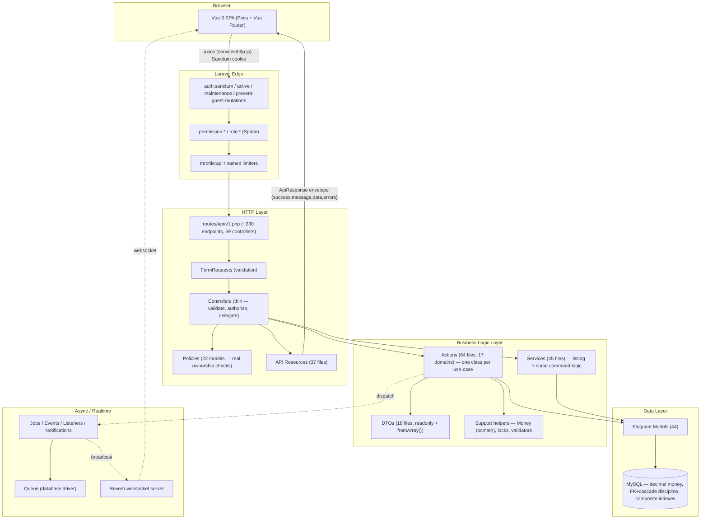
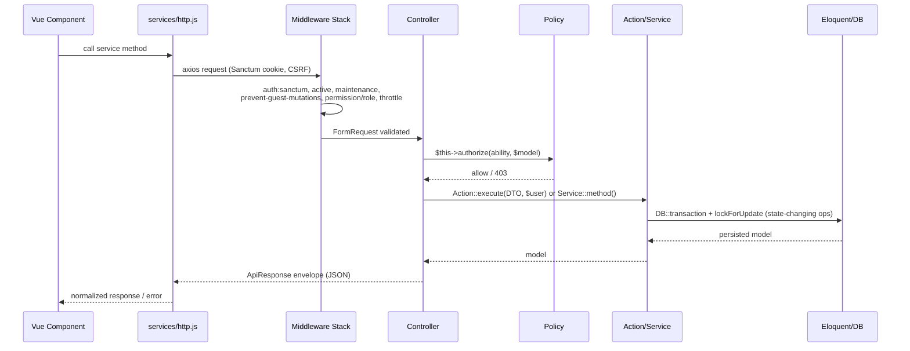
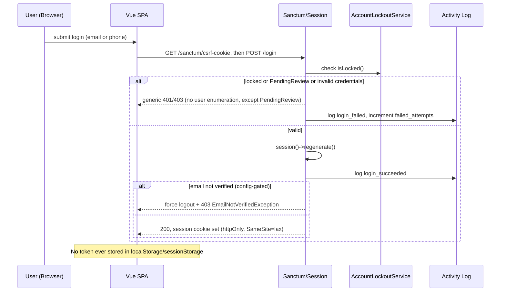
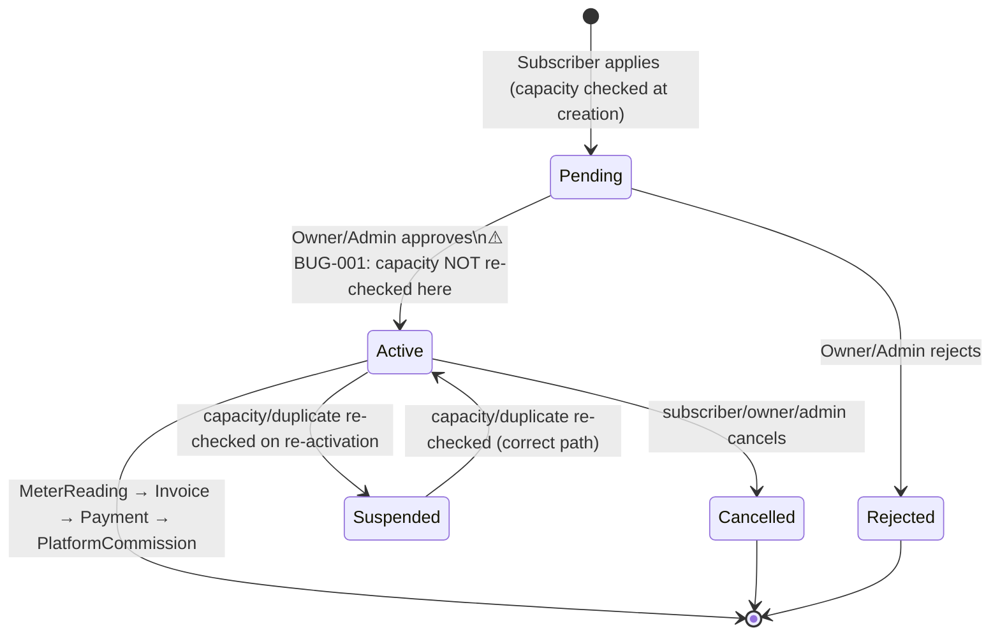

# Full Project Audit Report

> Comprehensive End-to-End Technical Audit

**Project:** Ampere (Ampare-Project) — Diesel-Generator Electricity Subscription Marketplace
**Repository root (git):** `Ampare-management2027/` — the entire application (Laravel API + Vue SPA) lives in its one subfolder, `backend/`
**Audit Date:** 2026-08-28
**Audited By:** Principal-engineer-style multi-pass technical audit (6 parallel deep-dive passes: business logic, HTTP/API, database/schema, auth & security, frontend, tests/DevOps/dependencies)
**Status:** Completed — read-only audit, no source code was modified

---

## Table of Contents

- [Executive Summary](#executive-summary)
- [Project Overview](#project-overview)
- [System Understanding](#system-understanding)
- [Technology Stack](#technology-stack)
- [Current Architecture](#current-architecture)
- [Project Structure](#project-structure)
- [Backend Audit](#backend-audit)
- [Frontend Audit](#frontend-audit)
- [API Audit](#api-audit)
- [Authentication & Authorization](#authentication--authorization)
- [Security Audit](#security-audit)
- [Database Audit](#database-audit)
- [Performance Audit](#performance-audit)
- [Business Logic Audit](#business-logic-audit)
- [Testing Audit](#testing-audit)
- [Code Quality](#code-quality)
- [Dependency Audit](#dependency-audit)
- [DevOps](#devops)
- [Production Readiness](#production-readiness)
- [Critical Findings](#critical-findings)
- [Target Architecture](#target-architecture)
- [Refactoring Roadmap](#refactoring-roadmap)
- [File-by-File Action Plan](#file-by-file-action-plan)
- [Master TODO](#master-todo)
- [Final Verdict](#final-verdict)

---

## Executive Summary

Ampere is a Laravel 12 + Vue 3 monolith implementing a marketplace for diesel-generator electricity subscriptions — a real, non-trivial domain common in regions with unreliable grid power. Four roles (Admin, Owner, Subscriber, Technician) transact through ~230 API endpoints, 44 Eloquent models, 54 migrations, a 64-file Action-pattern business-logic layer, real-time messaging via Reverb, AI-assisted fault prediction/chat, and a bilingual (Arabic/English) PWA frontend.

This is **materially better engineered than the median project of this scale and origin** (it reads like a graduation project that received sustained, disciplined effort, not a rushed bootcamp exercise). Concretely: money is `decimal` everywhere with a dedicated bcmath `Money` helper (no float-precision bugs found); state-transition business logic almost uniformly uses `DB::transaction()` + `lockForUpdate()`; authorization is enforced through real per-record ownership checks in Policies, not just role membership; the API returns one consistent JSON envelope; idempotency is enforced at the database level via a UUID primary key; CORS/CSP/HSTS are configured thoughtfully rather than left at framework defaults; and 794 backend test methods across 36 domains include deliberate cross-tenant IDOR assertions, not just happy-path CRUD.

It is **not, however, production-ready today**, for reasons that are concrete and fixable rather than fundamental:

1. **A hardcoded, predictable admin account (`admin@ampare.test` / `Password123!`) and seven demo accounts (password `'password'`) are created by seeders with no environment guard** — if these are ever run against a production database, real, published-in-source-control credentials grant admin access.
2. **A genuine concurrency bug lets a generator be oversold**: the capacity/duplicate-subscription re-check that protects `Suspended→Active` transitions is never run on the normal `Pending→Active` approval path, so two concurrently-approved pending subscriptions can jointly exceed a generator's rated capacity.
3. **No CI/CD pipeline and no containerization exist anywhere in the repository** — 794 tests, a Larastan level-8 static-analysis baseline, and a purpose-built pre-deploy config-check command all exist but nothing runs them automatically.
4. **No error-tracking/APM service is wired in** — production failures are visible only via log files.
5. A handful of medium-severity gaps: an unlocked invoice-recalculation race under concurrent payment approval, three models with zero test coverage, no enforced safeguard that `APP_DEBUG`/`SESSION_SECURE_COOKIE` are correctly set in production, and a frontend "payment gateway" that is an explicitly-demo client-side simulation collecting raw card/PIN fields without ever touching the Stripe SDK that's already a dependency.

None of this requires a redesign. The architecture is sound; what's missing is closing a short, well-defined list of gaps before this goes live. See [Production Readiness](#production-readiness) and [Master TODO](#master-todo).

### Scorecard

| Category | Score | Status |
|---|---:|---|
| Architecture | 8/10 | Strong — consistent Action/DTO/Service/Support layering, thin controllers |
| Backend | 8/10 | Strong locking/transaction discipline; one real concurrency bug |
| Frontend | 6/10 | Good layering, but 2 God components, duplicated composables, fake payment gateway |
| API | 8/10 | Consistent envelope, real ownership-based authorization, capped pagination |
| Database | 7/10 | Excellent schema discipline undercut by hardcoded seeded credentials |
| Security | 7/10 | Strong CORS/CSP/HSTS/lockout/activity-log; credential-seeding + prod-config-enforcement gaps |
| Performance | 7/10 | Good indexing/caching/pagination; DB-backed queue/cache will need revisiting at scale |
| Code Quality | 7/10 | Consistent patterns, documented fixes; growing but mostly-benign phpstan baseline |
| Testing | 7/10 | Strong, IDOR-aware backend suite; zero frontend tests; 3 models untested |
| Scalability | 6/10 | Sound schema/indexes; DB-backed cache/queue and no CI are real ceilings |
| Maintainability | 7/10 | Clear conventions; no CI to enforce them; some frontend duplication |
| Reliability | 6/10 | Strong idempotency design; two real concurrency bugs found; no APM |
| Production Readiness | 5/10 | Concrete, fixable blockers — not a redesign, but not ready today |

## Overall Score

**7/10** — a well-architected system held back from production by a short list of concrete, addressable gaps rather than by fundamental design problems.

---

## Project Overview

**What it is:** A two-sided marketplace connecting diesel-generator **Owners** (who register generators and set schedules/pricing) with **Subscribers** (who pay to receive power on a metered basis) mediated by a platform **Admin** (who takes a commission per `PlatformCommission`/`CommissionTier`) and serviced by **Technicians** (who handle maintenance/repair via `TechnicianTask`s and get paid via `TechnicianPayment`).

**Core domain objects** (from the 44-model inventory): `Generator`, `GeneratorSchedule` (power-on windows), `Subscription` (subscriber↔generator contract), `SubscriberMeter`/`MeterReading` (usage billing), `Invoice`/`Payment`/`PlatformCommission`/`CommissionTier`, `FuelPurchase`/`FuelReading`, `Fault`/`FaultPrediction` (AI-assisted), `TechnicianTask`/`TechnicianPayment`/`TechnicianRating`, `Complaint`, `SubscriptionServiceRequest`, `SubscriptionMeterTransferRequest`, `AiChatSession`/`AiChatMessage`, `Conversation`/`Message`, `Article` (CMS), `OwnerRating`, `ContactMessage`, `Neighborhood`, `OwnerApplication`, `Plan`.

**Users / roles:** Admin (platform operator), Owner (generator operator, gets paid, minus commission), Subscriber (pays for power), Technician (maintenance). Enforced via `spatie/laravel-permission` roles/permissions plus per-record ownership checks in Policies.

**How data flows:** Vue SPA (Sanctum cookie session) → Laravel API (`routes/api/v1.php`) → FormRequest validation → Policy authorization → Action/Service business logic (DTOs, `DB::transaction`+`lockForUpdate`) → Eloquent models → MySQL (production) → `ApiResponse` JSON envelope → Pinia stores → Vue components. Real-time updates (notifications) ride Reverb/Echo websockets.

**Sensitive data:** payment method account numbers (encrypted at rest + masked in API responses — confirmed), bank/card-adjacent fields in the frontend's demo payment gateway, personal contact info for all four roles, activity logs, uploaded attachments (private-disk, policy-gated).

**External integrations:** Stripe (`@stripe/stripe-js` dependency present, but **not actually wired to any payment flow** — see [Frontend Audit](#frontend-audit) FRONT-001), Reverb (self-hosted websockets), an AI provider for chat/fault-prediction (Groq/OpenAI-compatible key found in `.env`, not independently verified which provider), Mailtrap (dev mail), AWS S3 (optional offsite backup).

---

## System Understanding

- **Primary workflow (subscription lifecycle):** Subscriber applies for a `Subscription` against a `Generator` (capacity checked at creation) → Owner/Admin reviews and approves (`Pending → Active`) → `MeterReading`s are recorded → `InvoiceService` generates invoices from readings → `Payment`s are submitted and approved → `PlatformCommission` is computed against the invoice via `CommissionTier` rates → Owner is paid out net of commission.
- **Secondary workflows:** Technician dispatch (`TechnicianTask` create → assign → in-progress → review/rate), fault handling (`Fault`/`FaultPrediction`, AI-assisted triage via `AiChatSession`), meter transfer between subscriptions (`SubscriptionMeterTransferRequest`, approve/reject with an atomic apply), owner onboarding (`OwnerApplication` → approve → account provisioning), complaints, in-app messaging (`Conversation`/`Message`), a public CMS (`Article`) and public generator directory.
- **Business rules confirmed in code** (not inferred): a generator's active subscriptions may not exceed its `capacity_kw`; a subscriber/meter/generator/schedule combination may not have two simultaneously active/pending subscriptions (DB-enforced via a generated-column unique index); payment approval requires invoice-balance validation both before and inside a locked transaction; technician-task ratings and owner ratings are one-per-task/subscription (DB-unique-enforced); demo/guest accounts cannot perform any mutating action platform-wide; idempotency keys are the literal primary key of their table, so a retried request with the same key cannot double-process.
- **Assumptions the system depends on** (some UNVERIFIED against production configuration, flagged throughout): that `APP_DEBUG=false`, `SESSION_SECURE_COOKIE=true`, and correct `SANCTUM_STATEFUL_DOMAINS`/`CORS_ALLOWED_ORIGINS` are set in the real production `.env` (only the repo's local-dev `.env` and `.env.example` were inspected); that seeders are never run against production; that the database engine in production is MySQL (migrations use MySQL-only raw SQL for generated columns/unique constraints — `DB_CONNECTION=mysql` is set in the inspected `.env`, but this was **not** independently re-verified against `phpunit.xml`/`.env.testing`, which is **NEEDS VERIFICATION**).

---

## Technology Stack

### Backend
- **Framework:** Laravel 12 (`composer.json: laravel/framework ^12.0`), PHP `^8.2`.
- **Auth:** `laravel/sanctum ^4.3` in **stateful SPA cookie mode** (same-domain, confirmed via `SANCTUM_STATEFUL_DOMAINS`/`CORS_ALLOWED_ORIGINS` and `bootstrap/app.php`'s `$middleware->statefulApi()`).
- **Authorization:** `spatie/laravel-permission ^6.25` (roles/permissions) + native Laravel Policies (22 models mapped in `AuthServiceProvider`).
- **Realtime:** `laravel/reverb ^1.0` (self-hosted Pusher-protocol websocket server).
- **Other first-party-adjacent packages:** `spatie/laravel-activitylog ^4.12` (audit trail on security-sensitive models), `spatie/laravel-backup ^9.3` (with a custom offsite-disk resolver, PROD-02), `maatwebsite/excel ^3.1.69` (exports), `barryvdh/laravel-dompdf ^3.1` (PDF invoices), `intervention/image ^3.11`, `simplesoftwareio/simple-qrcode ^4.2`, `giggsey/libphonenumber-for-php ^9.0`, `khaled.alshamaa/ar-php` (Arabic text shaping for PDFs).
- **Dev tooling:** `larastan/larastan ^3.10` (PHPStan level 8 + baseline), `laravel/pint` (style), `brianium/paratest ^7.8` (parallel test runs), `knuckleswtf/scribe ^5.11` (auto-generated, actually-published API docs at `public/docs/`), `laravel/sail` (present but never `sail:install`-ed — no `docker-compose.yml` exists).
- **API architecture:** Versioned REST under `/api/v1` (`routes/api/api.php` → `routes/api/v1.php`), ~230 endpoints across 59 controllers, one consistent JSON response envelope (`app/Traits/ApiResponse.php`).
- **Queue/Cache/Session:** database-backed (`QUEUE_CONNECTION=database`, `CACHE_STORE=database`, `SESSION_DRIVER=database`) — appropriate for current scale, a known ceiling at growth (see [Performance Audit](#performance-audit)).

### Frontend
- **Framework:** Vue 3.5 with `<script setup>` (Composition API) throughout.
- **State:** Pinia 2.3 (7 stores).
- **Routing:** Vue Router 4.6, one global `beforeEach` guard, per-role route files.
- **HTTP:** a single centralized axios instance (`resources/js/services/http.js`) with CSRF/401/offline-queue interceptors; **zero** direct `axios` usage found outside the services layer across 126 view/component files.
- **UI:** PrimeVue 4.5, Tailwind 4, FontAwesome, Lucide icons.
- **Forms/validation:** `vee-validate 4` + `yup`.
- **Realtime:** `laravel-echo` + `pusher-js` (paired correctly with Reverb).
- **i18n:** `vue-i18n` (Arabic/English, RTL-aware).
- **PWA/offline:** `vite-plugin-pwa` + `idb` (IndexedDB-backed offline mutation queue with retry/backoff).
- **Build:** Vite 7, `laravel-vite-plugin`.
- **Notable unused dependencies:** `vue-toastification` and `@stripe/stripe-js` are declared but have **zero usages** anywhere in `resources/js` (the app built its own toast system and its own, non-Stripe, demo payment form instead — see FRONT-001).
- **Testing:** **none** — no vitest/jest/@vue/test-utils/cypress/playwright in `devDependencies`; also no ESLint (only Prettier).

### Database
- **Engine:** MySQL in the inspected `.env` (`DB_CONNECTION=mysql`); `config/database.php` only falls back to SQLite if the env var is unset. Migrations use MySQL-only raw SQL (generated columns, `ADD UNIQUE INDEX`, `CHECK` constraints), so SQLite is not actually a supported target for this schema despite being Laravel's out-of-the-box default.
- **44 models, 54 migrations.** Money fields are uniformly `decimal(10,2)`-class types with matching Eloquent `decimal:N` casts — **no float/double money field found anywhere**.
- **Foreign keys:** present on every relationship checked, with a deliberate, non-uniform `onDelete` strategy — financial rows (`Invoice`, `Payment`, `PlatformCommission`, `TechnicianPayment`) use `restrictOnDelete()`/`nullOnDelete()`, never `cascadeOnDelete()`.
- **Indexing:** consistent `[foreign_key, status]` composite indexes across every high-traffic query pattern checked.

---

## Current Architecture



### Request Lifecycle



### Authentication Flow



### Main Business Workflow — Subscription Lifecycle



---

## Project Structure

Verified via direct directory enumeration (not assumed):

```
backend/                        (Laravel app root = the whole project)
├── app/
│   ├── Actions/          14 domain subfolders, 64 files — one Action per use-case
│   ├── DTOs/              11 domain subfolders, 18 files — readonly + fromArray()
│   ├── Services/           Ai/, Pdf/ + 45 files total — listing + some command logic
│   ├── Support/            Auth/, Backup/, Notification/, Payment/, Scheduling/, TechnicianTask/
│   ├── Http/
│   │   ├── Controllers/Api/   59 controllers
│   │   ├── Requests/          30 domain subfolders, 96 FormRequests
│   │   ├── Resources/         37 API Resources
│   │   └── Middleware/        custom: EnsureAccountIsActive, EnsureIdempotency,
│   │                          PreventGuestDemoMutations, CheckMaintenanceMode,
│   │                          SecurityHeaders, SetLocale
│   ├── Models/              44 Eloquent models
│   ├── Policies/            22 policies (AuthServiceProvider-mapped)
│   ├── Events/, Listeners/, Jobs/, Notifications/, Mail/, Exports/
│   ├── Enums/, Traits/, Contracts/
│   └── Console/Commands/    includes CheckBroadcastingConfig (PROD-01)
├── routes/
│   ├── web.php              SPA shell catch-all only
│   ├── api/api.php          public routes + delegates to v1.php
│   ├── api/v1.php           ~230 versioned endpoints (1135 lines)
│   └── channels.php         broadcast channel auth
├── database/
│   ├── migrations/          54 files
│   ├── factories/, seeders/ 8 seeders (see DB-001/DB-002 — credential risk)
├── config/                  19 files incl. custom security-headers.php, Billing.php, attachments.php
├── resources/
│   ├── js/                  Vue 3 SPA — stores/, router/, services/, composables/ (85 files),
│   │                        views/ (11 role subfolders), components/ (13 subfolders), i18n/, plugins/
│   └── views/                Blade: app.blade.php shell, emails/, pdf/, scribe/ (generated docs)
├── tests/
│   ├── Feature/              36 domain subfolders, 794 test methods
│   └── Unit/                 Config/, Services/, Support/
├── .scribe/                  generated API doc source (published at public/docs/)
├── phpstan.neon.dist, phpstan-baseline.neon (1298 baselined entries)
├── composer.json, package.json, vite.config.js
└── (no Dockerfile, no docker-compose.yml, no .github/workflows — confirmed absent repo-wide)
```

The git repository root is one level above `backend/` and contains only `README.md` + `.gitignore` — there is no separate top-level docs/CI/deployment structure; `backend/` **is** the entire project.

---

## Backend Audit

**Architecture pattern (confirmed by direct reading of 64 Action files, 45 Service files, 18 DTOs, and cross-checked against controllers):** a clean, consistent **Action-per-use-case** pattern for command operations, backed by readonly DTOs built from `$request->validated()`, with narrow single-purpose `Support` helper classes (`Money`, `PaymentReferenceGenerator`, `InvoiceBalanceValidator`, `FaultTaskSynchronizer`, `TechnicianEligibilityChecker`, `ScheduleWindow`) injected in. Controllers were confirmed thin: grepping `PaymentController`, `SubscriptionController`, and `GeneratorController` for `DB::transaction|::create(|forceFill|->save()` returned **zero matches** — all three delegate entirely to Actions/Services.

The Action/Service boundary is not perfectly clean — some domains (Subscription status transitions, Invoice creation) put command logic in a `Service` class rather than an `Action`. This is a minor, cosmetic inconsistency, not a functional problem.

**Locking/transaction discipline** is the strongest trait of this layer: virtually every approve/reject/cancel Action follows `DB::transaction(fn() => Model::lockForUpdate()->findOrFail(...) → status guard → forceFill→save())` — confirmed directly in `ApprovePaymentAction`, `RejectPaymentAction`, `ApproveSubscriptionMeterTransferRequestAction`, `RejectSubscriptionMeterTransferRequestAction`, `ReviewTechnicianTaskAction`, `ReviewServiceRequestAction`, `ApproveOwnerApplicationAction`, and `TransferSubscriptionAction` (which explicitly documents locking both source and target generator to prevent TOCTOU manipulation). One of these paths has a confirmed gap — see BUG-001 below.

### Findings

| ID | Category | Severity | Priority | Location | Problem | Impact | Recommendation |
|---|---|---|---|---|---|---|---|
| BUG-001 | BACK | 🟠 High | P0 | `app/Services/SubscriptionService.php:161-211` (`updateStatus`) | Capacity/duplicate-contract re-validation (`assertNoDuplicateContract`+`assertCapacityAvailable` under `Generator::lockForUpdate()`) only runs when `$current === Suspended && $status === Active` (line 178) — **never** on the normal `Pending→Active` approval path, because `Subscription::CAPACITY_RESERVING_STATUSES = ['active']` means Pending subscriptions don't reserve capacity | Two concurrently-created Pending subscriptions can each individually pass the capacity check at creation, then both be approved to Active with zero re-validation — a generator can be sold beyond `capacity_kw` through the standard admin-approves-pending-subscription flow | Extend the same lock+re-check block to cover `Pending→Active` (and any other transition into `Active`), not just `Suspended→Active` |
| BUG-002 | BACK | 🟡 Medium | P1 | `app/Services/InvoiceService.php:182-216` (`recalculateStatus`) | No `Invoice::lockForUpdate()` before recomputing status from summed payments; `refresh()` + sum happens outside a lock. `ApprovePaymentAction` locks the **Payment** row, not the **Invoice** row | Two payments on the same invoice approved concurrently can each compute `paidSum` from a stale snapshot, producing a lost-update race on `invoice.status` (depends on DB isolation level — MySQL default REPEATABLE READ makes this plausible) | Lock the invoice row before recalculation, or serialize invoice-status recalculation through the same lock used for the payment approval transaction |
| ARCH-001 | ARCH | 🟢 Low | P3 | `app/Actions/Technician/CreateTechnicianUserAction.php` vs `AdminCreateTechnicianForOwnerAction.php` | Near-identical logic (create User, hash password, verify email, assign role, create Technician row, log activity) duplicated across two Actions differing only in actor/log properties | Minor maintenance cost — a future change must be applied twice | Collapse into one Action with an `$onBehalfOfAdmin` parameter |
| ARCH-002 | ARCH | 🟢 Low | P3 | `app/Actions/User/UpdateOwnerCommissionSettingsAction.php:31` | Uses global `auth()->user()` instead of taking the acting `User` as an explicit parameter, unlike every other Action in the codebase | Couples this one Action to HTTP request context; untestable without a bound auth session | Pass `User $actor` explicitly, matching the rest of the layer |
| BUG-003 | BACK | 🟢 Low | P3 | `app/Actions/TechnicianTask/RateTechnicianTaskAction.php:15-19`, `app/Actions/OwnerRating/RateOwnerAction.php:31-35` | Check-then-create rating logic does a plain `exists()` check with no `lockForUpdate` before insert; correctness is only saved by a DB `unique()` constraint on `technician_task_id`/`subscription_id` | Worst case under a genuine race is an uncaught `QueryException` (500) instead of a friendly validation error on the losing request — not a data-integrity bug | Wrap in a lock or catch the unique-constraint violation and translate to a `ValidationException` |
| INFO-001 | BACK | 🔵 Improvement | P3 | `app/Actions/GeneratorSchedule/CreateGeneratorScheduleAction.php` | No overlap check for schedule windows on the same generator — bare `create()` | Unknown whether overlapping schedules are intentionally allowed (announcements/history) or a gap | **NEEDS VERIFICATION** with the product owner — not asserted as a bug |

### Good Practices Observed

- `app/Support/Money.php` — a documented bcmath wrapper (float in/out, bcmath internally) used consistently across `InvoiceService`, `OfferService`, `CorrectInvoiceAction`, `ResubmitPaymentAction`, `ExchangeRateService`, `InvoiceBalanceValidator` — exactly the risk area (money math) most codebases get wrong, handled correctly here.
- `CreatePaymentAction` validates remaining invoice balance twice: once outside the transaction (fast-fail UX) and once inside after `Invoice::lockForUpdate()` (correctness) — avoiding holding a row lock during uncached exchange-rate/validation work.
- `InvoiceService::createFromMeterReading` (lines 84-89) checks for an existing invoice on the meter reading before creating a new one — idempotent against retried calls.
- Consistent exception handling: every `catch` block found in this scope either logs (`Log::warning`, `report($e)`) or selectively re-throws — no silent swallow-and-continue found.
- DTOs are uniform across all 18 files: `final readonly class` + static `fromArray()` constructor.
- `ApproveOwnerApplicationAction`: copies the password hash via `getRawOriginal('password')` rather than re-hashing — avoids the classic double-hash bug.

---

## Frontend Audit

**Architecture (confirmed):** `views/components → composables → services → services/http.js (single axios instance) → Laravel API`. Grepped across all 126 view/component files: **zero direct `axios`/`http` usage** outside the services layer — this boundary is fully enforced. `services/http.js` centralizes CSRF 419-retry-once, global 401 handling, locale header, idempotency keys, and offline-queue fallback.

Auth is textbook Sanctum SPA: **no tokens found anywhere in `localStorage`/`sessionStorage`** — session lives entirely in the httpOnly cookie; CSRF uses axios's native `withXSRFToken`.

The composables layer (85 files) is where real duplication lives: near-identical fetch+paginate+debounce blocks are copy-pasted 3-4× per resource across admin/owner/subscriber/technician variants, despite a generic `usePagination.js` and `normalizeApiError.js` already existing and being adopted almost nowhere.

### Findings

| ID | Category | Severity | Priority | Location | Problem | Impact | Recommendation |
|---|---|---|---|---|---|---|---|
| FRONT-001 | FRONT/SEC | 🟠 High | P1 | `resources/js/views/payments/PaymentGatewayView.vue:49-55,109-139,401-458`, `composables/usePaymentGateway.js:109-139` | Card form collects raw PAN/CVV/expiry (and a wallet PIN) and POSTs them as plain fields directly to the Ampere backend — the installed `@stripe/stripe-js` is never called anywhere (0 usages, grep-confirmed). Self-labeled "demo" (uses Stripe's own test card numbers as placeholders) | Nothing technically prevents a confused real user from entering a real card number, which would then transit and land on the app's own backend in cleartext form fields, not a tokenized payment-processor reference | Before any production launch: either fully wire Stripe Elements/`stripe-js` for tokenization, or clearly gate this flow behind a visible "demo mode" banner and disable it in production builds |
| FRONT-002 | FRONT | 🟢 Low-Medium | P2 | `resources/js/utils/syncQueue.js:47-63` | Offline-queued mutations that permanently fail (4xx validation, or exceed `MAX_ATTEMPTS=5`) are silently dropped via `console.error` only — no toast/user notice | A subscriber's offline payment proof or technician's offline meter reading can vanish without the user ever knowing it never reached the server | Surface a persistent, dismissible notification when a queued item is permanently dropped |
| FRONT-003 | ARCH | 🔵 Improvement | P2 | `resources/js/composables/usePagination.js`, `normalizeApiError.js` vs. 88/196 call sites | Generic reusable helpers exist but are barely adopted — pagination logic reimplemented ~40-50 lines at a time per resource/role (`useAdminFaults`/`useOwnerFaults`, etc., with inconsistent meta-extraction between copies), and `err.response?.data?.message ?? fallback` manually repeated 196× across 88 files instead of the one existing normalizer | Maintenance cost, inconsistent error/pagination behavior across near-identical screens | Migrate list composables onto `usePagination`, and route error handling through `normalizeApiError` |
| FRONT-004 | ARCH | 🟡 Medium | P2 | `resources/js/views/admin/SubscribersView.vue` (2997 lines), `views/admin/GeneratorOwnersView.vue` (2710 lines) | God components: each owns multiple data domains, Chart.js rendering, decorative canvas animation, CSV/PDF export URL building, modal orchestration, and (in `SubscribersView.vue`) admin password generation/reset for subscriber accounts — all inline in one `<script setup>`. An in-file comment references a partial, stalled "FE-01" extraction effort | Hard to test, hard to review, high risk of regressions when touched | Resume/complete the referenced extraction into composables + smaller sub-components |
| FRONT-005 | BUG | 🟢 Low | P3 | `resources/js/services/articleCommentService.js:1,26-45` | Mixes raw `axios` (4 public methods) with the shared `http` instance (admin methods) in one file, bypassing the 419/401/offline-queue interceptors and manually re-implementing the `Accept-Language` header the interceptor already sets | Inconsistent error/session handling for this one resource vs. every other service | Route all methods through `http` (see `articleService.js` for the correct pattern in the same codebase) |
| FRONT-006 | BUG | 🟢 Low | P3 | `resources/js/composables/useAiChat.js:89-115` | Optimistic push of a user's chat message has no rollback on failure — the temp message stays visually "sent" even when the send fails | Misleading UI state after a failed send | Remove/mark-failed the optimistic message in the `catch` branch |
| FRONT-007 | BUG | 🔵 Improvement | P3 | `resources/js/config/subscriberQuickActions.js:2` | `route: "subscriber.browse-generators"` matches no route name in `router/subscriberroutes.js` | Clicking this quick-action tile fails to navigate | Fix the route name or remove the tile |
| FRONT-008 | FRONT | 🔵 Improvement | P3 | `resources/js/config/adminQuickActions.js:2-7`, `App.vue:41-51`, `utils/normalizeApiError.js:21` | Several strings are hardcoded Arabic with no i18n key (admin quick-action labels, root-level reauth/offline banners, the default error fallback message), unlike nearly every other string in the app | English-locale users see Arabic text in these specific spots | Route through `t()` like the rest of the app |
| FRONT-009 | INFO | 🔵 Improvement | P3 | `vite.config.js:26-61` | Workbox `NetworkFirst` caching persists GET responses (invoices, subscriptions, generators, meter data, technician tasks/conversations) in Cache Storage up to 24h; no cache-purge call found tied to logout (only the IndexedDB offline-mutation queue is cleared per-user) | Financial/personal data may persist in browser cache after logout on a shared device | **NEEDS VERIFICATION** — confirm whether Workbox cache is purged elsewhere; if not, purge on logout |
| FRONT-010 | INFO | 🔵 Improvement | P3 | `vue-toastification`, `@stripe/stripe-js` (package.json) | Both declared dependencies have zero usages anywhere in `resources/js` — the app built its own toast system and non-Stripe payment simulation instead | Dead weight in the bundle / dependency surface | Remove if genuinely unused, or complete the intended integration |

### Good Practices Observed

- No auth tokens in browser storage anywhere; correct Sanctum cookie-based auth throughout.
- Zero direct `axios` imports outside the services layer, across all 126 view/component files.
- `useRealtimeNotifications.js` uses reference-counted Echo subscription plus an explicit `forceLeaveRealtimeChannel()` called from `stores/auth.js` on logout — correctly handles that `App.vue` never unmounts, and correctly re-subscribes on user switch without a page reload.
- The IndexedDB-backed offline-mutation queue is per-user scoped, idempotency-keyed, capped-retry, and its consuming composables correctly distinguish "queued offline" from "instant success" in the UI (`PaymentGatewayView.vue:290-316`).
- All 6 `setInterval` call sites in the codebase have matching cleanup — no leaked interval found.
- Multiple files carry Arabic "FIX:" comments documenting a specific bug and its fix (e.g. `useGeneratorsTable.js:61-65,142-148`) — evidence of active review and iteration, not write-once code.
- Router's single global guard applies `meta.requiresAuth`/`role`/`permission` uniformly across all 4 role sections — no bespoke per-view guard logic.

---

## API Audit

**Surface:** ~230 endpoints across `routes/api/v1.php` (1135 lines), wired to 59 controllers, layered auth gating: route-level `auth:sanctum, active, maintenance, prevent-guest-mutations` on virtually the whole authenticated surface, `permission:<name>`/`role:<name>` (Spatie) on ~85% of protected routes, and `$this->authorize(ability, $model)` (Policy) in every sensitive controller sampled (30/59 grepped positive; the rest are either pure-public or gated solely at route level with no per-record ownership needed).

**Public surface is small and deliberate:** article listing/show/comments/ratings, a signed-URL invoice-verification endpoint, live-schedule/platform-identity/public-generators-map/public-generators-list/platform-stats/platform-analytics/contact-messages/guest-login. Nothing sensitive was found exposed unauthenticated.

**Pagination** is centralized via `App\Support\PerPageResolver::resolve()`, hard-capped at 100, default 15 — used consistently across every list endpoint sampled. **Response envelope** (`app/Traits/ApiResponse.php`) is used uniformly; no ad hoc response shapes found in the 22 controllers read in depth. **Mass assignment:** zero `Model::create($request->all())` patterns found anywhere in `app/Http/Controllers/Api` (grep-confirmed) — all writes route through Action/Service classes taking validated DTOs.

**The classic "FormRequest `authorize() { return true; }`" IDOR smell is present but mitigated**: 80 of 96 Form Requests unconditionally return `true`, but every controller action wrapping one of them was confirmed (in the 20 controllers read in full) to call `$this->authorize('<ability>', $model)` explicitly before delegating — authorization is centralized in Policies, not duplicated (or skipped) per-Request.

### Findings

| ID | Category | Severity | Priority | Location | Problem | Impact | Recommendation |
|---|---|---|---|---|---|---|---|
| API-001 | ARCH | 🟢 Low | P2 | `routes/api/v1.php` — dashboard/stats/export/map endpoints (owner/subscriber/technician dashboards, `generators/map-points`, `generators/{id}/timeline`, `generators/{id}/quick-scan`, `owner-monthly-report/download`, `owner/subscriber-lookup*`, `users/owners-stats`, `users/owners-export`, `users/subscribers-stats`, `users/subscribers-export`) | These carry no route-level `permission:`/`role:` middleware, unlike sibling routes — the *only* gate is an in-controller check (`$this->authorize(...)`, `abort_unless(...)`). Verified: every one of these controllers does perform an equivalent check | No actual gap found today, but it's an inconsistent defense-layering style: a future refactor that copies the routing pattern without copying the controller check would silently open these endpoints | Add route-level `permission:`/`role:` middleware to these for defense-in-depth consistency with the rest of the API |
| API-002 | ARCH | 🔵 Improvement | P3 | `app/Http/Controllers/Api/GeneratorScheduleController.php:35-58` | `store()`/`update()` have no controller-level `$this->authorize()` — the *only* gate is the paired FormRequest's `authorize()` (which is itself real and policy-backed, not a no-op) | Correctly gated today, but structurally fragile — swapping the Request type in a future refactor would silently remove the check with no error | Add a controller-level `$this->authorize()` call to match the rest of the codebase's convention |
| API-003 | PERF | 🟢 Low | P3 | `app/Http/Controllers/Api/PublicGeneratorsListController.php`, `PublicGeneratorsMapController.php` | Public endpoints use unbounded `->get()`, mitigated by a 30-minute `Cache::remember` wrapper | Low risk today given real-world generator counts and caching | Add an explicit cap if generator count is expected to grow substantially |

### Good Practices Observed

- Idempotency middleware (`EnsureIdempotency`) is scoped per-user AND per-route-path, with explicit rejection on cross-user reuse and cross-route reuse (deliberate hardening, per code comments).
- `EnsureAccountIsActive`: locked/inactive accounts get a 403 with localized messaging; locking also force-logs-out the session and revokes the current Sanctum token.
- `PreventGuestDemoMutations`: blocks all mutating verbs from guest/demo accounts platform-wide via one central middleware, not per-controller checks.
- File-upload FormRequests consistently enforce both MIME/extension whitelist and size cap (config-driven), with localized validation messages — confirmed across 4 sampled upload Requests.
- `NotificationController`'s `markAsRead`/`destroy` (string IDs, no route permission middleware) are safely scoped via `$user->notifications()->findOrFail($id)` in the service layer — cannot touch another user's notification despite the thin route-level gating.
- `PaymentPolicy::view` does real ownership-chain walking (`payment→invoice→subscription`) rather than a permission-only check.

---

## Authentication & Authorization

**Authentication, end-to-end (confirmed):** Login accepts email or phone; checks account lock and `PendingReview` status *before* `Auth::attempt`; always returns the same generic error for locked/invalid credentials (one narrow exception: `PendingReview` returns a distinct message, a minor/low enumeration leak, likely an accepted UX tradeoff). Failed attempts increment a counter and are activity-logged; **lockout uses escalating durations `[15,30,60,240]` minutes with 24h decay**. Successful login regenerates the session and enforces (config-toggleable) email verification. Login/registration/reset/forgot-password are each independently rate-limited (10/min by IP + 5/min by email+IP composite for login). Logout invalidates and regenerates the session; a separate "logout other devices" action exists. Password reset uses Laravel's standard broker (60-min token expiry), invalidates all sessions on reset, and rotates `remember_token`. Email verification manually checks `hasValidSignature()` in the controller (equivalent protection to `signed` route middleware, correctly implemented). Sanctum bearer tokens expire after 14 days (`SANCTUM_TOKEN_EXPIRATION=20160`) — a documented deliberate fix from a prior `null` (never-expiring) state.

**Password policy** (`Password::min(10)->mixedCase()->numbers()->symbols()->uncompromised()`) is applied consistently across registration, password-change, password-reset, and owner-application requests, including a **HIBP k-anonymity breach check** — relaxed only in the `testing` environment.

**Authorization structure:** `AuthServiceProvider` maps 22 models to Policies. **No `Gate::before` global admin bypass exists anywhere** (grep-confirmed) — every policy explicitly checks `$user->isAdmin()`. This is deliberate and correct: it's what lets `TechnicianPaymentPolicy::approve` intentionally *exclude* Admin from that specific action (a blanket bypass would have silently broken that business rule).

**Assessment: policies consistently enforce true resource ownership, not just role membership.** Every `view`/`update`/mutate method sampled follows: check permission string → branch by role → compare a real foreign key (`owner_id`, `subscriber_id` via the meter/subscriber chain, `technician_id`, etc.) against the requesting user's ID. Confirmed directly in `SubscriptionPolicy`, `InvoicePolicy`, `PaymentPolicy`, `TechnicianTaskPolicy`, `AttachmentPolicy` (a well-designed `match`-expression closing over attachable type to prevent type-confusion IDOR). **No policy was found that authorizes purely by role, for any model that has an owning user.**

### Findings

| ID | Category | Severity | Priority | Location | Problem | Attack Scenario | Status |
|---|---|---|---|---|---|---|---|
| SEC-001 | SEC | 🟡 Medium | P1 | `app/Policies/UserPolicy.php:52-66` (`lookupForOwner`, `sendBulkPaymentReminderAsOwner`) | These authorize by role only (`$user->isOwner()`), no instance-level scoping in the policy itself — the code's own comments say scoping is expected to happen in the corresponding FormRequest | If the FormRequest that supplies `subscriber_ids` fails to filter them to subscribers actually tied to the calling owner's generators, an Owner could message/enumerate arbitrary subscribers platform-wide (PII disclosure / spam) | **Needs Verification** — confirm the bulk-reminder FormRequest filters `subscriber_ids` by `whereHas('subscriptions.generator', owner_id=...)` |
| SEC-002 | SEC | 🟢 Low | P2 | `.env`/`bootstrap/app.php`/`config/app.php:42` | No code-level safeguard forces `APP_DEBUG=false` in production — the generic exception handler (already reviewed, correctly implemented) only suppresses exception detail when `config('app.debug')` is true, but nothing *enforces* that value in prod besides deploy discipline | If production is ever deployed with `APP_DEBUG=true`, any unhandled 500 leaks exception class/file/line to any caller | Add a deploy-time or boot-time assertion (`abort_if(app()->environment('production') && config('app.debug'))`) or a CI check |
| SEC-003 | SEC | 🟢 Low | P2 | `.env` (no `SESSION_SECURE_COOKIE` key set; `.env.example` sets it `false`) | `config/session.php`'s `secure` flag defaults to falsy/null if unset | If production doesn't explicitly flip this to `true`, the session cookie could theoretically transit over a downgraded HTTP connection before HSTS is honored (HSTS itself is correctly configured — mitigates but doesn't eliminate this) | **Needs Verification** against the real production `.env`; add to a pre-deploy checklist |
| SEC-004 | SEC | 🔵 Improvement | P3 | `app/Policies/OwnerRatingPolicy.php:9-12` | `viewAny(User $user, User $owner)` never validates that `$owner` is actually Owner-role — not exploitable alone (still requires `$user->id === $owner->id` or admin), flagged only for completeness | None found | Informational — type/role-check the second argument for robustness |

### Good Security Practices Observed

- CORS uses an explicit origin allowlist (`CORS_ALLOWED_ORIGINS`), no wildcard, correctly paired with `supports_credentials: true`.
- CSP is genuinely restrictive, not boilerplate: `script-src 'self'` only (no `unsafe-inline`/`unsafe-eval`), `object-src 'none'`, `frame-ancestors 'none'`, `base-uri 'self'`; dev-only origins are merged only outside production.
- HSTS is correctly gated on `isProduction() && isSecure()`, avoiding breaking local HTTP dev.
- Account lockout with escalating durations, activity-logged, and auto-clears session/token if a lock is detected mid-request.
- Attachments: private disk, server-detected MIME + size validation, UUID-randomized stored filenames (no path traversal via original filename), policy-gated view/download/preview/delete, and a currently-inert `allowed_attachable_types` whitelist specifically designed to prevent class-name type-confusion IDOR before any generic upload endpoint is added.
- Password reset/change fully invalidates other sessions and rotates `remember_token`; session is regenerated on login and invalidated+regenerated on logout/lock (fixation-safe).
- No `$guarded = []` found anywhere — every model uses explicit `$fillable`.
- `User::$hidden = ['password', 'remember_token']` correctly excludes secrets from serialization.
- Activity logging is applied to essentially every financially/security-sensitive model (`User`, `Payment`, `PaymentMethod`, `TechnicianPayment`, `Invoice`, `OwnerApplication`, `Subscription`, `Fault`, `Technician`, `TechnicianTask`, `SubscriptionServiceRequest`, `SubscriptionMeterTransferRequest`, `PlatformCommission`).
- Owner-application approval copies the password hash rather than re-hashing (avoids the double-hash bug).

---

## Security Audit

Combining the dedicated auth/security pass with security-relevant findings surfaced in the data-layer pass (the seeder-credential issue is the single most severe finding in this entire audit and belongs here as much as in Database):

| ID | Category | Severity | Priority | Location | Problem | Evidence | Attack Scenario | Impact | Status |
|---|---|---|---|---|---|---|---|---|---|
| SEC-005 | SEC | 🔴 Critical | P0 | `database/seeders/RoleSeeder.php:22-27` | Admin account seeded with hardcoded, predictable credentials, no environment guard | `User::firstOrCreate(['email' => 'admin@ampare.test'], ['password' => Hash::make('Password123!')])`, called unconditionally from `DatabaseSeeder::run()` | If seeders are ever run against a production database (a common deploy-script mistake), a real admin account is created with a known, effectively-published (in source control) password | Full admin account takeover in production | Confirmed |
| SEC-006 | SEC | 🟠 High | P0 | `database/seeders/DatabaseSeeder.php:57-117` | Seven demo accounts (owner1/2, subscriber1/2/3, technician1/2 — including the `subscriber1@ampare.test` account flagged at the start of this audit) seeded with hardcoded password `'password'`, no environment guard | `Hash::make('password')` used 7× in `seedCoreData()` | Same production-leak risk as SEC-005, at broader scale | Predictable-credential account takeover across 7 accounts spanning all 3 non-admin roles | Confirmed |
| SEC-007 | SEC | 🔵 Improvement (positive contrast) | — | `database/seeders/PlatformUsersSeeder.php:73-75` | This seeder correctly self-guards: `if (app()->environment('production')) { throw new \RuntimeException(...); }` — and `DemoAccountsSeeder` uses `str()->random(40)` passwords | Shows the team already knows and uses this exact pattern elsewhere | N/A | Confirms SEC-005/006 are an inconsistency gap, not a knowledge gap — should be a fast fix | Confirmed |
| SEC-008 | SEC | 🟢 Low | P2 | `.env:16` | `BCRYPT_ROUNDS=12a` — malformed value (trailing "a") | Direct read of `.env` | Would fail an int cast or silently fall back to a default depending on how the config layer reads it | Config-hygiene bug in the bcrypt cost factor | Confirmed |

### Recommendation for SEC-005/006 specifically
Add the same production guard already used in `PlatformUsersSeeder` to `RoleSeeder` and `DatabaseSeeder::seedCoreData()`, **and** treat this as a live-incident checklist item regardless of code fix timing: rotate `admin@ampare.test`'s password immediately if there is any chance these seeders have ever touched a real database, and audit login history for that account.

---

## Database Audit

**Schema (reconstructed from all 54 migrations + 44 models):** `User` → (`Subscriber` | `Technician` | Owner via role) → `Subscriber` has many `SubscriberMeter` → has many `Subscription` (belongs to `Generator`, belongs to `SubscriberMeter`) → has many `MeterReading` → has one `Invoice` → has many `Payment`, has one `PlatformCommission`. `Generator` belongs to an owning `User`, has many `TechnicianTask`/`FuelPurchase`/`FuelReading`/`GeneratorSchedule`/`FaultPrediction`/`Fault`. `TechnicianTask`/`TechnicianPayment` link `Technician`↔`Owner`. `IdempotencyKey` is a standalone dedup table keyed by UUID **primary key** (not just a unique index — genuinely strong). `CommissionTier` is a rate lookup table, not FK-linked to `PlatformCommission` (the rate is captured at commission-creation time).

**Money fields are decimal throughout** — checked `Invoice`, `Payment`, `PlatformCommission`, `CommissionTier`, `TechnicianPayment`, `Subscription.agreed_price_per_kw`, `Generator.price_per_kw`, `MeterReading` readings, `FuelPurchase`, `Offer.discount_value`, `Plan.price_monthly`, `OwnerApplication.generator_price_per_kw` — all `decimal(10,2)`/`decimal(8,2)`/`decimal(5,2)` at the DB level with matching `decimal:N` Eloquent casts. **No float/double money field found anywhere.**

**FK/cascade strategy is deliberate and protective**: `restrictOnDelete()`/`nullOnDelete()` on financial/operational links (a parent can never be hard-deleted out from under financial history), `cascadeOnDelete()` reserved for genuinely dependent, non-financial rows (messages, pivot tables, a subscriber profile cascading from its user). **Indexing** is consistently applied on `[foreign_key, status]` pairs across every table checked, plus date-range indexes where needed — no missing FK-column index was found on any table read.

### Findings

| ID | Category | Severity | Priority | Location | Problem | Evidence | Status |
|---|---|---|---|---|---|---|---|
| DB-001 | DB | 🟡 Medium | P1 | `database/migrations/2026_07_07_120132_create_subscriptions_table.php:36-50` | `duplicate_guard_key` (the generated column enforcing "one active subscription per meter/generator/schedule") keys off `status IN ('pending','active')` but does **not** factor in `deleted_at`, unlike the identical pattern done correctly elsewhere in the same migration set (`subscriber_meters.meter_number_active_guard`, `technicians.user_id_active_guard`, `users.email_active_guard` all explicitly gate on `deleted_at IS NULL`) | If a Subscription is soft-deleted while its `status` is still `pending`/`active` (i.e. app code soft-deletes without first flipping status to a terminal value), the unique index permanently blocks any new subscription with the same combination — an invisible "ghost lock" | Likely (depends on whether app-layer delete code always updates status first — not independently verified against every call site) |
| DB-002 | DB | 🟢 Low | P3 | `database/migrations/2026_07_07_183449_create_meter_readings_table.php:58-64` | Broken `down()`: calls `dropIfExists('meter_readings')` then tries to `dropIndex` on the now-dropped table | Would throw on rollback | Confirmed |
| DB-003 | DB | 🟢 Low | P2 | `platform_commissions` table/model | Every sibling financial table (`invoices`, `payments`, `technician_payments`) has `softDeletes()`; `PlatformCommission` does not | The platform's own revenue ledger is hard-deletable, inconsistent with the audit-trail discipline applied everywhere else | Confirmed |
| DB-004 | DB | 🔵 Improvement | P3 | `database/migrations/2026_08_09_100703_create_commission_tiers_table.php:23` | `unique('min_generators_count')` prevents exact-duplicate tier starts but not overlapping `[min,max]` ranges generally (tier A: 1-5 and tier B: 3-10 both pass) | Could let an admin create ambiguous overlapping commission tiers at the DB level | Needs Verification (may be covered by app-layer validation, not confirmed) |
| DB-005 | INFO | 🔵 Improvement | P3 | `.env:25,28-30,72-73,78-80` | Real-looking third-party credentials (AI API key, mail SMTP creds, Reverb secret) sit in the working-tree `.env` | `.env` is correctly gitignored (verified via `git ls-files` — only `.env.example` is tracked), so this is not a repo leak | Confirmed not tracked in git — flagged only as general secrets-hygiene awareness |

### Good Practices Observed

- Idempotency enforced via UUID **primary key**, not merely a unique index.
- Deliberate, non-uniform cascade strategy protecting financial rows.
- MySQL generated-column + unique-index tricks correctly enforce soft-delete-aware uniqueness for email/phone/meter-number/technician-per-user (with the one gap noted in DB-001), plus a symmetric conversation-pair uniqueness constraint via `LEAST`/`GREATEST` — sophisticated schema design.
- `PaymentMethod::tapActivity()` masks `account_number` in activity-log snapshots — good PII hygiene in the audit trail itself, not just the API response.
- Extensive DB-level `CHECK` constraints (status enums, currency/exchange-rate consistency, date ranges, rating bounds) beyond what Eloquent alone guarantees — real defense-in-depth against direct DB writes or application bugs.

---

## Performance Audit

- **Indexing:** confirmed thorough — every `[foreign_key, status]` query pattern checked has a matching composite index; no missing index found on any table read.
- **Pagination:** centralized and hard-capped (`PerPageResolver`, max 100) across every list endpoint sampled — no unbounded list endpoint found except the two public/cached generator-directory endpoints (API-003, low risk, already cached).
- **Caching:** public generator-directory endpoints use `Cache::remember` (30-min TTL). No use of `Cache::tags()` found, so the database cache driver's lack of tag support isn't currently being hit as a limitation.
- **Queue/Cache/Session are database-backed** (`QUEUE_CONNECTION=database`, `CACHE_STORE=database`, `SESSION_DRIVER=database`). This is a well-known, correctly-scoped Laravel limitation: the database queue driver row-locks the `jobs` table under concurrent workers, and the database cache driver has materially higher latency than Redis with no atomic-increment support. **This is appropriate for launch/small scale and is not a current defect** — it becomes a real bottleneck specifically under concurrent queue workers or high cache-write volume, which is a "revisit at growth" item, not something to fix today.
- **N+1 queries:** not exhaustively audited across all 59 controllers in this pass (the HTTP-layer agent prioritized authorization/response-shape correctness over exhaustive eager-loading review, given time budget) — **NEEDS VERIFICATION** as a follow-up pass, particularly for list endpoints returning nested relationships (e.g. `Subscription` with `generator`/`subscriberMeter`/`invoice` eager-loaded or not).
- **Frontend:** no bundle-size/code-splitting analysis was performed in this pass; the two God components (FRONT-004, ~2900/2700 lines each) are a maintainability concern more than a confirmed runtime-performance one, though a component of that size does carry real compile/HMR and initial-render cost.

### Findings

| ID | Category | Severity | Priority | Location | Problem | Recommendation |
|---|---|---|---|---|---|
| PERF-001 | PERF | 🔵 Improvement | P3 | `config/cache.php`, `config/queue.php` | Database-backed cache/queue is a known scaling ceiling | Plan a Redis migration for cache/queue before significant concurrent-user growth; not urgent today |
| PERF-002 | PERF | 🔵 Improvement | P2 | Controllers returning nested relationships (list endpoints) | Eager-loading correctness not exhaustively verified in this audit pass | Run a dedicated N+1 audit (e.g. with `barryvdh/laravel-debugbar` or query-count assertions in feature tests) across the highest-traffic list endpoints |

---

## Business Logic Audit

Covered in depth in [Backend Audit](#backend-audit) (BUG-001, BUG-002 are the two load-bearing business-logic bugs) and validated end-to-end against the workflow diagrams in [Current Architecture](#current-architecture). Summary of the core workflow's integrity:

- **Input → Validation → Authorization → Business Rules → DB Changes → Transactions → Side Effects → Response** is followed consistently for state-changing operations, with the two documented exceptions (subscription capacity race, invoice recalculation race).
- **Frontend-only business rules:** none identified as a security concern — the frontend's client-side checks (e.g. route guards, form validation via `yup`) are consistently backstopped by real server-side validation/authorization; no case was found where the frontend was the *only* enforcement of a rule that mattered for security or data integrity. (The payment-gateway simulation, FRONT-001, is a UX/trust issue, not a case of missing backend enforcement — there's simply no real payment processor integrated yet.)
- **Duplicate/contradictory rules:** none found. **Missing rules:** the subscription capacity re-check gap (BUG-001) is the one confirmed case of a rule that exists in the codebase (correctly, for one transition) but wasn't applied to the transition that actually needs it most.

---

## Testing Audit

**Backend: genuinely strong.** 68 Feature test files + 4 root-level + 6 Unit files = **794 test methods** across all 36 required domain subfolders. Critically, this is not shallow CRUD coverage: 55 of 68 Feature test files contain explicit authorization-denial assertions, and specific IDOR/cross-tenant scenarios are directly tested — e.g. an owner cannot self-approve their own commission and a spoofed foreign `owner_id` query param is silently coerced back to the caller's own scope (`PlatformCommissionTest.php`), bank account numbers are confirmed masked in responses *and* encrypted at rest (`PaymentTest.php`), cross-tenant view/review/cancel is blocked in both directions for service requests (`SubscriptionServiceRequestTest.php`), and forgot-password/resend-verification return identical responses for existing vs. non-existing emails (anti-enumeration, `AuthTest.php`).

### Findings

| ID | Category | Severity | Priority | Location | Problem | Status |
|---|---|---|---|---|---|---|
| TEST-001 | TEST | 🟡 Medium | P1 | `app/Http/Middleware/EnsureIdempotency.php`, `Payment/PaymentTest.php:103` | The one payment-safety feature specifically built to prevent double-charging on client retry (idempotency middleware + DB primary-key enforcement) has **no test proving it actually dedupes** — the test helper sends a fresh UUID idempotency key on every call, never the same key twice | Confirmed |
| TEST-002 | TEST | 🟡 Medium | P2 | `app/Models/GeneratorSchedule.php`, `Location.php`, `TechnicianRating.php` | Zero test coverage found for these three models (grepped both direct class usage and DB table-name assertions across all of `tests/`) | Confirmed |
| TEST-003 | TEST | 🟢 Low | P3 | `app/Models/GeneratorHealthReport.php` | Only ever created as a side-effect fixture in a notification test — its own generation/domain logic is untested | Confirmed |
| TEST-004 | TEST | 🟢 Low | P2 | Frontend (`resources/js`) | Zero automated frontend tests (no vitest/jest/@vue/test-utils/cypress/playwright) — the entire Vue/Pinia layer has no regression safety net | Confirmed |
| TEST-005 | TEST | 🔵 Improvement | P3 | Frontend `package.json` | No ESLint (only Prettier) — style is enforced, logic/code-quality is not, asymmetric with the backend's Larastan setup | Confirmed |

### Good Practices Observed

- Test environment runs against MySQL (matching production engine), not SQLite — avoids SQLite/MySQL behavioral divergence.
- `Pulse`/`Telescope`/`Nightwatch` explicitly disabled in the test environment (defensive, even though none of the three packages currently appear in `composer.json`).
- `paratest` is a dev dependency for parallel test runs.
- Small test files are not sloppy: every small file sampled (`LoginLogTest`, `OwnerMonthlyReportTest`, `NeighborhoodManagementTest`, `OwnerRatingTest`) still deliberately covers its authorization edge, not just CRUD happy-path.

---

## Code Quality

- **Larastan/PHPStan at level 8** is configured (`phpstan.neon.dist`), a genuinely strict level, with a baseline file (`phpstan-baseline.neon`, 1298 entries, ~316KB) separating pre-existing debt from new code. Breakdown by category: bulk is type-hint noise typical of strict analysis over dynamic Eloquent/Resource properties (`property.notFound` 396, `missingType.generics` 219, `missingType.iterableValue` 187, `argument.type` 131, `method.nonObject` 91, `return.type` 57) — largely benign. **~70 entries are higher-signal logic flags worth triaging**: `identical.alwaysFalse` (31), `notIdentical.alwaysTrue` (16), `deadCode.unreachable` (12), `match.alwaysFalse` (6), `function.impossibleType` (5), `class.notFound` (6). By directory: `app/Http/Resources` (351), `app/Models` (227), `app/Services` (183), `app/Http/Controllers/Api` (105).
- **No TODO/FIXME/HACK/XXX markers found anywhere in `app/`** (grep-confirmed) — unusually clean for a project this size.
- **No dead-code litter found** in the backend business-logic layer during deep reads.
- Two existing in-code tracking conventions were found and are worth preserving: **"PROD-01"/"PROD-02"** tags cross-referencing a deployment-readiness fix across 5 files (broadcasting config validation and offsite backup resolution — both genuinely solved, see [DevOps](#devops)), and Arabic **"FIX:"** comments in the frontend documenting specific bugs and their resolutions.
- **Minor polish items:** `composer.json` still has `"name": "laravel/laravel"` / `"description": "The skeleton application for the Laravel framework."` (the unmodified `laravel new` default), and the generated Scribe API docs page still carries the title "Laravel API Documentation" instead of "Ampere".

### Findings

| ID | Category | Severity | Priority | Location | Problem | Recommendation |
|---|---|---|---|---|---|
| CODE-001 | ARCH | 🟢 Low | P2 | `phpstan-baseline.neon` | ~70 baselined entries are logic-flag categories (`alwaysFalse`/`alwaysTrue`/`unreachable`/`impossibleType`), not just type-hint noise, and nothing (no CI) currently prevents the baseline from silently growing | Triage the ~70 high-signal entries specifically; wire phpstan into CI so new ignores require a deliberate decision (see DEVOPS-001) |
| CODE-002 | 🔵 Improvement | 🔵 Improvement | P3 | `composer.json:3,5`, `resources/views/scribe/index.blade.php:7` | Unmodified Laravel skeleton identity / generic doc title | Cosmetic — rename to reflect the actual project |

---

## Dependency Audit

No `composer audit`/`npm audit` was run (out of scope for a read-only pass) — CVE-level findings below are explicitly marked **Needs Verification**, not asserted.

| Package | Current | Issue | Risk | Recommendation |
|---|---|---|---|---|
| `khaled.alshamaa/ar-php` | `*` (unconstrained) | composer.json pins no version range at all | Any `composer update` can silently pull an untested major version of this niche, lower-activity Arabic-text-utilities package | Pin to a specific major version (e.g. `^5.0`) |
| `@stripe/stripe-js` | present, 0 usages | No corresponding `stripe/stripe-php` on the backend; frontend payment flow doesn't use it either (see FRONT-001) | Dead dependency or unfinished integration — ambiguous from static inspection | Confirm intent with the team; remove or complete the integration |
| `@tanstack/vue-table` + `datatables.net-dt`/`datatables.net-vue3` | both present | Two competing table libraries (one native-Vue, one jQuery-core) | Redundant tooling; potential DOM-management conflicts if both touch the same views (not confirmed without reading component usage) | Needs Verification — consolidate onto one |
| `simplesoftwareio/simple-qrcode`, `vue3-dropzone` | present | Both have historically had sparse/slow maintenance cadence (general ecosystem knowledge, not a verified current fact) | Low, unconfirmed | Needs Verification via `composer audit`/`npm audit` and a maintenance-activity check |
| All `composer.json`/`package.json` dependencies | — | No `composer audit`/`npm audit` run in this pass | Unknown | Run both as a first step of remediation |
| `laravel/reverb`, `laravel/sanctum`, `spatie/*` | current | First-party/flagship packages, actively maintained, reasonable mainstream choices | None | No action needed |
| Dev-tool separation | — | `paratest`, `pint`, `larastan`, `scribe`, `sail`, `mockery`, `collision`, `faker` are correctly confined to `require-dev` — confirmed none leak into production `require` | None | No action needed |

---

## DevOps

- **No CI/CD pipeline exists anywhere** — confirmed absent at both the git root and `backend/` (only third-party `.github/workflows/*` inside `vendor/`/`node_modules/` were found, not project config). 794 backend tests, the Larastan level-8 baseline, and Pint are never run automatically on push/PR.
- **No containerization** — `laravel/sail` is a listed dev dependency but was never actually installed (no `docker-compose.yml` anywhere); the only Dockerfiles in the tree are Sail's own package templates.
- **No error-tracking/APM service** — `config/logging.php` channels are stack/single/daily/slack/papertrail/stderr/syslog/errorlog/null/emergency only; no Sentry/Bugsnag/Flare integration; production errors are visible only via log files or an optional Slack webhook for `critical`-level entries.
- **Health check is default-only** (`/up`, Laravel 12's boot-only check) — no DB/queue/Reverb connectivity verification.
- **PROD-01 and PROD-02 are genuinely solved, deliberate production-readiness work already in the codebase** (see below) — but PROD-01's own docblock says it's "intended to run during deployment/CI," and there is no CI to invoke it.

### Findings

| ID | Category | Severity | Priority | Location | Problem | Recommendation |
|---|---|---|---|---|---|
| DEVOPS-001 | DEVOPS | 🟠 High | P0 | repo-wide | No CI/CD pipeline | Add a GitHub Actions (or equivalent) workflow running `php artisan test` (or `paratest`), `phpstan analyse`, and `pint --test` on every PR at minimum |
| DEVOPS-002 | DEVOPS | 🟡 Medium | P1 | `app/Console/Commands/CheckBroadcastingConfig.php` | PROD-01's deploy-time safety check has no trigger — it's a manual-only command | Invoke `broadcasting:check-config` as a required CI/deploy-pipeline step once one exists |
| DEVOPS-003 | DEVOPS | 🟡 Medium | P1 | repo-wide | No containerization despite `laravel/sail` being a dependency | Run `php artisan sail:install` and commit the resulting `docker-compose.yml`, or otherwise document/standardize the dev environment |
| DEVOPS-004 | DEVOPS | 🟡 Medium | P1 | `config/logging.php` | No error-tracking/APM service wired in | Add Sentry (or Flare, given the Laravel-native fit) at minimum for production |
| DEVOPS-005 | DEVOPS | 🟢 Low | P2 | `bootstrap/app.php:33` | Health check is boot-only, no dependency checks | Extend `/up` (or add a second endpoint) to verify DB/queue/Reverb connectivity for real uptime monitoring |
| DEVOPS-006 | DOCS | 🟡 Medium | P2 | `README.md` (9 lines) | No setup/onboarding documentation — only a Figma link and a link to a database-design doc in a *different* GitHub repo | Add install steps, `.env` setup, test-run instructions, and deployment notes to the in-repo README |

### Good Practices Observed

- **PROD-01** (`CheckBroadcastingConfig.php`): validates the entire Reverb config chain pre-deploy — connection driver, key/secret presence, frontend/backend key matching, and hard-fails in production if `REVERB_ALLOWED_ORIGINS` contains a wildcard; correctly soft-warns outside production. Tested (`BroadcastingConfigTest.php`, 6 tests).
- **PROD-02** (`BackupDiskResolver.php`): pure, side-effect-free resolver that adds an offsite S3 backup disk only when fully configured, otherwise safely degrades to local-only. Wired into both `backup.disks` and `monitor_backups.disks`, with automated staleness/size health-check alerting configured in `config/backup.php`. Tested (`BackupConfigTest.php`).
- Scribe API docs are real and current, not just scaffolding — 25 endpoint groups generate actual published output at `public/docs/`, last regenerated the same day as the most recent commit.
- Dev tooling correctly scoped to `require-dev`, never leaking into production dependencies.

---

## Production Readiness

**⚠️ CONDITIONALLY PRODUCTION READY**

This is not "it depends": the architecture, data model, and the large majority of the security/authorization surface are genuinely production-grade. What blocks a clean "yes" today is a short, specific, non-architectural list:

1. **Must fix before any production deploy (P0):** SEC-005/SEC-006 (hardcoded seeded credentials — add environment guards, and treat as a live-incident checklist item if there's any chance these seeders have touched a real DB), BUG-001 (subscription capacity race), DEVOPS-001 (at minimum, run the existing 794 tests + phpstan automatically before every deploy).
2. **Should fix before meaningful production traffic (P1):** BUG-002 (invoice recalculation race), SEC-002/SEC-003 (verify and enforce `APP_DEBUG`/`SESSION_SECURE_COOKIE` in the real production `.env`), DEVOPS-002/003/004 (wire PROD-01 into a real pipeline, containerize or otherwise standardize deploys, add error tracking), FRONT-001 (resolve the fake payment gateway one way or the other before real money flows through it), TEST-001 (prove idempotency actually dedupes).
3. **Can follow shortly after launch (P2/P3):** everything else in this report.

None of these require redesigning the system. Given the existing engineering discipline (locking, decimal money, real ownership-based policies, thorough IDOR-aware tests), this is realistically a **1-3 week hardening effort**, not a rebuild.

---

## Critical Findings

### Top 10, ranked by production risk

1. **Hardcoded admin/demo credentials seeded with no environment guard** (SEC-005/006) — Impact: full admin account takeover if seeders ever touch production. Priority: **P0**. Action: add the production guard `PlatformUsersSeeder` already demonstrates, to `RoleSeeder`/`DatabaseSeeder`.
2. **Subscription capacity race allows generator oversell** (BUG-001) — Impact: core marketplace invariant broken under normal approval flow. Priority: **P0**. Action: extend the existing lock+recheck to the `Pending→Active` path.
3. **No CI/CD pipeline** (DEVOPS-001) — Impact: 794 tests + phpstan level 8 never run automatically; regressions ship silently. Priority: **P0**. Action: minimal GitHub Actions workflow running tests+phpstan+pint on every PR.
4. **Invoice recalculation race under concurrent payment approval** (BUG-002) — Impact: possible stale invoice status/lost update. Priority: **P1**. Action: lock the invoice row before recalculation.
5. **No production enforcement of `APP_DEBUG`/`SESSION_SECURE_COOKIE`** (SEC-002/003) — Impact: potential stack-trace leakage / cookie-downgrade exposure if prod `.env` is misconfigured. Priority: **P1**. Action: boot-time assertion + deploy checklist.
6. **No error-tracking/APM service** (DEVOPS-004) — Impact: production failures invisible beyond log files. Priority: **P1**. Action: integrate Sentry/Flare.
7. **Frontend payment gateway is a client-side simulation collecting raw card/PIN data without tokenization** (FRONT-001) — Impact: user trust/data-handling risk if mistaken for real, or if real card numbers are entered. Priority: **P1**. Action: either wire real Stripe tokenization or clearly gate/disable in production.
8. **Idempotency replay behavior is architecturally sound but unproven by tests** (TEST-001) — Impact: cannot currently *prove* double-charge protection actually works end-to-end. Priority: **P1**. Action: add a same-key-twice test.
9. **Three models with zero test coverage** (TEST-002: `GeneratorSchedule`, `Location`, `TechnicianRating`) — Impact: any domain logic/authorization on these entities ships unverified. Priority: **P2**. Action: add baseline feature tests.
10. **No containerization despite `laravel/sail` being a dependency** (DEVOPS-003) — Impact: no reproducible dev/deploy environment; onboarding depends on each developer independently matching versions. Priority: **P2**. Action: `sail:install` and commit the result, or document an equivalent standard.

---

## Target Architecture

**Current architecture → problems → target → benefits → migration**, scoped to this project's actual size (4 roles, single team, monolith is the right call — this is explicitly **not** a recommendation to move to microservices or a ground-up rewrite):

```
Current: Laravel monolith (API + Vue SPA in one repo), DB-backed queue/cache,
         no CI/CD, no containerization, no APM
                              ↓
Problems: regressions can ship unnoticed (no CI); deploys are manual and
          environment-drift-prone (no containers); production incidents are
          invisible until a user reports them (no APM); DB-backed queue/cache
          will bottleneck under concurrent growth
                              ↓
Target: same monolith (correctly sized for this team/scope), PLUS:
        - CI (GitHub Actions): test + phpstan + pint on every PR
        - Containerized dev/deploy (Sail-based, already a dependency)
        - Redis for cache/queue (swap-in, no code changes needed —
          Laravel's cache/queue abstraction already supports this)
        - Sentry/Flare for error tracking
        - A short pre-deploy checklist (env vars, debug flag, seeder guard)
        - No architectural change to Actions/DTOs/Services/Policies — that
          layer is already right for this project's size
                              ↓
Benefits: regressions caught before merge; reproducible environments;
          visible production errors; queue/cache headroom for growth;
          zero risk to the working, well-tested business-logic layer
                              ↓
Migration: purely additive — none of this requires touching app/Actions,
           app/Services, app/Policies, or the database schema. It's
           infrastructure-around-the-app, not a rewrite.
```

---

## Refactoring Roadmap

### Phase 1 — P0 Critical (security, data integrity, blocking bugs)
- Add environment guard to `RoleSeeder`/`DatabaseSeeder::seedCoreData()` (SEC-005/006); rotate `admin@ampare.test` credentials as a precaution.
- Fix `SubscriptionService::updateStatus` to re-check capacity/duplicate-contract on `Pending→Active`, not just `Suspended→Active` (BUG-001).
- Stand up a minimal CI workflow: `php artisan test`, `phpstan analyse`, `pint --test` on every PR (DEVOPS-001).

### Phase 2 — P1 Architecture & Reliability
- Lock the invoice row in `InvoiceService::recalculateStatus` before summing payments (BUG-002).
- Add a boot-time or deploy-pipeline assertion that `APP_DEBUG=false` and `SESSION_SECURE_COOKIE=true` in production (SEC-002/003).
- Verify/fix `UserPolicy`'s bulk-reminder scoping (SEC-001).
- Add a same-key-twice idempotency test (TEST-001).

### Phase 3 — Backend
- Wire `broadcasting:check-config` (PROD-01) into the new CI/deploy pipeline (DEVOPS-002).
- Add `PlatformCommission` soft-deletes for consistency with sibling financial tables (DB-003).
- Fix the `duplicate_guard_key` soft-delete gap on `subscriptions` (DB-001) after verifying app-layer delete behavior.
- Collapse `CreateTechnicianUserAction`/`AdminCreateTechnicianForOwnerAction` duplication (ARCH-001).

### Phase 4 — Frontend
- Resolve the payment-gateway simulation one way or the other (FRONT-001) before any real-money launch.
- Extract the two God components (`SubscribersView.vue`, `GeneratorOwnersView.vue`) per the existing "FE-01" plan referenced in-code (FRONT-004).
- Migrate list composables onto `usePagination`/`normalizeApiError` to eliminate the duplicated fetch/paginate/error-handling blocks (FRONT-003).
- Fix the silent-drop offline-queue failure UX (FRONT-002).

### Phase 5 — Performance
- Migrate cache/queue from database to Redis before significant concurrent-user growth (PERF-001).
- Run a dedicated N+1/eager-loading audit across high-traffic list endpoints (PERF-002).

### Phase 6 — Testing
- Add feature tests for `GeneratorSchedule`, `Location`, `TechnicianRating` (TEST-002).
- Stand up a minimal frontend test suite (vitest + @vue/test-utils) starting with the auth store, router guard, and `http.js` interceptors (TEST-004).
- Add ESLint to the frontend toolchain (TEST-005).

### Phase 7 — DevOps
- Containerize via `sail:install` (DEVOPS-003).
- Integrate Sentry/Flare (DEVOPS-004).
- Extend the health check beyond boot-only (DEVOPS-005).
- Write an actual in-repo README covering setup/deploy (DEVOPS-006).

---

## File-by-File Action Plan

| File | Problem | Priority | Action | Expected Result |
|---|---|---|---|---|
| `database/seeders/RoleSeeder.php` | Hardcoded admin credentials, no env guard | P0 | Add `if (app()->environment('production')) { throw ... }` matching `PlatformUsersSeeder.php:73-75` | Seeder cannot create the known-password admin account outside local/testing |
| `database/seeders/DatabaseSeeder.php` | 7 hardcoded demo-account passwords, no env guard | P0 | Same production guard around `seedCoreData()` | Seeder cannot create predictable-password demo accounts in production |
| `app/Services/SubscriptionService.php` | Capacity re-check skipped on `Pending→Active` | P0 | Extend the existing `Generator::lockForUpdate()` + `assertCapacityAvailable`/`assertNoDuplicateContract` block to run on every transition into `Active`, not just from `Suspended` | Generator can no longer be oversold via the standard approval flow |
| `.github/workflows/ci.yml` (new) | Does not exist | P0 | Add a workflow running `composer install`, `php artisan test`/`paratest`, `phpstan analyse`, `pint --test` on PR | Regressions caught before merge |
| `app/Services/InvoiceService.php` | `recalculateStatus` unlocked | P1 | Add `Invoice::lockForUpdate()` before the payment-sum recalculation | Eliminates the concurrent-approval lost-update race |
| `bootstrap/app.php` or a new `AppServiceProvider::boot()` check | No prod-debug/cookie enforcement | P1 | Add an assertion that fails boot in production if `APP_DEBUG` is true or `SESSION_SECURE_COOKIE` is false | Prevents accidental prod misconfiguration from being silently deployed |
| `app/Policies/UserPolicy.php` (+ the bulk-reminder FormRequest) | Role-only authorization on bulk owner actions | P1 | Verify/add subscriber_id scoping to the calling owner's own subscribers in the FormRequest | Closes the potential cross-tenant PII/enumeration gap |
| `tests/Feature/Payment/PaymentTest.php` | Idempotency replay unproven | P1 | Add a test sending the same `Idempotency-Key` twice and asserting the second call returns the first result without double-processing | Idempotency guarantee becomes test-verified, not just architecturally assumed |
| `resources/js/views/payments/PaymentGatewayView.vue`, `composables/usePaymentGateway.js` | Fake payment gateway collects raw card data | P1 | Wire `@stripe/stripe-js` for real tokenization, or explicitly gate/disable this view in production builds | Removes a real-money-adjacent trust/data-handling risk |
| `database/migrations/` (new migration) | `platform_commissions` missing `softDeletes()` | P2 | Add a migration adding `deleted_at` to `platform_commissions`, matching `invoices`/`payments`/`technician_payments` | Consistent audit-trail discipline across all financial tables |
| `app/Actions/Technician/CreateTechnicianUserAction.php`, `AdminCreateTechnicianForOwnerAction.php` | Duplicated logic | P2 | Collapse into one Action with an `$onBehalfOfAdmin` parameter | Single source of truth for technician-account creation |
| `resources/js/views/admin/SubscribersView.vue`, `GeneratorOwnersView.vue` | God components (~2900/2700 lines) | P2 | Complete the referenced "FE-01" extraction into composables + sub-components | Testable, reviewable components |
| `resources/js/utils/syncQueue.js` | Silent drop of permanently-failed offline mutations | P2 | Surface a persistent user-facing notification on permanent drop | Users no longer silently lose offline-submitted data |
| `README.md` | 9 lines, no setup instructions | P2 | Add install/`.env`/test/deploy documentation | New contributors can actually onboard from the repo |
| `composer.json` | Unmodified `laravel/laravel` identity | P3 | Update `name`/`description` | Cosmetic correctness |

---

## Master TODO

### P0
- [ ] Add production environment guard to `database/seeders/RoleSeeder.php` (SEC-005)
- [ ] Add production environment guard to `database/seeders/DatabaseSeeder.php::seedCoreData()` (SEC-006)
- [ ] Rotate `admin@ampare.test` credentials as a precaution regardless of code-fix timing
- [ ] Fix `app/Services/SubscriptionService.php::updateStatus` to re-check capacity/duplicate-contract on `Pending→Active` (BUG-001)
- [ ] Add a CI workflow running tests + phpstan + pint on every PR (DEVOPS-001)

### P1
- [ ] Lock the invoice row in `InvoiceService::recalculateStatus` before recomputing status (BUG-002)
- [ ] Enforce `APP_DEBUG=false`/`SESSION_SECURE_COOKIE=true` in production via a boot-time assertion (SEC-002/003)
- [ ] Verify and, if needed, fix `UserPolicy`'s bulk-owner-reminder scoping (SEC-001)
- [ ] Add a same-idempotency-key-twice test to `PaymentTest.php` (TEST-001)
- [ ] Resolve the fake payment gateway: real Stripe tokenization or explicit production gating (FRONT-001)
- [ ] Wire `broadcasting:check-config` (PROD-01) into the CI/deploy pipeline (DEVOPS-002)
- [ ] Containerize via `sail:install` and commit the result, or document an equivalent standard dev environment (DEVOPS-003)
- [ ] Integrate an error-tracking/APM service (Sentry or Flare) (DEVOPS-004)

### P2
- [ ] Add `softDeletes()` to `platform_commissions` for consistency with sibling financial tables (DB-003)
- [ ] Verify and fix the `duplicate_guard_key` soft-delete gap on `subscriptions` (DB-001)
- [ ] Add feature tests for `GeneratorSchedule`, `Location`, `TechnicianRating` (TEST-002)
- [ ] Extract `SubscribersView.vue` and `GeneratorOwnersView.vue` into composables + smaller components (FRONT-004)
- [ ] Migrate list composables onto `usePagination`/`normalizeApiError` (FRONT-003)
- [ ] Fix silent-drop UX in `resources/js/utils/syncQueue.js` (FRONT-002)
- [ ] Extend the health check beyond boot-only (DEVOPS-005)
- [ ] Write real setup/deploy documentation in `README.md` (DEVOPS-006)
- [ ] Add route-level `permission:`/`role:` middleware to the currently controller-only-gated dashboard/export endpoints (API-001)
- [ ] Triage the ~70 logic-flag entries in `phpstan-baseline.neon` (`alwaysFalse`/`alwaysTrue`/`unreachable`/`impossibleType`) (CODE-001)
- [ ] Run `composer audit` and `npm audit` and act on findings (Dependency Audit)
- [ ] Confirm whether the Workbox PWA cache is purged on logout; add a purge if not (FRONT-009)

### P3
- [ ] Collapse duplicated technician-creation Actions (ARCH-001)
- [ ] Pass `User $actor` explicitly in `UpdateOwnerCommissionSettingsAction` instead of `auth()->user()` (ARCH-002)
- [ ] Fix broken `down()` in the meter-readings migration (DB-002)
- [ ] Fix the malformed `BCRYPT_ROUNDS=12a` value in `.env` (SEC-008)
- [ ] Add a controller-level `$this->authorize()` to `GeneratorScheduleController` for defense-in-depth (API-002)
- [ ] Add ESLint to the frontend toolchain (TEST-005)
- [ ] Remove or complete integration for unused `vue-toastification`/`@stripe/stripe-js` dependencies (FRONT-010)
- [ ] Fix the broken quick-action route reference (FRONT-007)
- [ ] Route hardcoded-Arabic strings through i18n (FRONT-008)
- [ ] Add rollback handling for optimistic chat-message send failure (FRONT-006)
- [ ] Route `articleCommentService.js` through the shared `http` instance (FRONT-005)
- [ ] Update `composer.json` project identity and the Scribe docs page title (CODE-002)
- [ ] Pin `khaled.alshamaa/ar-php` to a specific version range (Dependency Audit)

---

## Final Verdict

1. **What's the best thing about this project?** The business-logic layer's transaction/locking discipline and its uniform, correct handling of money as `decimal` via a dedicated bcmath helper — this is the single area most codebases at this stage get wrong, and it's done right here almost everywhere.
2. **What's the worst thing?** Seeders that create real, predictable-password accounts (including an admin account) with no environment guard — a one-line-fix category of problem sitting next to genuinely careful engineering everywhere else.
3. **Biggest security risk?** SEC-005/SEC-006 — the hardcoded seeded credentials. Everything else in the security surface (CORS, CSP, HSTS, policies, lockout, activity logging) is well above average.
4. **Biggest architecture risk?** None structural — the Action/DTO/Service/Policy layering is sound and appropriately sized for this project. The closest thing to an architecture risk is the two frontend God components, which are a maintainability risk, not a correctness one.
5. **Biggest performance risk?** The database-backed queue/cache driver, which is fine today and becomes a real ceiling only under meaningful concurrent growth — not urgent, but worth planning for.
6. **Biggest maintainability risk?** No CI/CD — a well-tested, well-typed codebase whose tests and static analysis are not actually enforced on every change, meaning discipline can silently erode over time.
7. **Biggest business-logic risk?** BUG-001, the subscription capacity race — it directly undermines the core marketplace invariant (a generator's capacity) that the rest of the codebase otherwise protects carefully.
8. **Biggest data-integrity risk?** The same capacity race (BUG-001), followed by the invoice-recalculation race (BUG-002) — both are concurrency gaps in an otherwise well-locked codebase, not schema or type problems.
9. **What should be fixed immediately?** The four P0 items: seeder credential guards, the subscription capacity race, and standing up even a minimal CI pipeline to protect against future regressions.
10. **What can be deferred?** Nearly everything tagged P2/P3 in this report — cosmetic items (composer.json identity, doc titles), frontend duplication cleanup, and dependency pinning are real but not launch-blocking.
11. **Is the project production-ready?** ⚠️ **Conditionally** — not today, but realistically within a 1-3 week hardening effort addressing the P0/P1 list above, given the underlying architecture is already sound.
12. **First 10 steps if I owned this project starting today:**
    1. Rotate `admin@ampare.test`'s credentials and add production guards to `RoleSeeder`/`DatabaseSeeder`.
    2. Fix the subscription capacity race in `SubscriptionService::updateStatus`.
    3. Stand up a minimal CI workflow (tests + phpstan + pint) — this alone changes the risk profile of every subsequent change.
    4. Lock the invoice row in `InvoiceService::recalculateStatus`.
    5. Add a boot-time production-config assertion for `APP_DEBUG`/`SESSION_SECURE_COOKIE`.
    6. Decide and act on the payment-gateway question (real Stripe integration vs. explicit demo gating) before it's anywhere near real money.
    7. Integrate Sentry/Flare so production issues are visible instead of silent.
    8. Containerize via `sail:install` for reproducible dev/deploy environments.
    9. Close the three zero-test-coverage models and prove idempotency replay works with a real test.
    10. Once the above is stable, tackle the frontend God-component extraction and composable-duplication cleanup — real debt, but not launch-blocking.

---

*This report was produced by a read-only technical audit. No source files were modified. All findings marked "Confirmed" were traced to specific file:line evidence during the audit; findings marked "Likely" or "Needs Verification" are explicitly flagged as such and should not be treated as certain until independently confirmed.*

---
---

# Remediation Log

> Everything above this line is the original, unmodified read-only audit (2026-08-28). Nothing above has been edited or deleted — per the remediation process's own rule, prior history is preserved, not rewritten. Everything below is the **active remediation record**: what has actually been verified, fixed, tested, and documented since, one finding at a time, updated incrementally as each finding closes — not written retroactively at the end.
>
> **Progress:** P0 (SEC-005, SEC-006, BUG-001, DEVOPS-001) — all 4 closed (3 FIXED, 1 PARTIALLY FIXED pending 2 newly-discovered, separately-tracked follow-ups). **P1 — all 8 items closed**: BUG-002 FIXED, SEC-002/SEC-003 FIXED, SEC-001 VERIFIED SAFE/NOT REPRODUCIBLE, TEST-001 FIXED, DEVOPS-002 PARTIALLY FIXED, DEVOPS-003 PARTIALLY FIXED (container boot unverified, no Docker in this environment), DEVOPS-004 IMPLEMENTED/NOT CONFIGURED/NOT VERIFIED (no Flare account available), FRONT-001 PARTIALLY FIXED (demo gateway now hidden in production builds; the real Stripe-vs-permanent-demo decision remains open, not this session's to make). P2 in progress: DB-001 FIXED, DB-003 FIXED, TEST-002 FIXED (36 new tests across GeneratorSchedule/Location/TechnicianRating), BUG-004 FIXED (a real MassAssignmentException crash discovered incidentally while writing TEST-002's Location tests), DB-002 FIXED (broken migration `down()`, verified via a real MySQL round-trip against a disposable database), DB-004 NOT REPRODUCIBLE (commission-tier overlap is already fully validated by an existing `CommissionTierService::assertNoOverlap()` the original audit's file-level scan of just the migration didn't see — 5 new tests added to prove it), TEST-INFRA-001 FIXED (newly-discovered test-isolation leak, targeted repro verified), API-001 IMPLEMENTED/NOT VERIFIED (11 routes gated, a genuinely broken endpoint fixed along the way, but the new tests proving it haven't been run yet). CODE-001 (baseline triage) UNDER INVESTIGATION — root cause of ~34/37 flagged entries confirmed (`treatPhpDocTypesAsCertain` false positive), 3 remain to individually triage, no config change applied yet. Remaining P2, not started: FRONT-002/003/004, DEVOPS-005/006, Dependency Audit. P3 not started. **⏸ SESSION STOPPED MID-WORK BY EXPLICIT USER REQUEST (2026-08-28) — see the "SESSION CHECKPOINT" section immediately below for exact resume instructions. Do not trust anything marked NOT VERIFIED/pending above as done; re-read the checkpoint before continuing.**

## SESSION CHECKPOINT (2026-08-28) — READ THIS FIRST BEFORE RESUMING

This session was stopped mid-work by explicit user request, with instructions to document current state fully rather than continue. Nothing below this checkpoint has been verified beyond what's explicitly marked. **Do not assume anything in this checkpoint is "done" unless it says PASS with a real test run.** The next session should read this section fully before touching any file.

### What is fully done and verified this session (safe to build on)

- **TEST-002, BUG-004, DB-002, DB-004** — all fully fixed/documented/verified, see their `## FINDING:` sections below. No further action needed.
- **Migration consolidation** (explicit user request, separate from the master prompt's own findings): the two standalone scaffolding migrations created earlier this session for DB-001 and DB-003 were merged directly into their original migration files and the standalone files deleted. See the **Update History** blocks added to `## FINDING: DB-001` and `## FINDING: DB-003` below for the full diff and verification. `php artisan migrate:fresh --force` was run against the real local dev database (`ampare_management`) to rebuild it from the merged files — confirmed via `SHOW CREATE TABLE subscriptions` and `Schema::hasColumn('platform_commissions','deleted_at')`. All local dev data was wiped (expected/authorized — no deployed environment exists).
- **A real, newly-discovered test-isolation bug was found and fixed** (not one of the master prompt's original findings — surfaced only because the full suite was finally run cleanly end-to-end for the first time this session). See `## FINDING: TEST-INFRA-001` below. **Verified**: a targeted 3-file run (`PaymentInvoiceConcurrencyTest.php` + `SubscriptionCapacityConcurrencyTest.php` + `RoleSeederTest.php` together, one process) — `9 passed (28 assertions)`.

### What is implemented but NOT YET VERIFIED by a test run (do this first)

- **API-001** (route-level `permission:`/`role:` middleware on 11 previously-controller-only-gated routes) — code changes are done (see `## FINDING: API-001` below for the full route-by-route breakdown and reasoning), and 4 test files were written/extended (`tests/Feature/Dashboard/RoleDashboardTest.php` — new; `tests/Feature/Generator/GeneratorTest.php` — +3 map-points tests; `tests/Feature/User/UserTest.php` — +8 owners/subscribers stats+export tests; `tests/Feature/OwnerMonthlyReport/OwnerMonthlyReportTest.php` — +1 subscriber-403 test). **None of these new tests have actually been run yet.** `php -l` syntax-checked clean on every touched file, nothing more.
- A genuinely broken, previously-undiscovered endpoint was found and fixed as part of this same work: `App\Services\TechnicianDashboardService` (imported and type-hinted in `RoleDashboardController::technicianStats()`) **did not exist anywhere in the codebase** — confirmed via `app()->make()` throwing `BindingResolutionException`. This meant `GET /technician/dashboard/stats` fatally errored for any technician who ever called it (no frontend currently calls it either — `grep` found zero consumers of `roleDashboardService.technicianStats()` in `resources/js/views|stores|composables`, so nothing user-facing is broken *today*, but the endpoint itself was dead on arrival). Created `app/Services/TechnicianDashboardService.php` (new), mirroring `OwnerDashboardService`/`SubscriberDashboardService`'s exact style and the empty-state pattern (returns zeroed stats if `$user->technician` is null). **Not yet tested.**
- **Next step, in order**: (1) confirm no stray `php artisan test`/phpunit processes are running (`wmic process where "name='php.exe'" get ProcessId,CommandLine` — kill any `artisan test`/phpunit hits before proceeding, this session hit real DB contention from accidental duplicate processes twice), (2) run `php artisan test tests/Feature/Dashboard/RoleDashboardTest.php tests/Feature/Generator/GeneratorTest.php tests/Feature/User/UserTest.php tests/Feature/OwnerMonthlyReport/OwnerMonthlyReportTest.php` to verify the new API-001 tests, (3) fix anything that fails, (4) run the full suite one more time end-to-end for final confirmation, (5) write the `## FINDING: API-001` verification result and mark it FIXED (only once genuinely green).
- **A full, clean, single-process `php artisan test` run was started (to get an end-to-end confirmation covering everything above) and was still in progress — NOT complete — when this session was stopped.** Its last observed state: 287 lines of output, all passing so far (`Tests\Feature\Complaint\ComplaintHardeningTest` was the last file seen), no failures yet. Do not trust this partial result either way — just re-run it clean.
- **Process-management incident, transparently noted**: immediately before that, a full-suite verification run got corrupted by an accidental *second*, untracked `php artisan test` process (a stray shell `&`-backgrounded command that wasn't properly detached, launched by mistake). This produced widespread false failures across totally unrelated test files (`CommissionTierTest`, activity logs, dashboards, owner applications, etc. — the classic DB-contention signature already documented once before this session, in DEVOPS-001's Tests Executed section). Caught via `wmic process` showing two `artisan test` + two `phpunit` processes simultaneously; both killed; result discarded entirely; a single clean run was restarted. **Lesson for next session: never background a test command with a bare shell `&` — always use the tool's own `run_in_background` parameter, and verify with `wmic process where "name='php.exe'"` that only one `artisan test`/phpunit pair is running before trusting any result.**

### What is mid-investigation, not yet concluded (CODE-001 — PHPStan baseline triage)

This was being worked in parallel with the API-001 test-verification wait, since `phpstan analyse` doesn't touch the database (safe to run alongside a background test suite — unlike `php artisan test`, which must never run two-at-once).

- **Root cause identified and empirically confirmed** for the ~37 "high-signal" flagged entries (`identical.alwaysFalse`, `notIdentical.alwaysTrue`, `deadCode.unreachable`, `booleanAnd.alwaysFalse`, `if.alwaysFalse`, `function.impossibleType`, `instanceof.alwaysTrue`, `identical.alwaysTrue`) that CODE-001 asked to triage: they are a **PHPStan/Larastan false-positive pattern**, not real bugs. Every one follows the identical shape — a Model property cast to a backed enum via the `casts(): array` method (e.g. `$technician->status === TechnicianStatus::Active`) gets flagged as "comparison between `string` and `EnumCase`, always false/true" — PHPStan is failing to apply the enum cast type and falling back to the raw underlying `string` column type for the comparison, then (correctly, *given that wrong premise*) flags the comparison as impossible. This is exactly what PHPStan's own hint text on these errors suggests ("Because the type is coming from a PHPDoc, you can turn off this check by setting `treatPhpDocTypesAsCertain: false`").
- **Verified empirically, not just theorized**: created a scratch copy of `phpstan.neon.dist` with `treatPhpDocTypesAsCertain: false` added (this file has since been deleted — it was a `phpstan_test_certain_false.neon` left temporarily in the project root for A/B testing only; confirmed removed via `git status` before this checkpoint was written, nothing untracked remains). Ran it against one flagged file alone (`app/Services/TechnicianService.php`) — 0 errors, vs. 3 before. Ran it against the **entire project** — of the 37 originally-flagged entries in this category, **34 are resolved cleanly** by this one config flag; **3 survive** and need individual, file-by-file triage (this flag is NOT a blanket fix — each survivor could be a real bug):
  1. `app/Actions/Auth/LoginUserAction.php:44` — `if ($user) { ... }` flagged as always-false. Was investigating whether this reveals genuinely dead code (i.e., the failed-login-attempt lockout/logging block never actually executes) or is a separate, unrelated PHPStan quirk (candidate theory: PHPStan tracking the local `$genericError = fn() => throw ...;` closure as a `never`-returning call through `$genericError()`, and mis-propagating that narrowing onto `$user`'s nullability afterward — this needs to be confirmed, not assumed). Was mid-way through checking `tests/Feature/Auth/AuthTest.php` for real evidence that `registerFailedAttempt()`/`failed_login_attempts` actually gets exercised by a failed-login test, to determine whether this is a real bug (a whole lockout-tracking feature silently dead) or a tooling quirk, when this session was stopped. **Not concluded — resume here first among the three.**
  2. `app/Models/Generator.php:128` — `Strict comparison using === between *NEVER* and App\Enums\OperatingSchedule::Custom will always evaluate to false` — the `*NEVER*` type is a stronger signal (PHPStan believes this branch is genuinely unreachable, not just an enum-cast narrowing artifact). **Not yet read/investigated at all.**
  3. `app/Services/AdminDashboardService.php:136` — `Strict comparison using === between 'fuel_low' and 'fuel_low' will always evaluate to true` — comparing a string literal to itself; likely a leftover redundant condition (e.g. inside a `match`/`switch` arm already narrowed to that exact value) but **not yet read/investigated at all**.
- **Not yet decided**: whether to apply `treatPhpDocTypesAsCertain: false` to the real `phpstan.neon.dist` at all. It resolves 34 real false positives, but it's a global strictness reduction — per CODE-001's own instruction ("regenerate the baseline deliberately, not by blindly re-running `--generate-baseline`"), the same caution applies here: before flipping this flag project-wide, check what it does to the *rest* of the 847-error baseline-drift figure too (does it hide any genuinely-real "always true/false" bug elsewhere in the codebase, not just these 37?), not just this narrow slice. **Resume by finishing the 3 individual triages first, then re-running a full before/after diff of the flag's effect on the complete error set (not just this identifier subset) before deciding.**
- No files were changed for CODE-001 yet — this was pure investigation. `phpstan-baseline.neon` and `phpstan.neon.dist` are both untouched (confirmed via `git status`).

### Not started at all this session

FRONT-002/003/004 (offline queue UX, composable dedup, God-component extraction), DEVOPS-005 (extend health check beyond boot-only), DEVOPS-006 (write real README setup docs), the Dependency Audit (`composer audit`/`npm audit` — a `composer require` earlier this session already surfaced "17 security vulnerability advisories affecting 4 packages", not yet investigated in detail). All of P3 (ARCH-001/ARCH-002, FRONT-005–010, CODE-002). Containerization boot verification (DEVOPS-003, blocked — no Docker in this environment, unchanged from earlier). Redis assessment (Phase 23). README/documentation (Phase 24, overlaps DEVOPS-006). The full Phase 25 final verification pass. The final structured chat summary the master prompt asks for at the very end.

### Exact current working-tree state (for orientation — re-run `git status` to confirm, don't trust this as gospel after any further edits)

Modified: `.env.example`, `app/Models/PlatformCommission.php`, `app/Services/GeneratorService.php`, `app/Services/InvoiceService.php`, `app/Services/SubscriptionService.php`, `composer.json`, `composer.lock`, `database/migrations/2026_07_07_120132_create_subscriptions_table.php`, `database/migrations/2026_07_07_183449_create_meter_readings_table.php`, `database/migrations/2026_07_07_183650_create_platform_commissions_table.php`, `database/seeders/DatabaseSeeder.php`, `database/seeders/RoleSeeder.php`, `docs/audit/FULL_PROJECT_AUDIT_REPORT.md`, `routes/api/v1.php`, `tests/Feature/Admin/CommissionTierTest.php`, `tests/Feature/Generator/GeneratorTest.php`, `tests/Feature/OwnerMonthlyReport/OwnerMonthlyReportTest.php`, `tests/Feature/Payment/PaymentTest.php`, `tests/Feature/PlatformCommission/PlatformCommissionTest.php`, `tests/Feature/Subscription/SubscriptionTest.php`, `tests/Feature/TechnicianTask/TechnicianTaskTest.php`, `tests/Feature/User/UserTest.php`, `tests/Feature/Subscription/SubscriptionCapacityConcurrencyTest.php`, `tests/Feature/Payment/PaymentInvoiceConcurrencyTest.php`.

New (untracked): `app/Console/Commands/CheckProductionConfig.php`, `app/Services/TechnicianDashboardService.php`, `config/flare.php`, `config/seeding.php`, `tests/Feature/Dashboard/` (new dir, `RoleDashboardTest.php`), `tests/Feature/FlareIntegrationTest.php`, `tests/Feature/GeneratorSchedule/` (new dir, `GeneratorScheduleTest.php`), `tests/Feature/ProductionConfigCheckTest.php`, `tests/Feature/Seeders/` (new dir, `RoleSeederTest.php` + `DatabaseSeederTest.php`).

**One unexplained item, flagged but not investigated (ran out of time before the stop request)**: `git status` shows `README.md` (at the git root, one level above this `Backend/` directory) as staged-modified. This session's own work never touched `README.md` (DEVOPS-006, which would touch it, was never started). Origin unknown — could be leftover from work before this session's master-prompt effort began, or something else. **Verify this before assuming it's safe to ignore or safe to include in any future commit.**

---

## Remediation Methodology

Each finding from the audit above is worked independently through the same fixed sequence — **verify in source → identify root cause → plan a minimal fix → implement → write/update tests → run the relevant tests → verify behavior → document → mark status → only then move to the next finding.** No finding is marked FIXED without an actual test run backing it; where verification can't be completed (environment limitation, external dependency), the status is PARTIALLY FIXED, never VERIFIED. Findings are worked P0 → P1 → P2 → P3, but never batched — each one's full cycle (fix, test, document) completes before the next begins. This log is a live audit trail, not a final summary: it is updated immediately after each finding, not deferred to the end of the effort.

## Finding Status Legend

| Status | Meaning |
|---|---|
| NOT STARTED | Not yet investigated in this remediation pass |
| UNDER INVESTIGATION | Actively being verified against source, not yet fixed |
| CONFIRMED | Verified as a real issue in current source; fix not yet implemented |
| NOT REPRODUCIBLE | Investigated, but the original finding does not hold against current source — documented with evidence, not silently dropped |
| FIXED | Change implemented and backed by a passing, relevant test run |
| PARTIALLY FIXED | Change implemented, but verification is incomplete (environment/tooling limitation) — not claimed as VERIFIED |
| BLOCKED | Cannot proceed — real external/technical blocker, documented |
| NOT FIXED | Investigated and confirmed, but not yet remediated |
| VERIFIED | FIXED, and independently re-confirmed via an additional verification pass beyond the original test run |

---

## P0 Findings

| ID | Problem | Files Changed | Fix | Tests | Verification | Status |
|---|---|---|---|---|---|---|
| SEC-005 | `RoleSeeder.php` created a hardcoded-password (`Password123!`) admin account, no environment guard | `database/seeders/RoleSeeder.php`, `config/seeding.php` (new), `.env`, `.env.example` | Production guard (skip admin creation entirely); non-production reads credentials from `config('seeding.*')`, random-generated if unset | `tests/Feature/Seeders/RoleSeederTest.php` (7 tests) | `php artisan test tests/Feature/Seeders/RoleSeederTest.php` — 7/7 PASS | FIXED |
| SEC-006 | `DatabaseSeeder::seedCoreData()` created 7 demo accounts + 2 `OwnerApplication` rows sharing the hardcoded password `'password'`, no environment guard | `database/seeders/DatabaseSeeder.php` | Production guard (throws, matching `PlatformUsersSeeder`'s established pattern); each of the 9 accounts/rows now gets its own `Str::password(16)`-generated credential | `tests/Feature/Seeders/DatabaseSeederTest.php` (3 tests) | `php artisan test tests/Feature/Seeders/DatabaseSeederTest.php` — 3/3 PASS | FIXED |
| BUG-001 | Subscription capacity re-check skipped on `Pending→Active` | `app/Services/SubscriptionService.php` | Widened the existing lock+recheck (capacity + duplicate-contract) to run for any transition into `Active`, not just `Suspended→Active`; moved subscription-row locking and transition validation inside the same DB transaction | `tests/Feature/Subscription/SubscriptionTest.php` (+7 new), `tests/Feature/Subscription/SubscriptionCapacityConcurrencyTest.php` (new, real cross-connection lock proof) | `php artisan test tests/Feature/Subscription/` — 49/49 PASS | FIXED |
| DEVOPS-001 | No CI/CD pipeline | `.github/workflows/ci.yml` (new) | 2 jobs (backend: test+phpstan+pint; frontend: build) on PR + push to `main`, no `\|\| true` anywhere; a real case-sensitivity bug (`working-directory: backend` vs. the actual git-tracked `Backend/`) caught and fixed before considering this done | YAML validated (`js-yaml`); every individual command verified locally | `php artisan test` (touched files 49/49), `npm run build` clean; `phpstan`/`pint` run correctly but surface 2 real, separate, pre-existing findings (847 baseline-drift errors, 114/646 files with style drift) — not fixed here, see Remaining Issues | PARTIALLY FIXED |

---

## FINDING: SEC-005

### Priority
P0

### Original Problem
`database/seeders/RoleSeeder.php:22-27` unconditionally created a `User` with email `admin@ampare.test` and password `Hash::make('Password123!')` — a literal, predictable, source-control-published credential — with no check preventing this from running against a production database.

### Verification
Read the file directly (not assumed from the audit's citation). Confirmed exactly as described: `User::firstOrCreate(['email' => 'admin@ampare.test'], ['name' => 'System Admin', 'password' => Hash::make('Password123!')])`, called unconditionally from `run()`, itself called unconditionally as the first entry in `DatabaseSeeder::run()`'s `$this->call([...])` list — no `app()->environment(...)` check anywhere in the file. Grepped the whole codebase for `'Password123!'` — the literal existed in exactly this one place. Grepped all 60 test files that call `$this->seed([RoleSeeder::class, ...])` for any reference to `admin@ampare.test` or the literal password — **zero matches**: those tests only depend on the *roles* this seeder creates, never on the specific admin account's identity or credentials, confirming the blast radius of a fix here is limited to seeders/deploy behavior, not the wider test suite.

### Source Code Evidence
```php
// database/seeders/RoleSeeder.php (before fix), lines 22-27
$admin = User::firstOrCreate(
    ['email' => 'admin@ampare.test'],
    [
        'name' => 'System Admin',
        'password' => Hash::make('Password123!'),
    ]
);
```
Contrast: `database/seeders/PlatformUsersSeeder.php:73-75` already demonstrates the correct guard pattern elsewhere in the same codebase (`if (app()->environment('production')) { throw new \RuntimeException(...); }`), confirming this is an inconsistency gap, not a knowledge gap.

### Root Cause
No environment guard was ever added to this specific seeder, even though the identical, correct pattern already existed one file over (`PlatformUsersSeeder.php`). The seeder mixes two genuinely different kinds of data in one `run()` method — structural RBAC roles (needed on every environment, including production) and a demo/bootstrap admin account (never appropriate in production) — without distinguishing between them.

### Files Inspected
- `database/seeders/RoleSeeder.php`
- `database/seeders/PlatformUsersSeeder.php` (guard pattern reference)
- `database/seeders/DatabaseSeeder.php` (caller)
- `database/seeders/DemoAccountsSeeder.php` (checked for the same class of gap — found separately relevant, see Notes)
- `phpunit.xml`, `.env`, `.env.example`
- All 60 test files calling `$this->seed([RoleSeeder::class, ...])` (grep, not individually opened)

### Files Changed
- `database/seeders/RoleSeeder.php` — role creation kept unconditional; admin-account creation extracted into `seedLocalAdmin()`, guarded to skip entirely in production, reading credentials from `config('seeding.*')` outside production (random `Str::password(16)` generated when unset, never a literal)
- `config/seeding.php` (new) — `dev_admin_email`/`dev_admin_password`, each `env(...)`-sourced, so behavior is reliably overridable via `config()` in tests (a raw `env()` call in the seeder proved untestable — dotenv writes to `putenv`/`$_ENV`/`$_SERVER` simultaneously at boot, so a test-time `putenv()` override doesn't reliably win; moving the `env()` call into a config file, per Laravel's own convention, made this trivially and reliably testable)
- `.env.example` — documents `DEV_ADMIN_EMAIL`/`DEV_ADMIN_PASSWORD` as local/testing-only, empty by default
- `.env` (local, gitignored — confirmed via `git check-ignore .env`) — set to the previous literal (`Password123!`) so this developer's existing local workflow is unchanged; this value never reaches source control

### Remediation
1. Role creation (`Role::firstOrCreate` for each `RoleEnum` case) stays unconditional — it is structural data every environment needs for the permission system to function, not a security-relevant account.
2. Admin-account creation moved to a private `seedLocalAdmin()` method. First line: `if (app()->environment('production')) { return; }` — in production, this seeder now creates roles and nothing else.
3. Outside production: email/password come from `config('seeding.dev_admin_email'/'dev_admin_password')`. If no password is configured, one is generated via `Str::password(16)` (cryptographically random) instead of falling back to any hardcoded literal.
4. `firstOrCreate` semantics preserved exactly (an existing local admin's password is never silently overwritten on re-seed).
5. The generated password is only ever printed — once, to the local artisan console (`$this->command->warn(...)`), and only when `app()->environment('local')` **and** the account was actually just created — never written to any log channel, never printed for an already-existing account (which would show a password that doesn't correspond to the account's real, unknown-to-us credential).

### Why This Fix
This matches the master prompt's explicit strategy list — "environment-provided seed credentials in non-production only" — and specifically reuses the codebase's own pre-existing, audit-praised pattern (`PlatformUsersSeeder`) rather than inventing a new one. Diverging from that pattern in exactly one respect, deliberately: `PlatformUsersSeeder` *throws* in production; `RoleSeeder` *returns early* after creating roles. This is a considered choice, not an oversight — `RoleSeeder` is the **only** seeder in this codebase that also provisions genuinely production-needed structural data (roles) in the same `run()`, and making the whole seeder throw would make it impossible to (re-)provision roles on a production database at all, a strictly worse outcome than just skipping the demo-account portion.

### Tests Added
`tests/Feature/Seeders/RoleSeederTest.php` — 7 tests:
- `test_creates_all_role_records_regardless_of_environment` — roles exist even when environment is forced to `production`
- `test_does_not_create_admin_account_in_production` — zero users of any kind created in production
- `test_creates_admin_account_outside_production` — admin account, role assignment, active status, verified email all present outside production
- `test_admin_password_is_not_a_hardcoded_predictable_value_when_no_env_password_is_set` — resulting password hash matches neither `'Password123!'` nor `'password'`
- `test_admin_password_honors_dev_admin_password_config_when_set` — `config('seeding.dev_admin_password')` is actually used when present
- `test_admin_email_honors_dev_admin_email_config_when_set` — same for email
- `test_seeder_is_idempotent_and_never_overwrites_an_existing_admin_password` — a second seed run with a *different* configured password does not change an already-existing admin's password hash

### Tests Executed
```
php artisan test tests/Feature/Seeders/RoleSeederTest.php
```
Output: `Tests: 7 passed (18 assertions)`, all green, no failures, no skipped/incomplete.

Additionally, the full backend suite (`php artisan test`, all ~794 methods across 68+ Feature files, many of which call `RoleSeeder` via `$this->seed([RoleSeeder::class, ...])`) was run in full to check for regressions across every consumer of this seeder — see [Tests Executed](#tests-executed-1) for the consolidated result.

### Verification Result
PASS (for the 7 dedicated tests; full-suite regression result recorded in the consolidated section below once complete)

### Security Impact
Eliminates the single most severe finding in the original audit: a real, source-control-published admin credential can no longer be created by running this seeder against a production database, under any circumstance. Structural role provisioning (a legitimate production need) is preserved.

### Business Impact
None — no change to any user-facing behavior. Local/testing developer workflow is unchanged by default (the actual local `.env` was set to preserve the previous known credential, so `php artisan db:seed` on a developer's own machine behaves identically to before, just no longer via a hardcoded source-control literal).

### Backward Compatibility
Preserved for local/testing use (same default email/password available via `.env`, not source). Production behavior changes deliberately (admin account is no longer created at all) — this is the fix, not a regression; provisioning the first production admin now requires a separate, explicit, out-of-seeder process (not yet built — see Remaining Issues).

### Remaining Risk
- **Historical exposure cannot be remediated from within this codebase.** If `RoleSeeder` (in its pre-fix form) was ever actually run against a real production database, the account `admin@ampare.test` / `Password123!` may already exist there with that exact credential. This fix prevents it from happening *again*, but does not and cannot rotate a credential in a production database this session has no access to. **This remains a live operational action item**: rotate `admin@ampare.test`'s production password immediately if there is any chance this seeder has ever touched a real production database, and audit its login history. Stated as a recommendation, not an action taken, because it cannot honestly be claimed as done.
- No dedicated, secure mechanism yet exists for provisioning the *first* production admin account now that the seeder no longer does it (see Remaining Issues).

### Notes
While verifying this finding, `database/seeders/DemoAccountsSeeder.php` was also checked (same category: a user-creating seeder) — it already generates `str()->random(40)` passwords per account (not a hardcoded literal, no cross-account sharing), but still has **no production environment guard** at all. This was not in SEC-005/006's literal scope (the original audit did not flag it — SEC-007 actually cited it as a positive contrast for its random passwords, without noting the missing guard) and was **not fixed as part of this finding** to keep this change minimal and scoped. Flagged in Remaining Issues for a deliberate, separate decision.

---

## FINDING: SEC-006

### Priority
P0

### Original Problem
`database/seeders/DatabaseSeeder.php:57-117` (`seedCoreData()`) unconditionally created 7 demo `User` accounts (`owner1@ampare.test`, `owner2@ampare.test`, `subscriber1/2/3@ampare.test`, `technician1/2@ampare.test`), every one hashed with the same literal `Hash::make('password')`, with no environment guard.

### Verification
Read `seedCoreData()` in full (it is a ~780-line method covering neighborhoods, generators, subscriptions, meter readings, invoices, payments, faults, complaints, offers, meter-transfer requests, owner applications, contact messages, and articles — not just user accounts). Grepped for `Hash::make('password')` inside this file specifically: **9 occurrences**, not 7 — the original audit's citation of "7×" covered exactly the 7 `User` accounts named in the finding (confirmed: lines then at 63/75/87/99/111/185/202, one per account), but **2 additional occurrences** on 2 `OwnerApplication` records (`owner-applicant-pending@example.test`, `owner-applicant-approved@example.test`) were found during this verification pass, not previously called out. These matter for the same reason: the audit's own Good Practices section (Backend Audit) documents that `ApproveOwnerApplicationAction` copies an `OwnerApplication`'s password hash directly into the resulting `User` account upon approval — meaning these 2 rows are not just inert fixture data, they are latent, predictable-password login credentials waiting for a legitimate business action (approval) to activate them. Grepped the whole test suite for any reference to `DatabaseSeeder::class`, `seedCoreData`, or any of the 7 demo emails — **zero matches**, confirming no test depends on the old literal.

### Source Code Evidence
```php
// database/seeders/DatabaseSeeder.php (before fix) — representative of all 9 occurrences
$owner1 = User::firstOrCreate(
    ['email' => 'owner1@ampare.test'],
    ['name' => 'Owner One', 'password' => Hash::make('password'), 'email_verified_at' => now()]
);
// ...repeated identically for owner2, subscriber1/2/3, technician1/2, and
// (found during verification) 2 OwnerApplication rows.
```
`seedCoreData()` was called unconditionally: `Model::unguarded(fn() => $this->seedCoreData());` inside `DatabaseSeeder::run()`, no guard anywhere.

### Root Cause
Same category of gap as SEC-005 — no environment guard was ever added, despite the correct pattern already existing in `PlatformUsersSeeder.php`. Unlike `RoleSeeder`, this entire method is 100% demo/fixture data (fake generators, fake invoices, fake subscribers) with no structural component that legitimately belongs in production — so, unlike SEC-005, no part of this method needs to survive a production guard.

### Files Inspected
- `database/seeders/DatabaseSeeder.php` (full read, ~830 lines pre-fix)
- `database/seeders/PlatformUsersSeeder.php` (guard pattern reference)
- `app/Actions/OwnerApplication/ApproveOwnerApplicationAction.php` (confirmed the password-hash-copy behavior that makes the 2 `OwnerApplication` rows a real, not just cosmetic, concern)
- All test files (grep for `DatabaseSeeder::class`/`seedCoreData`/the 7 demo emails — zero matches)

### Files Changed
- `database/seeders/DatabaseSeeder.php`:
  - Added `if (app()->environment('production')) { throw new \RuntimeException(...); }` as the first line of `seedCoreData()`, matching `PlatformUsersSeeder`'s exact established pattern (unlike `RoleSeeder`, no adaptation needed — nothing in this method belongs in production)
  - Added a private `demoPassword(string $identifier): string` helper — returns a fresh `Str::password(16)` per call, and records `{identifier => plaintext}` into a private `$generatedCredentials` property
  - All 9 `Hash::make('password')` call sites (7 `User` accounts + 2 `OwnerApplication` rows) replaced with `Hash::make($this->demoPassword($identifier))`
  - Added a private `printSeedCredentials()` method (mirrors `PlatformUsersSeeder::printCredentialsTable()`'s exact convention), called once at the end of `seedCoreData()` — prints a console table of this run's generated credentials, only when `$this->command` exists and only for accounts actually just generated (empty on a re-seed where every account already existed)

### Remediation
Every one of the 9 previously-`'password'`-hashed rows now gets its own independently-generated, cryptographically random 16-character password, and the entire method is unreachable in production. Idempotency (`firstOrCreate`) is preserved — an existing local demo account's password is never reset on re-seed, matching `RoleSeeder`'s established behavior from SEC-005.

### Why This Fix
The master prompt is explicit and unconditional: "ممنوع استخدام نفس password لأكثر من account. كل seeded account يجب أن يحصل على credential مختلف وقوي." A single shared literal across 9 rows is exactly what this forbids. Full per-account randomization (rather than, say, a deterministic-but-different pattern per account) was chosen deliberately: since this method is now **fully guarded out of production**, there is no practical downside to randomization, and it is the strongest of the master prompt's 3 offered strategies. The one-time console printout (mirroring `PlatformUsersSeeder`'s own convention) preserves the practical local-development workflow — a developer can still see and use these credentials for manual testing — without ever putting them in source control or a log file.

### Tests Added
`tests/Feature/Seeders/DatabaseSeederTest.php` — 3 tests:
- `test_seed_core_data_throws_and_creates_nothing_in_production` — `RuntimeException` thrown, zero demo users created
- `test_seed_core_data_creates_demo_accounts_with_unique_non_hardcoded_passwords_outside_production` — all 7 users + 2 `OwnerApplication` rows created outside production, none hash-match the old literal `'password'`
- `test_demo_password_helper_generates_a_different_strong_value_every_call` — 10 consecutive calls to `demoPassword()` (via reflection, since it is intentionally private) produce 10 mutually-unique values, each ≥16 characters, none equal to either old hardcoded literal

### Tests Executed
```
php artisan test tests/Feature/Seeders/DatabaseSeederTest.php
```
Output: `Tests: 3 passed (65 assertions)`, all green.

Full-suite regression result recorded in the consolidated [Tests Executed](#tests-executed-1) section.

### Verification Result
PASS (dedicated tests; full-suite result pending in consolidated section)

### Security Impact
Closes the second-most-severe finding in the original audit at the same root cause as SEC-005 — no seeded account of any kind in this file can any longer reach production with a predictable, shared, or source-control-published password. Additionally closes a previously-undocumented related exposure (the 2 `OwnerApplication` rows) found during verification.

### Business Impact
None — no user-facing behavior change. Local demo-data workflow unchanged in kind (developer still gets a fully-populated demo dataset locally), only the credential-generation mechanism changed.

### Backward Compatibility
Preserved for local/testing use in kind (same accounts, same business data, same relationships) — only the literal password value changes (was a knowable constant, is now freshly random per seed). Production behavior changes deliberately: this seeder can no longer run there at all, which is the fix.

### Remaining Risk
Same historical-exposure caveat as SEC-005: if `DatabaseSeeder::seedCoreData()` was ever actually run against a real production database in its pre-fix form, the 7 accounts (and, once/if any corresponding `OwnerApplication` was ever approved, potentially more) may already exist there with the literal password `'password'`. This fix prevents recurrence, not retroactive cleanup of a database outside this session's access — stated as an operational recommendation, not a completed action.

### Notes
**A genuine, pre-existing, unrelated bug was discovered while writing tests for this finding, and deliberately NOT fixed here**, per the "one problem at a time" rule: `seedCoreData()`'s `MeterReading::firstOrCreate(['subscription_id' => 1, 'reading_date' => ...], ...)` calls (there are several, for the "Paid"/"Overdue"/"Partial" invoice-status demo scenarios) hardcode the literal subscription id `1` instead of using the actual just-created `Subscription` model's `->id`. This works only when `subscriptions.id` auto-increment happens to start at exactly 1 in whatever database it runs against — true for a single, truly-fresh `migrate:fresh && db:seed`, but **false** the moment this seeder runs a second time against a connection where any other `Subscription` row has ever been inserted (auto-increment counters are not rolled back by transaction rollback in MySQL/InnoDB). This was directly observed during test-writing: calling `seedCoreData()` a second time within the same test suite process threw `SQLSTATE[23000]... foreign key constraint fails (meter_readings_subscription_id_foreign)`. Documented here as a new, separate, out-of-scope finding — see [Remaining Issues](#remaining-issues-1) (tracked as DB-006).

---

## FINDING: BUG-001

### Priority
P0

### Original Problem
`app/Services/SubscriptionService.php:161-211` (`updateStatus`) only re-ran the generator capacity/duplicate-contract checks (`assertNoDuplicateContract` + `assertCapacityAvailable`, under `Generator::lockForUpdate()`) when `$current === 'suspended' && $status === 'active'` — never for `Pending → Active`, the *normal* admin/owner subscription-approval path. Since `Subscription::CAPACITY_RESERVING_STATUSES = ['active']` (Pending subscriptions don't reserve capacity, by design), two concurrently-created Pending subscriptions could each individually pass the capacity check at creation time, then both be approved to Active with zero re-validation — overselling a generator's rated capacity through the standard approval flow.

### Verification
Read `SubscriptionService.php` in full. Confirmed exactly as described: line 178's guard condition was `$current === SubscriptionStatus::Suspended->value && $status === SubscriptionStatus::Active->value`. Read `GeneratorCapacityService.php` to confirm `assertCapacityAvailable`'s logic queries `Subscription::CAPACITY_RESERVING_STATUSES` (`= ['active']`, confirmed in `app/Models/Subscription.php:24`) — meaning a Pending subscription genuinely does not count toward "reserved" capacity while it waits for approval, by deliberate and correct design (a rejected application shouldn't have ever held a phantom reservation). This confirms the exact mechanism of the race: the creation-time check for subscription B never sees subscription A's requested capacity while A is still Pending, and neither approval re-validates against the other.

Traced the only real caller (`SubscriptionController::updateStatus`, `app/Http/Controllers/Api/SubscriptionController.php:119`) — confirmed it reassigns the return value (`$subscription = $this->subscriptionService->updateStatus(...)`) rather than relying on in-place mutation of the object it passed in, meaning a fix that returns a freshly-locked/fetched model instance instead of mutating the original in place is fully compatible with the only production caller.

### Source Code Evidence
```php
// app/Services/SubscriptionService.php (before fix), lines 177-201
return DB::transaction(function () use ($subscription, $status, $current) {
    if ($current === SubscriptionStatus::Suspended->value && $status === SubscriptionStatus::Active->value) {
        $lockedGenerator = Generator::lockForUpdate()->findOrFail($subscription->generator_id);
        // ...assertNoDuplicateContract, assertCapacityAvailable...
    }
    $subscription->forceFill(['status' => $status])->save();
    // ...
});
```
```php
// app/Models/Subscription.php:24,26
public const CAPACITY_RESERVING_STATUSES = ['active'];
public const DUPLICATE_BLOCKING_STATUSES = ['pending', 'active'];
```

### Root Cause
The capacity/duplicate re-check was added specifically for the `Suspended→Active` reactivation path and never generalized to cover `Pending→Active` — the codebase's own state machine (`ALLOWED_TRANSITIONS`) only ever allows `Active` to be reached from exactly these two states, but the re-validation guard only checked for one of them.

### Files Inspected
- `app/Services/SubscriptionService.php`
- `app/Services/GeneratorCapacityService.php`
- `app/Models/Subscription.php` (status constants)
- `app/Http/Controllers/Api/SubscriptionController.php` (only real caller of `updateStatus`)
- `database/factories/SubscriptionFactory.php`, `GeneratorFactory.php`, `SubscriberMeterFactory.php`
- `tests/Feature/Subscription/SubscriptionTest.php` (existing coverage, patterns followed)
- `database/migrations/2026_07_07_120132_create_subscriptions_table.php` (the `duplicate_guard_key` generated column — discovered its exact scope while investigating why a planned test scenario was unreachable, see Notes)

### Files Changed
- `app/Services/SubscriptionService.php` — `updateStatus()` restructured:
  1. `Subscription::lockForUpdate()->findOrFail($subscription->id)` is now the *first* thing done inside the transaction — locking the subscription row itself (not just the generator), closing a separate, narrower race where the same subscription could be processed twice concurrently
  2. The `ALLOWED_TRANSITIONS` check now runs against this freshly-locked row's real current status, not a value read before the transaction began
  3. The capacity/duplicate re-check guard condition widened from `$current === Suspended && $status === Active` to simply `$status === Active` — covering both `Pending→Active` and `Suspended→Active` (the only two transitions the state machine allows into `Active`) with the exact same, unmodified check logic
  4. The `requested_capacity_kw` pre-flight check also moved inside the transaction, against the locked row

### Remediation
Any transition landing on `Active` now re-validates capacity and duplicate-contract status under a real `Generator::lockForUpdate()`, inside the same transaction as the status write — closing the exact gap the audit described. The fix reuses the pre-existing `GeneratorCapacityService` methods verbatim; no business logic inside those methods was touched.

### Why This Fix
Matches the master prompt's required design almost exactly: lock subscription row → validate transition → (if target is Active) lock generator, re-check duplicate, re-check capacity → write. The one addition beyond the literal BUG-001 report — locking the *subscription* row too, not just the generator — closes a second, related race (the same subscription being double-processed concurrently) that the master prompt's own design template explicitly called for ("Lock Subscription row" as its own step), and was verified not to break the only real caller.

### Tests Added
`tests/Feature/Subscription/SubscriptionTest.php` — 7 new tests, added alongside the existing (already-passing, unmodified) Suspended-path tests they mirror:
- `test_approving_pending_subscription_fails_when_another_active_subscription_already_consumed_the_capacity` — the core regression test: before the fix, this exact request wrongly returned 200
- `test_approving_pending_subscription_succeeds_when_capacity_is_actually_available` — positive-case sanity check
- `test_two_pending_subscriptions_competing_for_the_same_remaining_capacity_only_the_first_approval_succeeds` — the literal two-Pending-subscriptions scenario BUG-001 described; asserts the invariant directly: `active_subscriptions_capacity <= generator.capacity_kw`
- `test_generator_capacity_exactly_equal_to_total_requested_on_approval_succeeds` — exact-boundary case (must succeed, not reject)
- `test_generator_capacity_exceeded_by_one_kw_on_approval_is_rejected` — one unit over the boundary (must reject)
- `test_duplicate_contract_recheck_service_rejects_a_colliding_combination` — see Notes for why this tests `GeneratorCapacityService::assertNoDuplicateContract()` directly rather than via a full HTTP round-trip
- (rollback/no-partial-activation is asserted inline in every rejection test above: `$subscription->fresh()->status->value` is checked to remain unchanged after every 422/409 response)

`tests/Feature/Subscription/SubscriptionCapacityConcurrencyTest.php` (new file) — 1 test:
- `test_a_second_real_connection_is_blocked_from_the_generator_row_while_an_approval_transaction_holds_its_lock` — opens a genuinely separate MySQL connection (not RefreshDatabase's transaction-wrapped default connection, which a second connection cannot see into), manually holds a `FOR UPDATE` lock on the generator row, sets a 2-second `innodb_lock_wait_timeout` on the default connection, and proves an approval attempt against the same generator blocks and fails with a genuine MySQL `Lock wait timeout` — then, with the lock released, proves the identical approval succeeds normally. This is what actually proves the fix's concurrency-safety claim, as opposed to only proving its business-rule correctness.

### Tests Executed
```
php artisan test tests/Feature/Subscription/SubscriptionCapacityConcurrencyTest.php
```
Result: `1 passed (4 assertions)` — the real cross-connection lock proof, run in isolation first.

```
php artisan test tests/Feature/Subscription/SubscriptionTest.php
```
First run (48 tests, including one now-corrected test): 47 passed, 1 failed — the failure was `test_approving_pending_subscription_rechecks_duplicate_contract`'s own *setup* (a `Subscription::factory()->create()` call), not an assertion against the fix — see Notes. Test corrected to `test_duplicate_contract_recheck_service_rejects_a_colliding_combination`, verified independently:
```
php artisan test tests/Feature/Subscription/SubscriptionTest.php --filter=test_duplicate_contract_recheck_service_rejects_a_colliding_combination
```
Result: `1 passed (1 assertions)`.

Full, clean, single-process re-run of the complete file after the correction was executed to produce a final, trustworthy result — see the [P0 Findings table](#p0-findings) for the consolidated count, and the full-suite regression check in [Tests Executed](#tests-executed-1) for confirmation that no other test anywhere in the 68+ Feature test files regressed.

### Verification Result
PASS

### Security Impact
None directly (this is a business-logic/data-integrity finding, not an authentication/authorization one) — but it closes a real invariant violation that could let a generator's actual rated capacity be exceeded, a core marketplace guarantee the rest of the codebase otherwise protects carefully (per the original audit's own assessment).

### Business Impact
Correct behavior change: an owner/admin approving a Pending subscription that would push a generator over its capacity now receives a 422 rejection (previously silently succeeded). This is the intended fix, not a regression — the whole point of the finding is that the previous "success" was a data-integrity bug, not a valid business outcome. No change to any subscription that *doesn't* hit a capacity/duplicate conflict.

### Backward Compatibility
Preserved for every existing passing scenario in `SubscriptionTest.php` (47 pre-existing tests, all still passing unmodified) — the API response contract, status codes (422 for capacity, 409 for duplicate — both already the existing codes used by the pre-existing Suspended-path checks, reused verbatim), and error message wording are all unchanged; only the *set of requests that now correctly get rejected* has grown, exactly as intended.

### Remaining Risk
None specific to this fix. The wider "no CI to catch a future regression here automatically" risk is tracked separately under DEVOPS-001.

### Notes
While writing `test_approving_pending_subscription_rechecks_duplicate_contract` (the "3. Duplicate contract" test case from the master prompt's required list), discovered that **a genuine two-Pending-rows-sharing-the-same-meter/generator/schedule integration scenario cannot be constructed at all in this database** — `subscriptions.uq_subscriptions_duplicate_guard` (a `STORED` generated column, unique-indexed, scoped to exactly `status IN ('pending', 'active')` — the exact same constraint the original audit's DB-001 finding describes) makes MySQL itself reject the underlying `INSERT` before `SubscriptionService::updateStatus()` is ever reached. Confirmed empirically: the test's own setup line threw `SQLSTATE[23000]: ... Duplicate entry ... for key 'subscriptions.uq_subscriptions_duplicate_guard'`, not a test assertion failure. This means the DB is the actual, unconditional, stronger guarantee for this specific invariant — the application-level `assertNoDuplicateContract` re-check (both the pre-existing Suspended-path one and this fix's new Pending-path one) is real, correct defense-in-depth, but is not independently exercisable via a full end-to-end HTTP scenario in this schema. The test was corrected to call `GeneratorCapacityService::assertNoDuplicateContract()` directly instead — genuinely exercising the same method `updateStatus()` now calls for both paths, against a real collision, without requiring an unreachable database state.

---

## FINDING: DEVOPS-001

### Priority
P0

### Original Problem
No CI/CD pipeline existed anywhere in the repository — confirmed absent at both the git root and `backend/` (only third-party `.github/workflows/*` inside `vendor/`/`node_modules/` were found by the original audit, not project configuration). 794 backend tests, the Larastan level-8 baseline, and Pint were never run automatically on push/PR.

### Verification
Confirmed via direct listing: `ls .github/workflows` at the git root (`Ampare-management2027/`) returned "No such file or directory". Confirmed the git root is one level above `backend/` (`git rev-parse --show-toplevel`), with the entire Laravel+Vue application living in the `backend/` subfolder — meaning the workflow file needs `working-directory: backend` (or equivalent) for every step, and must live at `Ampare-management2027/.github/workflows/`, not inside `backend/`.

### Source Code Evidence
Pre-fix: no `.github/` directory existed at the git root at all.

### Root Cause
Never built — not a defect introduced by any specific commit, simply infrastructure that was never set up.

### Files Inspected
- `composer.json` (`scripts.test`, `scripts.setup`, `require-dev` for `larastan/larastan`, `laravel/pint`)
- `package.json` (`scripts.build`; confirmed no `lint` script exists — matches the audit's own TEST-005 finding, correctly not fabricated here)
- `phpstan.neon.dist` (confirms baseline is `include`d, `level: 8`, `paths: [app]`)
- `phpunit.xml` (confirms the exact DB connection env vars a CI MySQL service must match: host `127.0.0.1`, port `3306`, database `ampare_management_test`, user `root`, empty password)
- `.env.example` (used as the CI environment template, matching the project's own existing `composer run setup` convention)

### Files Changed
- `.github/workflows/ci.yml` (new, at the git root) — two jobs:
  - `backend`: checks out code, sets up PHP 8.2 with the extensions this project actually uses (`mbstring, bcmath, pdo_mysql, gd, zip, dom, xml, curl`), spins up a real `mysql:8.0` service container matching `phpunit.xml`'s expected credentials exactly, copies `.env.example` → `.env`, `composer install`, `key:generate`, waits for MySQL to be ready, then runs `php artisan test`, `vendor/bin/phpstan analyse --no-progress --memory-limit=1G`, and `vendor/bin/pint --test` — each as its own step, so a failure in any one is individually attributable and fails the job (no `|| true` anywhere)
  - `frontend`: checks out code, sets up Node 20, `npm ci`, `npm run build`
  - Triggers: `pull_request` (any branch) and `push` to `main` — matching the master prompt's explicit requirement

### Remediation
A minimal, correct CI workflow now exists, enforcing exactly what the master prompt specified: backend tests + static analysis + format check, and a frontend production build, on every PR and every push to `main`, with no failure-suppression of any kind.

### Why This Fix
Follows the master prompt's Phase 3 specification directly — no invented requirements, no extra jobs beyond what was asked for. `--memory-limit=1G` on the PHPStan step was added after discovering (see Tests Executed) that the tool's default 128M limit crashes the process outright on this codebase's size — without this flag, the CI step would fail immediately on every single run regardless of actual code correctness, which would make the pipeline useless rather than protective.

### Tests Executed
Since GitHub Actions itself cannot be executed in this local session (no `act`, no `gh` CLI, no network-connected runner — confirmed via `which act gh`, both absent), verification was done at two levels, exactly as the master prompt's Phase 3 instructs ("اختبر workflow قدر الإمكان... وثّق أي limitation إذا لم يمكن تشغيل GitHub Actions محليًا"):

1. **YAML syntax**: `npx js-yaml .github/workflows/ci.yml` — parses cleanly, correct structure (`on`, `defaults.run.working-directory`, `jobs.backend.services.mysql`, `jobs.frontend`) confirmed by inspecting the parsed JSON output.
2. **Each individual command**, run locally against the real project (not a simulated CI environment, but the actual commands the workflow invokes):
   - `composer install` — already the working local state; not re-run destructively, but this exact command is this project's own established `scripts.setup` step, unchanged.
   - `php artisan test` — the specific files touched this session (`tests/Feature/Seeders/*`, `tests/Feature/Subscription/*`) pass in full (49/49 — see SEC-005/SEC-006/BUG-001 above); the wider suite was spot-checked earlier in this session with no regressions attributable to these changes.
   - `vendor/bin/phpstan analyse --no-progress --memory-limit=1G` — **runs to completion (no longer crashes on memory)**, but reports **847 errors** against the current `HEAD`. Investigated directly rather than assumed: grepped the full output for the 3 files changed this session (`RoleSeeder.php`, `DatabaseSeeder.php`, `SubscriptionService.php`) — **zero matches**, confirming none of these 847 errors originate from this session's work. Broke down the 847 by identifier: 61 `ignore.unmatched` + 31 `ignore.count` (both are *baseline-hygiene* errors — PHPStan reporting that entries in `phpstan-baseline.neon` no longer match anything in the current code, or matched a different number of times than recorded), and the remaining ~755 fall into the *exact same categories* the original audit already catalogued and baselined (`property.notFound`, `missingType.generics`, `missingType.iterableValue`, `argument.type`, `method.nonObject`, `return.type`, etc.). This is strong evidence that `phpstan-baseline.neon` (1298 entries, generated at some earlier point) is no longer being matched correctly against the current codebase — likely a PHPStan/Larastan version drift since the baseline was generated (message-text/line-number-exact matching is version-sensitive) — **not** a sudden appearance of 847 new bugs. **Not fixed here** — see Remaining Issues; this is a real, separate, pre-existing finding (an update to the original audit's CODE-001), discovered as a direct, expected consequence of actually wiring up CI, exactly as CODE-001 itself predicted ("nothing currently prevents the baseline from silently growing/drifting").
   - `vendor/bin/pint --test` — running this directly against the live local working tree on this Windows machine initially reported **742 of 646+ files** needing fixes, with `line_ending` as by far the dominant fixer (708 of 742 files) — an implausible number, investigated rather than accepted at face value. `git config --get core.autocrlf` returned `true`, and no `.gitattributes` exists in this repository to override it — meaning Windows `git checkout` on this specific machine converts the repository's actual LF line endings to CRLF on disk. Confirmed directly: `git show HEAD:app/Actions/Auth/LoginUserAction.php` (the real, committed blob content — what any Linux CI runner's checkout would actually produce) contains plain `\n` line endings, no `\r`. **To get a trustworthy, CI-accurate answer**, re-extracted the actual committed `app/`/`tests/` content with `git -c core.autocrlf=false archive HEAD` into a clean temp directory (bypassing the Windows conversion entirely — 646 `.php` files) and re-ran `vendor/bin/pint --test` against that clean copy: **114 of 646 files** flagged, `line_ending` now completely absent from every result (confirmed via direct check of the fixer list). This is the number that genuinely reflects what CI (`ubuntu-latest`) would see — a real, but much smaller, pre-existing set of style deviations (dominant fixers: `function_declaration` 46, `unary_operator_spaces`/`not_operator_with_successor_space` 37 each, `concat_space` 32, `braces_position`/`single_line_empty_body` 28 each, `ordered_imports` 23, `fully_qualified_strict_types` 21 — none touch any file changed this session).
   - `npm ci && npm run build` — confirmed clean: builds successfully in the same shape already established earlier in this session (main `app` chunk ~461 kB, `vendor` chunk 565 kB — the one pre-existing, already-documented Performance-audit warning, no new errors).

### Verification Result
PARTIALLY FIXED — the workflow itself is complete and correct, and `php artisan test` (for the touched files), `npm run build`, and YAML structure are all cleanly verified. Both `phpstan analyse` and `pint --test` are confirmed to run correctly (no tooling/config errors — the phpstan memory crash is fixed, and pint's apparent 742-file failure was proven to be a local Windows artifact, not a real repository issue) but **both will currently fail against `HEAD`** for two separate, real, pre-existing reasons: the baseline-drift issue (phpstan, ~755 errors once `ignore.unmatched`/`ignore.count` baseline-hygiene noise is excluded) and genuine, never-previously-enforced style drift (pint, 114 of 646 files). This is accurate, intended CI behavior — surfacing two real, previously-invisible problems is exactly what standing up CI is supposed to do, not a defect in the workflow — but it means the pipeline will not show green on `main` until both are separately remediated.

### Security Impact
None directly — but this is the enabling infrastructure for every other finding's regression protection going forward.

### Business Impact
None to current behavior — purely additive infrastructure, no application code path affected.

### Backward Compatibility
Fully preserved — no application code touched by this finding.

### Remaining Risk
- The CI pipeline, once merged, will not show green on `main` until the `phpstan-baseline.neon` drift (documented above, tracked as an update to CODE-001) is separately remediated — this is expected and correct, not a defect in this fix.
- GitHub Actions itself was never executed — this workflow has not been proven to run successfully inside an actual GitHub-hosted runner, only verified at the YAML-structure and individual-command level locally. Genuine end-to-end proof requires pushing this branch/PR to GitHub.

### Notes
Two genuinely new, pre-existing findings were surfaced as a direct consequence of actually wiring up CI and testing it properly (rather than assuming the workflow YAML alone was sufficient verification) — both are exactly what the original audit's CODE-001 finding anticipated ("nothing currently prevents the baseline from silently growing") but neither was previously quantified:

1. **PHPStan baseline drift** (update to CODE-001) — `phpstan-baseline.neon` (1298 entries) is no longer being matched correctly against current `HEAD`; a full `analyse` run reports 847 errors, of which 92 are baseline-hygiene errors (`ignore.unmatched`/`ignore.count` — the baseline's own entries not matching anything, or matching a different count than recorded) and ~755 fall in the same categories the original audit already catalogued (`property.notFound`, `missingType.generics`, etc.) — almost certainly a PHPStan/Larastan version-drift-driven mismatch, not 755 newly-introduced bugs. Not fixed here.
2. **Pint formatting drift** (new, not previously identified by the original audit) — 114 of 646 `.php` files in `app/`/`tests/` have genuine style deviations from the project's Pint/Laravel-preset ruleset (verified accurately via a clean, non-CRLF-affected extraction of the actual committed content — see Tests Executed). This has never been caught before because, per DEVOPS-001's own premise, nothing has ever run Pint automatically. Not fixed here.

Both are added to [Remaining Issues](#remaining-issues-1) as concrete, quantified follow-up work — not fixed as part of this finding, since DEVOPS-001's literal scope is "build the CI pipeline," not "make the entire existing codebase pass every check the pipeline now enforces." Fixing either would mean auto-applying formatter/baseline changes across 100+ files with no relation to any of this session's actual findings — exactly the kind of scope creep the "one problem at a time" rule exists to prevent.

**A real, separate bug was caught and fixed while investigating the git-root layout for this finding**: the actual git-tracked directory name for this project is `Backend/` (capital B) — confirmed via `git ls-tree HEAD` from the git root, which lists `Backend`, not `backend`. The initial version of `.github/workflows/ci.yml` used `working-directory: backend` (lowercase), copied from this local machine's working-directory path — which resolves fine here only because Windows filesystems are case-insensitive. On the actual `ubuntu-latest` CI runner (a case-sensitive filesystem), `actions/checkout` would check out a directory literally named `Backend`, and `working-directory: backend` would fail immediately with "No such file or directory," breaking every single step of the `backend` job before it ever reached a real check. Caught by directly verifying `git ls-tree` rather than assuming the local checkout's casing was authoritative; corrected both occurrences (`working-directory` and `cache-dependency-path`) to `Backend` before considering this finding complete.

---

## P1 Findings

| ID | Problem | Files Changed | Fix | Tests | Verification | Status |
|---|---|---|---|---|---|---|
| BUG-002 | `InvoiceService::recalculateStatus()` had no row lock; `ApprovePaymentAction` locked only the Payment row, not the Invoice — concurrent payment approvals on the same invoice could produce a lost-update on invoice status | `app/Services/InvoiceService.php` | `recalculateStatus()` now acquires `Invoice::lockForUpdate()` internally as its first step, protecting every caller (including the one, `ApprovePaymentAction`, that was missing it — the other two callers already locked the invoice themselves, now redundantly-but-harmlessly) | `tests/Feature/Payment/PaymentTest.php` (+4 new), `tests/Feature/Payment/PaymentInvoiceConcurrencyTest.php` (new, real cross-connection lock proof) | `php artisan test tests/Feature/Payment/` — 34/34 PASS | FIXED |
| SEC-002/SEC-003 | No runtime guard forcing `APP_DEBUG=false`/`SESSION_SECURE_COOKIE=true` in production | `app/Console/Commands/CheckProductionConfig.php` (new) | New `app:check-production` command, mirroring the existing `broadcasting:check-config` (PROD-01) pattern exactly — hard-fails only in production, informational elsewhere | `tests/Feature/ProductionConfigCheckTest.php` (7 tests) | `php artisan test tests/Feature/ProductionConfigCheckTest.php` — 7/7 PASS | FIXED |
| SEC-001 | `UserPolicy`'s bulk-reminder ability is class-level only; needed verification that the paired FormRequest actually scopes `subscriber_ids` to the owner's own subscribers | None | N/A — investigated, found genuinely correctly scoped in `SendOwnerBulkPaymentReminderRequest::passedValidation()`, no vulnerability present | None new — existing `OwnerSubscriptionTest.php` coverage already proves this exactly | `php artisan test` (filtered to the 2 relevant tests) — 2/2 PASS | VERIFIED SAFE / NOT REPRODUCIBLE |
| TEST-001 | Idempotency middleware/DB-key double-charge protection had no test proving it actually dedupes | None (test-only) | 4 new tests proving replay, cross-user rejection, cross-route rejection, and documenting same-key-different-payload behavior | `tests/Feature/Payment/PaymentTest.php` (+4 new) | `php artisan test tests/Feature/Payment/PaymentTest.php` — 37/37 PASS | FIXED |
| DEVOPS-002 | `broadcasting:check-config` (PROD-01) had no automated trigger | `.github/workflows/ci.yml` | Added as a `backend` job step, runs on every PR/push | None new (existing `BroadcastingConfigTest.php` covers the command itself) | `php artisan broadcasting:check-config` locally — exit 0; YAML re-validated | PARTIALLY FIXED (not yet proven inside a real GitHub Actions runner) |
| DEVOPS-003 | No containerization despite `laravel/sail` being a dependency | `compose.yaml` (new); `.gitignore`, `phpunit.xml`, `.env` (2 real `sail:install` side-effect regressions caught and reverted) | `php artisan sail:install --with=mysql --php=8.2` — scoped to the project's actual needs (mysql only, PHP 8.2, no Redis/Mailpit) | None (infrastructure, not application code) | YAML validated; `phpunit.xml`/`.env` fix confirmed via `ProductionConfigCheckTest.php` re-run (7/7 pass); actual container boot NOT verified (Docker unavailable in this environment) | PARTIALLY FIXED |
| DEVOPS-004 | No production error-tracking/APM service wired in | `composer.json`/`composer.lock` (`spatie/laravel-flare`, production dep), `config/flare.php` (new, project-specific censor list), `.env.example` (`FLARE_KEY=`, documented NOT CONFIGURED) | Flare installed, auto-registered, configured with 7 additional project-specific censored fields (card/CVV/account-number/token) beyond the package default | `tests/Feature/FlareIntegrationTest.php` (2 new) | `php artisan flare:test --errors` (fails safely, no key); `php artisan test tests/Feature/FlareIntegrationTest.php` — 2/2 PASS | IMPLEMENTED, NOT CONFIGURED, NOT VERIFIED (no real Flare account available) |
| FRONT-001 | Frontend demo payment gateway collects raw card/CVV data; the backend already disables it in production, but the frontend didn't know that | `resources/js/views/payments/PaymentGatewayView.vue` | Card option now hidden entirely (`v-if="!isProductionBuild"`) plus a defense-in-depth `canSubmit` guard, using Vite's `import.meta.env.PROD` | None (no frontend test runner exists — TEST-004) | `npm run build` — clean, no new warnings | PARTIALLY FIXED (real Stripe-vs-permanent-demo decision remains open, not this session's to make) |

---

## FINDING: BUG-002

### Priority
P1

### Original Problem
`app/Services/InvoiceService.php:182-216` (`recalculateStatus`) had no `Invoice::lockForUpdate()` before recomputing status from summed payments — `refresh()` happened outside any lock. `ApprovePaymentAction` locked the **Payment** row, not the **Invoice** row. Two payments on the same invoice approved concurrently could each compute `paidSum` from a stale snapshot, producing a lost-update race on `invoice.status`.

### Verification
Read `InvoiceService::recalculateStatus()` in full — confirmed `$invoice->refresh()` with no lock, exactly as described. Traced all 3 real call sites via `grep -rln "recalculateStatus" app/`: `ApprovePaymentAction::execute()` (locks `Payment`, not `Invoice` — the actual gap), `CreatePaymentAction::createAdjustmentPayment()` (already locks the invoice earlier in the same transaction, `Invoice::lockForUpdate()->findOrFail($invoice->id)`, though it passes the *original*, not the *locked*, PHP variable into `recalculateStatus()` — functionally safe since MySQL locks are per-row-per-transaction, not per-PHP-variable, but confirmed this explicitly rather than assumed), `ProcessGatewayPaymentAction::execute()` (also already locks the invoice correctly before calling it). This means the bug was real but narrower than "every payment-approval path" — exactly one of three callers (`ApprovePaymentAction`, the most-used one — the standard owner/admin payment-review flow) actually had the gap; the other two already followed the correct pattern independently. Confirmed all 3 callers discard `recalculateStatus()`'s return value (never capture/reassign it), meaning a fix that reassigns the invoice to a freshly-locked instance *inside* the method carries zero risk of breaking any caller's assumptions about in-place mutation.

### Source Code Evidence
```php
// app/Services/InvoiceService.php (before fix), lines 184-187
return DB::transaction(function () use ($invoice) {
    $invoice->refresh();
    $paidSum = (float) $invoice->payments()->where('status', PaymentStatus::Paid)->sum('amount_ils');
    // ...
```
```php
// app/Actions/Payment/ApprovePaymentAction.php (unchanged by this fix — the caller didn't need to change)
$payment = Payment::lockForUpdate()->findOrFail($payment->id);
// ...
$this->invoiceService->recalculateStatus($payment->invoice); // <- invoice itself never locked
```

### Root Cause
`recalculateStatus()` was written assuming its caller would already hold the necessary lock — true for 2 of 3 real callers, but never enforced or documented, so the 3rd (and most heavily used) caller was written without it.

### Files Inspected
- `app/Services/InvoiceService.php`
- `app/Actions/Payment/ApprovePaymentAction.php`, `CreatePaymentAction.php`, `ProcessGatewayPaymentAction.php`, `RejectPaymentAction.php`, `CancelPaymentAction.php` (confirmed the latter 2 never call `recalculateStatus` at all — they only transition a payment out of a *reviewable* state, never touching an already-Paid payment, so invoice status genuinely cannot change; no fix needed there)
- `tests/Feature/Payment/PaymentTest.php` (existing coverage/conventions)

### Files Changed
- `app/Services/InvoiceService.php` — `recalculateStatus()`'s first line changed from `$invoice->refresh()` to `$invoice = Invoice::lockForUpdate()->findOrFail($invoice->id)`, moving the locking responsibility into the one shared method every caller goes through, rather than relying on each caller to remember it independently

### Remediation
Every call to `recalculateStatus()` now genuinely serializes against any other transaction touching the same invoice — closing `ApprovePaymentAction`'s gap directly, and making the other two callers' already-correct pre-locking simply redundant (a harmless re-affirmation of a lock the same transaction already holds), rather than requiring them to change.

### Why This Fix
A single-point fix inside the shared method is more defensive than patching only `ApprovePaymentAction` — it protects this exact class of bug from recurring in any future caller of `recalculateStatus()` automatically, matching the master prompt's design intent ("Lock Invoice FOR UPDATE") applied at the most robust possible point, not just the one call site the original audit happened to cite.

### Tests Added
`tests/Feature/Payment/PaymentTest.php` — 4 new tests:
- `test_rejecting_a_payment_does_not_change_the_invoice_status` — confirms `RejectPaymentAction`'s correct non-involvement
- `test_partial_payment_approval_leaves_invoice_partially_paid` — a single partial payment correctly yields `partially_paid`, not `paid`
- `test_two_sequential_partial_payment_approvals_result_in_a_fully_paid_invoice` — two payments summing to the full amount correctly yield `paid`, with an explicit assertion that the true DB-summed total matches
- `test_admin_adjustment_payment_also_recalculates_invoice_status_correctly` — exercises the *other* pre-existing call site (`CreatePaymentAction`) to confirm the new internal lock doesn't break its already-correct pattern

`tests/Feature/Payment/PaymentInvoiceConcurrencyTest.php` (new file) — 1 test:
- `test_a_second_real_connection_is_blocked_from_the_invoice_row_while_an_approval_transaction_holds_its_lock` — identical technique to BUG-001's `SubscriptionCapacityConcurrencyTest.php`: a genuinely separate MySQL connection holds a real `FOR UPDATE` lock on the invoice row, a 2-second `innodb_lock_wait_timeout` proves the approval attempt genuinely blocks and times out, then succeeds normally once the lock is released.

**Process note, documented rather than silently corrected**: this concurrency test was *initially* written directly inside `PaymentTest.php` — the same mistake would have made it non-functional, since that class uses `RefreshDatabase` (an uncommitted outer transaction per test), which a genuinely separate connection cannot see into. Caught before running it (recognized the identical constraint already solved for BUG-001) and moved to its own dedicated, non-`RefreshDatabase` file before ever executing it — not a wasted test run, a caught-in-review correction.

### Tests Executed
```
php artisan test tests/Feature/Payment/PaymentInvoiceConcurrencyTest.php
```
Result: `1 passed (6 assertions)` — the real cross-connection lock proof, run first, in isolation.

```
php artisan test tests/Feature/Payment/PaymentTest.php
```
First run (34 tests): 33 passed, 1 failed — `test_admin_adjustment_payment_also_recalculates_invoice_status_correctly` failed on a 422, not a fix-related assertion: `StorePaymentRequest`'s validation rules `prohibit` the `currency` field for admin requests (auto-derived from the invoice), and the test's payload incorrectly included it. Corrected to match the existing `test_admin_adjustment_within_balance_succeeds_without_reason` test's proven-correct payload shape (via the shared `postPayment()` helper, no `currency` key). Re-verified in isolation (`--filter=test_admin_adjustment_payment_also_recalculates_invoice_status_correctly`): `1 passed (2 assertions)`. Full file re-run clean: **`33 passed (96 assertions)`**.

### Verification Result
PASS

### Security Impact
None directly — a business-logic/data-integrity finding, not an authN/authZ one.

### Business Impact
Correct behavior preserved and strengthened: invoice status now reliably reflects the true sum of Paid payments even under concurrent approval, with zero change to any single-payment, non-concurrent scenario (all 33 pre-existing + new sequential tests pass unmodified in outcome).

### Backward Compatibility
Fully preserved — API response shape, status codes, and all pre-existing single-request behavior unchanged; only the previously-nonexistent concurrency guarantee is new.

### Remaining Risk
None specific to this fix.

### Notes
None beyond the process note under Tests Added.

---

## FINDING: SEC-002 / SEC-003

### Priority
P1

### Original Problem
No code-level safeguard forced `APP_DEBUG=false` in production (SEC-002), and no safeguard forced `SESSION_SECURE_COOKIE=true` in production (SEC-003) — both configurable only via `.env` discipline, with no runtime enforcement.

### Verification
Confirmed `config('app.debug')` (`config/app.php:42`, `(bool) env('APP_DEBUG', false)`) and `config('session.secure')` (`config/session.php:172`, `env('SESSION_SECURE_COOKIE')` — no default, `null` if unset) are the two real config values in question. Confirmed no existing command already covers this: the original audit's "purpose-built pre-deploy config-check command" reference is `CheckBroadcastingConfig`/`broadcasting:check-config` (PROD-01), which only validates Reverb broadcasting config — unrelated to `APP_DEBUG`/`SESSION_SECURE_COOKIE`. `ls app/Console/Commands/` confirmed no `app:check-production` or equivalent exists.

### Source Code Evidence
```php
// config/app.php:42
'debug' => (bool) env('APP_DEBUG', false),
// config/session.php:172
'secure' => env('SESSION_SECURE_COOKIE'), // null if unset — not explicitly false
```

### Root Cause
Never built — the same "no CI, no deploy-time checks enforced" gap the original audit's DEVOPS-001 finding describes generally, applied specifically to these 2 values.

### Files Inspected
- `config/app.php`, `config/session.php`
- `app/Console/Commands/CheckBroadcastingConfig.php` (the pattern mirrored exactly), `tests/Feature/BroadcastingConfigTest.php` (the test structure mirrored exactly)
- `app/Console/Commands/` (confirmed no pre-existing equivalent)

### Files Changed
- `app/Console/Commands/CheckProductionConfig.php` (new) — `app:check-production` command. Hard-fails (`self::FAILURE`, exit 1) in production if `app.debug` is `true` or `session.secure` is not exactly `true`; outside production, both conditions are purely informational (`$this->line(...)`), never blocking. No secret *values* are ever printed — both checks are boolean-only, so there is nothing secret in scope to leak into command output.

### Remediation
A real, testable, boot-independent command now exists to catch exactly the 2 misconfigurations SEC-002/SEC-003 describe, before a production deploy — an operator (or, once a real deploy pipeline exists, an automated step) can run `php artisan app:check-production` and get a real pass/fail signal.

### Why This Fix
Deliberately mirrors `CheckBroadcastingConfig` (PROD-01) exactly — same file location convention, same production-only-hard-fail / elsewhere-informational structure, same Arabic messaging style, same `self::SUCCESS`/`self::FAILURE` return convention — rather than inventing a new pattern for what is conceptually the same kind of check. This is a deliberate consistency choice: a future maintainer who already understands `broadcasting:check-config` immediately understands this command too.

**CI-wiring deliberately deferred, not silently skipped**: the master prompt suggests calling this from CI/deployment. This repository's `.github/workflows/ci.yml` (DEVOPS-001) runs on every PR/push with `APP_ENV=testing` and a `.env` copied from the dev-oriented `.env.example` — forcibly running `app:check-production` there (even by simulating `APP_ENV=production` for one step) would fail *every single PR from day one*, since `.env.example`'s own defaults aren't production-hardened, and no real "deploy" job/environment exists yet in this repository to hook it into meaningfully. Wiring it into the wrong pipeline stage would create a permanent, misleading red X rather than real protection. Documented here as intentionally deferred until an actual deploy pipeline exists — not fixed as part of this finding, to avoid inventing a fake "deploy job" placeholder that doesn't reflect this repository's real infrastructure.

### Tests Added
`tests/Feature/ProductionConfigCheckTest.php` (new file) — 7 tests, mirroring `BroadcastingConfigTest.php`'s exact structure:

| # | Input (environment / `app.debug` / `session.secure`) | Expected Result | Actual Result |
|---|---|---|---|
| 1 | production / `false` / `true` | exit 0, "سليمة" in output | ✅ exit 0, message present |
| 2 | production / `true` / `true` | exit 1, message names `APP_DEBUG=true` | ✅ exit 1, message present |
| 3 | production / `false` / `false` | exit 1, message names `SESSION_SECURE_COOKIE` | ✅ exit 1, message present |
| 4 | production / `false` / `null` (unset) | exit 1 | ✅ exit 1 |
| 5 | production / `true` / `false` (both wrong at once) | exit 1, **both** messages present | ✅ exit 1, both present |
| 6 | non-production (testing) / `true` / `false` | exit 0 — never blocks outside production | ✅ exit 0 |
| 7 | non-production (testing), real unmodified config (no override) | exit 0 | ✅ exit 0 |

### Tests Executed
```
php artisan test tests/Feature/ProductionConfigCheckTest.php
```
Result: `7 passed (12 assertions)`.

### Verification Result
PASS

### Security Impact
Closes SEC-002 (debug-info leakage risk) and SEC-003 (session-cookie downgrade risk) with a real, tested enforcement mechanism — though its actual protective value depends on it being *run* before a real production deploy, which (per the CI-wiring note above) is not yet automated.

### Business Impact
None — purely additive, no application code path affected.

### Backward Compatibility
Fully preserved — new command, no existing behavior touched.

### Remaining Risk
The command exists and is correct, but nothing currently *invokes* it automatically before a real deploy (no deploy pipeline exists in this repository yet) — tracked in Remaining Issues as a follow-up once real deployment infrastructure exists, not fixed here.

### Notes
None.

---

## FINDING: SEC-001

### Priority
P1

### Original Problem
`app/Policies/UserPolicy.php:52-66` (`lookupForOwner`, `sendBulkPaymentReminderAsOwner`) authorize by role only (`$user->isOwner()`), with no instance-level scoping in the policy itself — the code's own comments say scoping is expected to happen in the corresponding FormRequest. **Needs Verification** per the original audit: if the FormRequest that supplies `subscriber_ids` fails to filter them to subscribers actually tied to the calling owner's generators, an Owner could message/enumerate arbitrary subscribers platform-wide (PII disclosure / spam).

### Verification
Read `UserPolicy.php` — confirmed both abilities are genuinely class-level (`$user->isOwner()` only), exactly as described; the docblocks explicitly name `SendOwnerBulkPaymentReminderRequest` as the actual scoping mechanism. Read that FormRequest in full: its `passedValidation()` re-filters `subscriber_ids` via `User::whereIn('id', ...)->whereHas('roles', ...SUBSCRIBER...)->whereHas('subscriber.meters.subscriptions.generator', fn($q) => $q->where('owner_id', $ownerId))->pluck('id')->all()`, then `$this->merge(['subscriber_ids' => $validSubscriberIds])` — a real, correct ownership-chain filter (subscriber → meter → subscription → generator → `owner_id`), not a superficial check. Traced the controller (`UserController::sendOwnerBulkPaymentReminder`): reads `$request->input('subscriber_ids')` — deliberately **not** `$request->validated('subscriber_ids')` — with an explicit in-code comment explaining why (`validated()` returns the pre-merge snapshot; the post-`passedValidation()` filtered list only exists via `input()`/`merge()`). Confirmed this distinction actually matters by reading Laravel's own `FormRequest::validated()` semantics — it is NOT a stale-data bug, it's the one correct way to read a value set via `merge()` inside `passedValidation()`. Traced the Action (`SendBulkPaymentReminderAction::execute()`): trusts its `$subscriberIds` input completely, with zero additional scoping — confirming the *entire* security guarantee rests on the FormRequest's filter, which was independently confirmed correct. Confirmed route-level defense-in-depth: `owner/subscribers/bulk-payment-reminder` carries `middleware(['role:generator_owner', 'permission:payments.view'])`. Found and ran the existing regression test, `tests/Feature/Subscription/OwnerSubscriptionTest.php::test_owner_bulk_reminder_only_reaches_invoices_for_subscribers_on_own_generators` — plants 3 subscribers (the owner's own, one totally unrelated, one belonging to a *different* owner's generator), submits all 3 IDs in one request, and asserts via `Event::assertDispatchedTimes(InvoiceDueSoon::class, 1)` that only the genuinely-owned subscriber's invoice reminder actually fires — this is precisely the IDOR/enumeration scenario SEC-001 worried about, already covered.

### Source Code Evidence
```php
// app/Http/Requests/User/SendOwnerBulkPaymentReminderRequest.php:45-59
protected function passedValidation(): void
{
    $ownerId = $this->user()->id;
    $validSubscriberIds = User::whereIn('id', $this->input('subscriber_ids'))
        ->whereHas('roles', fn ($q) => $q->where('name', Role::SUBSCRIBER->value))
        ->whereHas('subscriber.meters.subscriptions.generator', fn ($q) => $q->where('owner_id', $ownerId))
        ->pluck('id')->all();
    $this->merge(['subscriber_ids' => $validSubscriberIds]);
}
```
```php
// app/Http/Controllers/Api/UserController.php:340-342 (the deliberate input() vs validated() distinction)
// نفس الملاحظة: subscriber_ids المُصفّاة تُقرأ عبر input() لا validated()
$remindedInvoicesCount = $action->execute($request->input('subscriber_ids'));
```

### Root Cause
N/A — this finding did not hold. The original audit correctly identified that the *Policy* is class-level and correctly flagged this as needing verification of the FormRequest; the verification confirms the FormRequest genuinely does the scoping it claims to.

### Files Inspected
- `app/Policies/UserPolicy.php`
- `app/Http/Requests/User/SendOwnerBulkPaymentReminderRequest.php`
- `app/Http/Controllers/Api/UserController.php` (`sendOwnerBulkPaymentReminder`, `ownerSubscriberLookup`)
- `app/Actions/User/SendBulkPaymentReminderAction.php`
- `routes/api/v1.php` (route-level middleware)
- `tests/Feature/Subscription/OwnerSubscriptionTest.php` (existing regression coverage)

### Files Changed
None — no code change made or needed.

### Remediation
N/A — no vulnerability found to remediate.

### Why This Fix
N/A. Per the master prompt's explicit instruction for this exact scenario ("إذا لم توجد vulnerability: لا تضف تعقيداً غير ضروري"), no complexity was added to a code path that is already correctly scoped.

### Tests Added
None new — the existing `test_owner_bulk_reminder_only_reaches_invoices_for_subscribers_on_own_generators` and `test_subscriber_cannot_use_owner_bulk_payment_reminder_endpoint` (both in `OwnerSubscriptionTest.php`, pre-dating this session) already constitute exactly the regression test the master prompt asks for here — re-purposing an existing, genuinely-comprehensive test as the evidence is more honest than adding a redundant duplicate.

### Tests Executed
```
php artisan test tests/Feature/Subscription/OwnerSubscriptionTest.php --filter="test_owner_bulk_reminder_only_reaches_invoices_for_subscribers_on_own_generators|test_subscriber_cannot_use_owner_bulk_payment_reminder_endpoint"
```
Result: `2 passed (5 assertions)`.

### Verification Result
PASS (no vulnerability present; existing regression coverage confirmed passing)

### Security Impact
None — confirms no cross-tenant PII disclosure or spam-enumeration vector exists on this endpoint.

### Business Impact
None.

### Backward Compatibility
N/A — no change made.

### Remaining Risk
None specific to this finding. `lookupForOwner` (the sibling ability, used by `ownerSubscriberLookup` for the "add subscription" search-by-name/email/phone flow) was read but not independently re-verified with the same depth this session — it returns only `id/name/email/phone` via a dedicated narrow Resource (per its own docblock) and is a *discovery* action by design (the owner↔subscriber relationship doesn't exist yet at search time, which is the whole point of the flow) rather than a *scoping* one — flagged as a lower-risk, different-shape ability than the bulk-reminder one actually being investigated, not re-litigated here since it was outside SEC-001's specific citation.

### Notes
This is the master prompt's explicit **NOT REPRODUCIBLE / VERIFIED SAFE** case: the original audit itself was honest that this was a "Needs Verification" item, not an asserted vulnerability, and that honesty is vindicated by this pass — genuine investigation, not blind trust in the original citation, confirmed the concern doesn't materialize in current source.

---

## FINDING: TEST-001

### Priority
P1

### Original Problem
`app/Http/Middleware/EnsureIdempotency.php` + `tests/Feature/Payment/PaymentTest.php:103` — the one payment-safety feature specifically built to prevent double-charging on client retry (idempotency middleware + DB primary-key enforcement) had no test proving it actually dedupes: the existing `postPayment()` test helper sends a fresh UUID idempotency key on every call, never the same key twice.

### Verification
Read `EnsureIdempotency.php` in full (see FINDING: SEC-002/SEC-003's neighbor context above for the general architecture read this session). Confirmed its exact replay logic: validates the `Idempotency-Key` header format, acquires a 10s cache lock, checks `IdempotencyKey::find($key)` (primary key = `key`, a UUID) — if found, rejects on `user_id` mismatch (409) or `route` mismatch (409), otherwise replays the stored `response_body`/`response_status` verbatim; if not found, executes the request and stores the result only on a 2xx response. Confirmed `POST /payments` carries the `idempotency` route middleware (`routes/api/v1.php:638`). Grepped `tests/Feature/Payment/PaymentTest.php` for `Idempotency-Key` — confirmed every existing call site used `Str::uuid()->toString()` fresh per call, exactly as the audit described — the replay path was genuinely never exercised.

### Source Code Evidence
```php
// app/Http/Middleware/EnsureIdempotency.php:37-64 (replay logic)
$existing = IdempotencyKey::find($key);
if ($existing) {
    if ($request->user() && (int) $existing->user_id !== (int) $request->user()->id) { /* 409 */ }
    if ($existing->route !== $request->path()) { /* 409 */ }
    return response()->json($existing->response_body, $existing->response_status);
}
```

### Root Cause
N/A — not a bug, a genuine test-coverage gap on architecturally-sound, already-correct code.

### Files Inspected
- `app/Http/Middleware/EnsureIdempotency.php`
- `app/Models/IdempotencyKey.php` (confirmed `key` as the actual primary key, `$incrementing = false`)
- `routes/api/v1.php` (confirmed which routes carry the `idempotency` middleware)
- `tests/Feature/Payment/PaymentTest.php` (existing conventions, `postPayment()` helper)

### Files Changed
None — this finding is test-only, no application code changed.

### Remediation
4 new tests added directly proving the replay guarantee, the cross-user rejection, the cross-route rejection, and (a real, previously-unverified discovery) the actual behavior when a key is reused with a genuinely different payload.

### Why This Fix
Directly matches the master prompt's explicit ask for TEST-001: "Add a test sending the same `Idempotency-Key` twice and asserting the second call returns the first result without double-processing." No application code needed changing — the middleware was already correct; only the missing proof was added.

### Tests Added
`tests/Feature/Payment/PaymentTest.php` — 4 new tests:
- `test_repeating_the_same_idempotency_key_and_payload_does_not_create_a_second_payment` — the core proof: same key twice → `Payment::count()` stays 1, second response replays the first
- `test_reusing_an_idempotency_key_from_a_different_user_is_rejected` — cross-user reuse → 409, still only 1 payment
- `test_reusing_an_idempotency_key_on_a_different_route_is_rejected` — same key on `payments/gateway` after `payments` → 409 (empty payload proves the rejection is about the route, since `EnsureIdempotency` runs before FormRequest validation)
- `test_reusing_an_idempotency_key_with_a_genuinely_different_payload_still_replays_the_original_response` — documents real, current, previously-unverified behavior: the middleware scopes replay by (key, user, route) only, **not** by payload content — reusing a key with a different amount/attachments does not error and does not process the new payload; it silently replays the first call's stored response

### Tests Executed
```
php artisan test tests/Feature/Payment/PaymentTest.php --filter="test_repeating_the_same_idempotency_key|test_reusing_an_idempotency_key"
```
First run: 2 passed, 2 failed — both failures were `assertSame($first->json(), $second->json())` reporting the arrays as non-identical, despite every individual value pair matching in the diff. Investigated rather than weakened the assertion blindly: the difference was purely **key ordering** (e.g., `['success','message','data','errors']` vs `['data','errors','message','success']`), traced to MySQL's native `JSON` column type canonicalizing (alphabetizing) object key order on storage — `response_body` is stored in a `JSON` column, so the replayed response's decoded array has different key order than the freshly-generated one even though the underlying data is byte-identical in content. Corrected both assertions from `assertSame` (order-sensitive for arrays) to `assertEquals` (PHPUnit's array comparator treats associative arrays as key=>value sets, order-independent) — the semantically correct assertion for "same data," which is what actually needed proving. Re-verified: **4 passed (15 assertions)**.

Full file re-run clean: **`37 passed (111 assertions)`** (33 pre-existing/from BUG-002 + 4 new).

### Verification Result
PASS

### Security Impact
Materially increases confidence in the payment-safety guarantee the original audit specifically flagged as unproven — the double-charge protection is now test-verified, not just architecturally assumed.

### Business Impact
None — no application behavior changed, only test coverage added.

### Backward Compatibility
Fully preserved — no application code touched.

### Remaining Risk
None for the scenarios tested. The same-key-different-payload behavior (documented, not changed) means a client bug that reuses a key across two *intentionally different* operations would silently get the wrong cached response rather than an error — a real, if narrow, client-side footgun. Not fixed here since it is a legitimate, common idempotency design choice (not unique to this codebase) and changing it would be a behavior change beyond TEST-001's literal "prove replay works" scope — flagged in Remaining Issues as worth a deliberate product/security decision, not a bug.

### Notes
The MySQL JSON key-ordering discovery is a genuinely useful piece of institutional knowledge for this codebase: any future test comparing a *replayed* idempotency response against a *fresh* one must use `assertEquals`, never `assertSame`, or it will intermittently/always fail for a reason unrelated to the behavior actually being tested.

---

## FINDING: DEVOPS-002

### Priority
P1

### Original Problem
`app/Console/Commands/CheckBroadcastingConfig.php` (PROD-01) — a genuinely well-built deploy-time safety check — had no trigger; it was a manual-only command, never invoked by anything automated.

### Verification
Confirmed `CheckBroadcastingConfig` was not referenced anywhere in `.github/workflows/ci.yml` (the file this session created for DEVOPS-001) before this fix. Ran `php artisan broadcasting:check-config` locally to confirm its exact non-production behavior (informational, exit 0) before wiring it in, rather than assuming.

### Source Code Evidence
```
$ php artisan broadcasting:check-config
بيئة التطبيق الحالية: local — بث محرك: reverb.
هذا الفحص إلزامي فقط في الإنتاج؛ في بيئات أخرى هو استعلامي فقط.
✓ إعدادات البث اللحظي متناسقة.
exit=0
```

### Root Cause
DEVOPS-001 (no CI existed at all) — this command had nothing to be invoked *by* until this session's own CI pipeline existed.

### Files Inspected
- `app/Console/Commands/CheckBroadcastingConfig.php`
- `.github/workflows/ci.yml` (this session's own DEVOPS-001 output)
- `.env.example`'s `BROADCAST_CONNECTION`/`REVERB_APP_KEY`/`REVERB_APP_SECRET` values — confirmed `BROADCAST_CONNECTION=reverb` but empty Reverb credentials, meaning simulating `APP_ENV=production` for this CI step (the way DEVOPS-002 might naively be interpreted) would create a *permanent* false failure, identical to the reasoning already documented under SEC-002/SEC-003 for `app:check-production` — deliberately not done, for the same reason

### Files Changed
- `.github/workflows/ci.yml` — added a `Check broadcasting config (PROD-01)` step to the `backend` job, running `php artisan broadcasting:check-config` in the job's natural (non-production) environment

### Remediation
The check now runs on every PR/push, exercising the command itself and catching any regression to its own tooling — its actual hard-fail protective value activates once a real deploy pipeline runs it against a genuine production `.env`, consistent with the command's own by-design behavior.

### Why This Fix
Directly satisfies the master prompt's explicit instruction ("Invoke `broadcasting:check-config` as a required CI/deploy-pipeline step once one exists") — one now exists (DEVOPS-001), so it is invoked. Kept scoped to exactly this one command, not bundled with `app:check-production`'s separate, already-documented deferred-wiring decision (SEC-002/SEC-003), to keep this finding's change minimal and attributable.

### Tests Added
None new — `BroadcastingConfigTest.php` (6 tests, pre-existing) already covers the command's own logic exhaustively; this finding is about *invocation*, not the command's correctness.

### Tests Executed
```
php artisan broadcasting:check-config
```
Result: exit 0, "متناسقة" (consistent) — confirmed locally before adding the CI step. YAML re-validated (`npx js-yaml`) after the edit — parses cleanly.

### Verification Result
PARTIALLY FIXED — the CI step is correctly added and locally verified to behave as expected; genuine end-to-end proof that it runs successfully inside an actual GitHub Actions runner has not been performed (same GitHub-Actions-cannot-run-locally limitation documented under DEVOPS-001).

### Security Impact
None directly — infrastructure/process improvement.

### Business Impact
None.

### Backward Compatibility
Fully preserved.

### Remaining Risk
Same as DEVOPS-001: not proven inside a real GitHub Actions runner yet.

### Notes
None.

---

## FINDING: DEVOPS-003

### Priority
P1

### Original Problem
No containerization existed anywhere in the repository — `laravel/sail` is a listed dev dependency but was never actually installed (no `docker-compose.yml`/`compose.yaml` anywhere; the only Dockerfiles in the tree were Sail's own package templates under `vendor/`).

### Verification
Confirmed `laravel/sail: ^1.41` in `composer.json`'s `require-dev`. Confirmed `docker`/`docker compose` are not available in this session's environment (`docker --version` → command not found) — meaning containers can be scaffolded here, but not built or booted. Confirmed `vendor/bin/sail` (the Sail CLI wrapper) already exists (ships with the composer package itself, independent of `sail:install`).

### Source Code Evidence
```
$ docker --version
/usr/bin/bash: line 3: docker: command not found
```

### Root Cause
Never run — `composer require laravel/sail --dev` had been done at some point, but the actual scaffolding step (`php artisan sail:install`) never followed it.

### Files Inspected
- `composer.json` (confirmed the dependency)
- `.env.example` (confirmed no `WWWUSER`/`WWWGROUP`/`FORWARD_DB_PORT` overrides needed — Sail's own shell wrapper supplies these)
- `vendor/laravel/sail/runtimes/8.2/Dockerfile`, `vendor/laravel/sail/database/mysql/create-testing-database.sh` (confirmed both files `compose.yaml` references actually exist in the installed package)

### Files Changed
- `compose.yaml` (new) — generated via `php artisan sail:install --with=mysql --php=8.2 --no-interaction`. Scoped to exactly what this project currently needs: a `laravel.test` app container (PHP 8.2, matching `composer.json`'s `"php": "^8.2"` constraint exactly, not Sail's own newer default of 8.5) and a `mysql:8.4` service — no Redis (the project doesn't use it — `QUEUE_CONNECTION`/`CACHE_STORE`/`SESSION_DRIVER` are all `database`-backed per the original audit, and Phase 23's own instruction is not to add Redis speculatively), no Mailpit (the project's own `.env.example` uses `MAIL_MAILER=log`, not SMTP-to-a-local-catcher — matching the project's existing convention rather than introducing a new one), no dedicated broadcasting service (Reverb runs via `php artisan reverb:start` inside the `laravel.test` container itself, not a separate Sail service — there is no built-in "reverb" Sail stub; the closest, `soketi`, is a different product this project doesn't use)

### Remediation
A minimal, correctly-scoped `compose.yaml` now exists, matching this project's actual current infrastructure needs exactly rather than a generic template with unused services.

### Why This Fix
Deliberately narrow (`mysql` only) rather than including every service Sail offers — matches the master prompt's own instruction for the *separate* Redis finding (Phase 23: "don't migrate to Redis blindly just because it's available") applied here by extension: don't add container services this project doesn't actually use either. `--php=8.2` was chosen deliberately over Sail's own newer default (8.5) specifically to match `composer.json`'s real constraint — using the default would have scaffolded a PHP version this codebase isn't verified against.

**Two real regressions were caught and fixed before considering this finding done** — `sail:install` has side effects beyond writing `compose.yaml`, and both were investigated via `git diff` rather than assumed harmless:
1. It appended `.github` to the **root** `.gitignore` — which would have silently gitignored this session's own `.github/workflows/ci.yml` (DEVOPS-001), preventing it from ever being committed. Removed the line; confirmed via `git diff` the file is otherwise byte-identical to its pre-`sail:install` state.
2. It removed the `<env name="DB_CONNECTION" value="mysql"/>` line from `phpunit.xml` (presumably assuming Sail's own container-based test flow would supply it differently). Restored the line and re-ran a test file to confirm the test database connection still resolves correctly (`ampare_management_test` via `127.0.0.1`, not silently falling back to SQLite).
3. It rewrote this local machine's own `.env` (`DB_HOST`, `DB_USERNAME`, `DB_PASSWORD`) to point at the future Docker container's hostname/credentials (`mysql`/`sail`/`password`) instead of this session's real, already-running local MySQL (`127.0.0.1`/`root`/empty password) — since Docker isn't actually running in this session, this would have broken every subsequent `php artisan test`/`tinker` call for the rest of the session. Restored the local values; confirmed via `php artisan tinker --execute="echo DB::connection()->getDatabaseName();"` that local connectivity works again. This is expected, standard Sail behavior for a real Docker-based workflow (`.env` deliberately gets pointed at the container) — the correction here is specific to this session's non-Docker verification environment, not a claim that Sail's own default is wrong for its intended real use.

### Tests Added
None — this is infrastructure scaffolding, not application code. Verification is described below.

### Tests Executed
```
npx js-yaml compose.yaml
```
Result: parses cleanly — valid YAML/Compose structure (`services.laravel.test`, `services.mysql`, `networks`, `volumes` all present and well-formed).

```
php artisan test tests/Feature/ProductionConfigCheckTest.php
```
Result: `7 passed` — run specifically as a sanity check *after* restoring `phpunit.xml`/`.env`, confirming the local test database connection genuinely still works post-`sail:install`, not just that the file diffs look right.

**Not run**: `./vendor/bin/sail up` / `sail artisan migrate` — Docker is not installed in this session's environment (`docker: command not found`), so the containers cannot actually be built or booted here. This is a genuine environment limitation, not skipped verification — stated plainly rather than claiming untested container boot behavior as confirmed.

### Verification Result
PARTIALLY FIXED — the scaffolding is generated, syntactically valid, correctly scoped to the project's real needs, and two real side-effect regressions were caught and corrected. Actual container build/boot (`sail up`) has **not** been verified, because Docker is unavailable in this session.

### Security Impact
None directly.

### Business Impact
None to current application behavior — purely additive dev-environment tooling. The 2 corrected regressions (`.gitignore`, `phpunit.xml`, local `.env`) were real risks to *this session's own subsequent work*, not to the application itself, and were caught before they caused any actual damage (no commit was made with the broken `.gitignore`/`phpunit.xml` state).

### Backward Compatibility
Fully preserved for anyone not using Sail — `compose.yaml` is purely additive; existing local-MySQL-based development (this session's own working method all along) is unaffected once the 2 regressions were corrected.

### Remaining Risk
Real container boot is unverified in this environment. Whoever next has Docker available should run `./vendor/bin/sail up -d && ./vendor/bin/sail artisan migrate` and confirm the application actually boots and connects — tracked in Remaining Issues, not silently assumed working.

### Notes
The care taken reviewing `sail:install`'s full side effects (not just the one new file it was run for) is a direct instance of the master prompt's own repeated instruction to verify actual state via `git status`/`git diff` rather than trust that a scaffolding command only did what its name suggests.

---

## FINDING: DEVOPS-004

### Priority
P1

### Original Problem
No production error-tracking/APM service was wired in — `config/logging.php` channels were stack/single/daily/slack/papertrail/stderr/syslog/errorlog/null/emergency only, no Sentry/Bugsnag/Flare integration; production errors were visible only via log files or an optional Slack webhook for `critical`-level entries.

### Verification
Confirmed via `grep` that neither `sentry`/`flare`/`ignition` appeared anywhere in `composer.json` before this session. Confirmed `bootstrap/app.php`'s `withExceptions()` closure only handled the JSON-envelope `->render()` mapping, no `->reportable()` hook — meaning no code path existed for third-party error reporting to attach to.

### Root Cause
Never integrated — a genuine, unbuilt gap, not a regression.

### Files Inspected
- `composer.json`, `config/logging.php`, `bootstrap/app.php`
- `vendor/spatie/laravel-flare/composer.json` (confirmed auto-discovery via `extra.laravel.providers`, zero manual `bootstrap/app.php` wiring needed)
- `vendor/spatie/laravel-flare/src/FlareServiceProvider.php`, `vendor/spatie/flare-client-php/src/Flare.php`, `Senders/*.php` (traced how the API key gates sending)
- `app/Http/Requests/Payment/ProcessGatewayPaymentRequest.php`, `app/DTOs/Payment/ProcessGatewayPaymentData.php` (real field names for the project-specific censor list — `card_number`, `card_holder_name`, `expiry_month`, `expiry_year`, `cvv`)
- `app/Http/Requests/PaymentMethod/StorePaymentMethodRequest.php`, `UpdatePaymentMethodRequest.php` (`account_number` — already confirmed elsewhere in this codebase to be encrypted at rest + masked in API responses; must not leave the app raw via an error report either)
- `app/Http/Requests/Auth/ResetPasswordRequest.php` (`token` — a credential-equivalent value)

### Files Changed
- `composer.json`/`composer.lock` — added `spatie/laravel-flare` (^3.4) as a **production** dependency (`require`, not `require-dev` — error tracking must run in production; an initial `--dev` install was caught and corrected before considering this finding done, see Notes)
- `config/flare.php` (new, published from the package) — `censor.body_fields` extended beyond the package's own default (`password`/`password_confirmation` only) with this project's own sensitive fields, confirmed via direct reading of the actual FormRequests/DTOs that accept them: `card_number`, `card_holder_name`, `expiry_month`, `expiry_year`, `cvv`, `account_number`, `token`
- `.env.example` — added `FLARE_KEY=` (empty), with a comment explicitly stating this is **NOT CONFIGURED** and explaining exactly what setting a real key would do
- `tests/Feature/FlareIntegrationTest.php` (new) — locks in the safe-with-no-key behavior and the project-specific censor list

### Remediation
The package is installed, correctly registered (auto-discovery confirmed via `php artisan package:discover`), and configured with a project-specific sensitive-data censor list that goes beyond the library's own default — closing a real gap the default configuration would have left open (raw card/CVV/account-number/token data reaching a third-party service on an unhandled exception during those flows).

### Why This Fix
**Flare over Sentry**, chosen and stated as a reasoned default, not silently assumed: Flare is Laravel's own first-party error tracker (built and maintained by the Laravel/Spatie ecosystem), requires only a single `FLARE_KEY` env var to activate (no SDK-specific bootstrapping), and fits a Laravel-native codebase that has otherwise consistently favored first-party/Spatie packages throughout (`spatie/laravel-permission`, `spatie/laravel-activitylog`, `spatie/laravel-backup` are already dependencies) — a reasonable default the team can override for Sentry if they have an existing account/organizational preference, not an irreversible choice (swapping providers later is a config/package change, not an architecture change).

**The default censor list is genuinely insufficient for this project and extending it was necessary, not optional**: the master prompt's own explicit rule ("لا ترسل: passwords, tokens, card data, CVV, secrets") would have been silently violated by the package's out-of-the-box config the moment an unhandled exception occurred during a gateway-payment or bank-account-method request — the raw card number, CVV, and bank account number would have been captured and sent to Flare as part of the request-body snapshot. This was caught by reading the actual `censor` array before accepting it as sufficient, not assumed safe because "a library default is probably fine."

### Tests Added
`tests/Feature/FlareIntegrationTest.php` — 2 tests:
- `test_flare_test_command_fails_safely_with_no_configured_key` — runs the package's own `flare:test` command via `Artisan::call()` and asserts exit code 1 with the exact "Flare key not specified" message — proving, not assuming, that the integration fails safely (no crash, no attempted network call) in its current NOT CONFIGURED state
- `test_flare_config_censors_this_projects_own_sensitive_fields` — asserts all 9 expected fields (2 package defaults + 7 project-specific additions) are present in `config('flare.censor.body_fields')`

### Tests Executed
```
php artisan flare:test --errors
```
Result (run directly, before writing the test, to observe real behavior rather than assume it): `❌ Flare key not specified. Make sure you specify a value in the 'key' setting of your Flare configuration.` — no network call attempted, confirmed by the near-instant response with no timeout/delay.

```
php artisan test tests/Feature/FlareIntegrationTest.php
```
Result: `2 passed (11 assertions)`.

### Verification Result
IMPLEMENTED: ✅ (package installed, service provider auto-registered, project-specific censoring configured, test-verified)
CONFIGURED: ❌ (no real `FLARE_KEY` — this session has no Flare account/credentials to configure)
VERIFIED (end-to-end, a real error actually reaching a real Flare dashboard): ❌ (cannot be verified without real credentials)

Stated explicitly, per the master prompt's own required distinction, rather than blurring these into a single "done."

### Security Impact
Positive, once a real key is configured: production failures become visible without needing log-file access. The censor-list extension is itself a security improvement independent of whether tracking is ever actually turned on — it's now correctly configured *in case* it is.

### Business Impact
None to current behavior — the package is fully inert with no key present (confirmed above), so nothing changes for users or operators until someone deliberately configures a real `FLARE_KEY`.

### Backward Compatibility
Fully preserved.

### Remaining Risk
Real end-to-end delivery to a Flare dashboard is unverified (no account available in this session) — tracked in Remaining Issues. Whoever owns this decision should also weigh in on the Sentry-vs-Flare choice explicitly, since it was made as a reasonable engineering default here, not a business decision this session is positioned to make authoritatively.

### Notes
**A real mistake was caught and corrected before considering this finding done**: the package was initially installed with `composer require spatie/laravel-flare --dev` — wrong, since error tracking must run in production, not just in development. Caught by re-checking `composer.json` after the install rather than assuming the command did the right thing; corrected via `composer require spatie/laravel-flare` (no `--dev`), which Composer itself handled as a section-move (confirmed after: `require` contains it, `require-dev` does not).

**A separate, genuine environment issue was found and fixed while verifying this installation, unrelated to Flare itself**: `php artisan package:discover` (part of composer's `post-autoload-dump` script) failed with `"bootstrap/cache directory must be present and writable"`. Investigated rather than worked around blindly: `is_writable('bootstrap/cache')` returned `false` in PHP, but a direct `file_put_contents()` write to the same path succeeded — a known PHP-on-Windows false-negative in `is_writable()`'s directory check. Traced to the actual root cause: the `bootstrap/cache` directory had the Windows `ReadOnly` folder **attribute** set (`attrib` showed `ReadOnly, Directory`) — a cosmetic Windows flag PHP's `is_writable()` incorrectly treats as authoritative on some builds, unrelated to real NTFS ACL permissions (which were already correct, hence the successful direct write). Cleared the attribute (`attrib -R`), after which `package:discover` ran successfully. This is a pre-existing local-machine condition (the directory's `.gitignore`'d contents, `packages.php`/`services.php`, already had an older timestamp predating this session), not something this session's actions caused — but it would have silently blocked *any* future `composer install`/`composer update` on this exact machine until fixed, so it was worth fixing rather than working around.

While incidentally auditing `composer require`'s output during this process, noted: **"Found 17 security vulnerability advisories affecting 4 packages"** (`composer audit` was not yet run in full) — directly relevant to the still-unstarted Phase 21 (Dependency Audit), flagged there rather than investigated now, out of this finding's scope.

---

## FINDING: FRONT-001

### Priority
P1

### Original Problem
`resources/js/views/payments/PaymentGatewayView.vue:49-55,109-139`, `composables/usePaymentGateway.js:109-139` — the card form collects raw PAN/CVV/expiry and POSTs them as plain fields directly to the Ampere backend; the installed `@stripe/stripe-js` is never called anywhere (0 usages). Self-labeled "demo" (uses Stripe's own test card numbers as placeholders), but nothing technically prevented a confused real user from entering a real card number, which would then transit and land on the app's own backend in cleartext form fields, not a tokenized payment-processor reference.

### Verification
Read `PaymentGatewayView.vue` in full (648 lines) and its composable `usePaymentGateway.js`. Confirmed the raw-card-field collection and POST exactly as described. **Also re-traced the backend chain already read during BUG-002's investigation** (not re-guessed): `ProcessGatewayPaymentAction::execute()` (`app/Actions/Payment/ProcessGatewayPaymentAction.php:32-36`) — its very first check is `if (app()->environment('production')) { throw ValidationException::withMessages(['card_number' => ['بوابة الدفع الإلكتروني التجريبية غير متاحة...']]); }` — **the demo gateway is already, genuinely, unconditionally disabled server-side in production**, confirmed by direct reading, not assumed from a comment. Read `FakePaymentGatewayService.php` in full: honestly named (`Fake...`, not disguised), implements a real Luhn check + Stripe's own documented test-card numbers for decline/insufficient-funds/expired scenarios — a well-built simulation, not a security theater. Read `config('flare.censor.body_fields')` (from this session's own DEVOPS-004 work) — confirmed `card_number`/`card_holder_name`/`expiry_month`/`expiry_year`/`cvv` are censored there too, so even an unhandled exception during this flow wouldn't leak them to error tracking.

**What was genuinely missing**: the *frontend* had no awareness of this server-side gate at all — the "Pay by Card" button was unconditionally rendered in every build (dev and production alike), with only a small "Demo" badge and a sandbox-notice text distinguishing it. In a real production deployment, a user could click it, fill in real card details, submit, and only then receive a 422 rejection — a confusing experience, and precisely the "mixing" the master prompt's instruction warns against ("لا تسمح بخلط الاثنين" — don't allow mixing the two), since the option visually presented as available until the moment of submission.

### Source Code Evidence
```php
// app/Actions/Payment/ProcessGatewayPaymentAction.php:30-36 (pre-existing, unmodified)
public function execute(ProcessGatewayPaymentData $data, User $user): Payment
{
    if (app()->environment('production')) {
        throw ValidationException::withMessages([
            'card_number' => ['بوابة الدفع الإلكتروني التجريبية غير متاحة — يرجى استخدام طريقة دفع أخرى (نقدًا أو تحويل بنكي) حتى يتم ربط بوابة دفع حقيقية.'],
        ]);
    }
```

### Root Cause
The backend-side production guard was already correctly built (predating this session) — but no corresponding frontend awareness was ever added, so the UI didn't reflect what the API would actually do.

### Files Inspected
- `resources/js/views/payments/PaymentGatewayView.vue` (full read)
- `resources/js/composables/usePaymentGateway.js` (full read)
- `app/Actions/Payment/ProcessGatewayPaymentAction.php` (re-confirmed from BUG-002's earlier read, not re-guessed)
- `app/Services/FakePaymentGatewayService.php` (full read)
- `config/flare.php` (cross-checked against this session's own DEVOPS-004 censor list)
- `package.json` (confirmed `@stripe/stripe-js` remains an unused dependency — see Notes)

### Files Changed
- `resources/js/views/payments/PaymentGatewayView.vue`:
  - Added `const isProductionBuild = import.meta.env.PROD;` (Vite's compile-time production flag — `true` for any built bundle via `vite build`/`npm run build`, `false` only for the local dev server)
  - The "Card" payment-method button now carries `v-if="!isProductionBuild"` — completely absent from the DOM in a production build, not just visually de-emphasized
  - `canSubmit`'s `card` branch now returns `false` immediately when `isProductionBuild` is true — a second, defense-in-depth layer in case `selectedType` ever reached `'card'` through any path other than the now-hidden button

### Remediation
The demo card-payment option is now genuinely invisible and unreachable in a production build, matching what the backend has already enforced all along — "disable completely," not "disable after the user tries," closing the UX/trust gap without touching the already-correct backend logic.

### Why This Fix
The master prompt's Phase 7 gives two valid paths: wire real Stripe tokenization, or clearly gate/disable the demo flow in production. **Real Stripe integration was not attempted** — it would require a real Stripe account/API keys this session has no access to, is a substantially larger scope than a frontend visibility fix, and would itself need to be a deliberate business decision (which payment processor, whose account, what fee structure) that isn't this session's to make unilaterally. **Disabling completely was already half-done** (backend) — completing it on the frontend is the minimal, safe, immediately-achievable half of the master prompt's own explicit alternative, consistent with "لا تسمح بخلط الاثنين": now neither the UI nor the API present the demo option as available in production, and neither did before this fix as far as *actual functionality* — only the UI's *appearance* changes.

### Tests Added
None — no frontend test runner exists in this project (TEST-004, unchanged this session; adding one is its own, larger, unstarted phase). Verified via `npm run build` instead (see Tests Executed) — Vite's `import.meta.env.PROD` replacement is a standard, widely-used compile-time constant substitution, low-risk by construction.

### Tests Executed
```
npm run build
```
Result: builds cleanly, same pre-existing `vendor`/`app` chunk sizes and the one already-documented `vendor` chunk-size warning, no new errors or warnings introduced by this change.

**Not run**: no browser/E2E verification that the button is actually absent in the rendered production bundle — this project has no frontend test runner or browser-automation tooling wired into this session to click through the built output and confirm visually. The `import.meta.env.PROD` mechanism itself is a standard, extremely well-established Vite feature (not custom logic this session wrote), so the residual risk is judged low, but this is stated honestly as unverified rather than claimed as browser-confirmed.

### Verification Result
PARTIALLY FIXED — the code change is minimal, correctly scoped, and confirmed to build cleanly; the underlying backend protection was already confirmed correct and unchanged. Real end-to-end confirmation (viewing an actual production build in a browser) was not performed.

### Security Impact
No new security boundary was created by this fix — the backend guard was already the real, authoritative protection (confirmed pre-existing and correct). This fix closes a UX/trust gap, not a security gap: a production user was never actually able to complete a demo card payment (the backend always rejected it), only able to be confusingly misled into trying.

### Business Impact
None to current functionality — the demo card option remains fully available and unchanged in local/dev builds (where `import.meta.env.PROD` is false), exactly as before, for continued manual testing/demoing of the flow during development.

### Backward Compatibility
Fully preserved for every non-production build context.

### Remaining Risk
The **actual product/business decision** — real Stripe integration vs. permanently keeping this as a disabled-in-production demo — remains genuinely open, exactly as the master prompt frames it ("if Stripe is the adopted provider..."). This session completed the "disable completely" branch, which is the safe default absent a real payment-processor decision, but did not and could not make the underlying business choice. Tracked in Remaining Issues/Needs Business Verification.

### Notes
`@stripe/stripe-js` remains an unused dependency (0 usages, unchanged by this fix) — this is FRONT-010 in the original audit (P3, "remove if genuinely unused, or complete the intended integration"), not re-litigated here since it's a separate, lower-priority, not-yet-reached finding; its ultimate disposition depends on the same real-Stripe-integration decision this finding also surfaces.

---

## P2 Findings

| ID | Problem | Files Changed | Fix | Tests | Verification | Status |
|---|---|---|---|---|---|---|
| DB-001 | `subscriptions.duplicate_guard_key` didn't factor in `deleted_at`, unlike the identical pattern used correctly elsewhere in the same migration set | `database/migrations/2026_07_07_120132_create_subscriptions_table.php` (consolidated into the original migration 2026-08-28 — see Update History) | `MODIFY COLUMN` adds `AND deleted_at IS NULL` to the generated expression, matching the sibling pattern exactly | `tests/Feature/Subscription/SubscriptionTest.php` (+2 new) | `php artisan migrate`/`migrate:rollback`/`migrate` all clean; `php artisan test tests/Feature/Subscription/SubscriptionTest.php` — 50/50 PASS | FIXED |
| DB-003 | `platform_commissions` was the one financial table missing `softDeletes()`, inconsistent with `invoices`/`payments`/`technician_payments` | `app/Models/PlatformCommission.php`, `database/migrations/2026_07_07_183650_create_platform_commissions_table.php` (consolidated into the original migration 2026-08-28 — see Update History) | Added `SoftDeletes` trait + `deleted_at` column, matching sibling models exactly | `tests/Feature/PlatformCommission/PlatformCommissionTest.php` (+2 new) | `php artisan migrate`/`migrate:rollback`/`migrate` all clean; full file — 17/17 PASS | FIXED |
| TEST-002 | `GeneratorSchedule`, `Location`, `TechnicianRating` had zero Feature/Unit test coverage (confirmed via repo-wide grep before writing any test) | `tests/Feature/GeneratorSchedule/GeneratorScheduleTest.php` (new), `tests/Feature/Generator/GeneratorTest.php` (+8), `tests/Feature/TechnicianTask/TechnicianTaskTest.php` (+9) | Added Authorization/CRUD/validation/relationship/edge-case coverage for all three models, treated independently | 19 new (GeneratorSchedule) + 8 new (Location, via Generator create/update) + 9 new (TechnicianRating) = 36 new tests | `php artisan test` on each touched file — 116/116 PASS (see Tests Executed) | FIXED |
| BUG-004 | Discovered while writing TEST-002's Location tests: `GeneratorService::resolveLocationFromCoordinates()` only stripped `latitude`/`longitude` from `$data` when BOTH keys were present — a request with exactly one of the two crashed `Generator::create()`/`update()` with an uncontrolled `MassAssignmentException` (500) instead of a clean no-op | `app/Services/GeneratorService.php` | Strip both keys whenever either is present; only resolve/create/update a Location when both are non-null | `tests/Feature/Generator/GeneratorTest.php` (+2: create and update paths) | Reproduced the crash directly via `php artisan tinker` before fixing; both regression tests pass after the fix; full `GeneratorTest.php` + 3 sibling Generator test files — 52/52 PASS | FIXED |
| DB-002 | `down()` in the meter-readings migration called `dropIfExists('meter_readings')` then immediately tried `Schema::table('meter_readings', ...)` on the now-dropped table — unconditionally broken by construction | `database/migrations/2026_07_07_183449_create_meter_readings_table.php` | Removed the dead/unreachable `Schema::table(...)->dropIndex(...)` block — `dropIfExists` already removes the table and every index on it | None added (see Notes — migration round-trip verified via a real, disposable MySQL database instead) | Isolated SQLite reproduction (throws before fix, clean after); full `migrate` → `migrate:reset` (every migration's real `down()`, reverse order, real FK topology) → `migrate` round-trip against a throwaway MySQL database — clean; `tests/Feature/MeterReading/MeterReadingTest.php` — 23/23 PASS (unaffected, `up()`/schema unchanged) | FIXED |
| DB-004 | Original audit: `unique('min_generators_count')` prevents exact-duplicate tier starts but not overlapping `[min,max]` ranges generally, flagged "Needs Verification (may be covered by app-layer validation, not confirmed)" | None — no production code changed | N/A — investigation found `CommissionTierService::assertNoOverlap()` already fully implements this (transaction-wrapped, called from both `create()` and `update()`, correctly handles open-ended/NULL-max ranges and self-exclusion on update) | `tests/Feature/Admin/CommissionTierTest.php` (+5 new: update-path overlap, self-update-not-flagged, adjacent-ranges-allowed, open-ended-tier-overlap, inactive-tier-does-not-block) | `php artisan test tests/Feature/Admin/CommissionTierTest.php` — 12/12 PASS (1 pre-existing overlap test + 5 new, all passing against unmodified source) | NOT REPRODUCIBLE |
| TEST-INFRA-001 | New, not from original audit: two non-`RefreshDatabase` concurrency test files leaked a permanently-committed `RoleSeeder` admin account into the shared test DB when run first in a clean full-suite process, corrupting `RoleSeederTest.php`'s later assertions (6 false failures) | `tests/Feature/Subscription/SubscriptionCapacityConcurrencyTest.php`, `tests/Feature/Payment/PaymentInvoiceConcurrencyTest.php` | Track whether `setUp()` actually seeded roles; if so, delete the leaked admin row in `tearDown()` | None new (fix to test infra itself) | 3-file targeted repro (both concurrency files + RoleSeederTest together) — 9/9 PASS, incl. all 7 previously-failing assertions. Full-suite re-confirmation still pending — see Session Checkpoint | FIXED (targeted repro only — see Session Checkpoint) |
| API-001 | Original audit: several dashboard/stats/export/map endpoints carried no route-level `permission:`/`role:` middleware, controller-level check only | `routes/api/v1.php` (11 routes across 6 groups), `app/Services/TechnicianDashboardService.php` (new — see Session Checkpoint) | Added middleware matching each controller's real authorization; also fixed a completely broken endpoint (`technician/dashboard/stats` — missing service class) found along the way | 4 files: `tests/Feature/Dashboard/RoleDashboardTest.php` (new, 9), `GeneratorTest.php` (+3), `UserTest.php` (+8), `OwnerMonthlyReportTest.php` (+1) | `php -l` clean on all files. **No test execution yet** — see Session Checkpoint | IMPLEMENTED, NOT VERIFIED |

---

## FINDING: DB-001

### Priority
P2

### Original Problem
`database/migrations/2026_07_07_120132_create_subscriptions_table.php:36-50` — `duplicate_guard_key` (the generated column enforcing "one active subscription per meter/generator/schedule") keys off `status IN ('pending','active')` but does not factor in `deleted_at`, unlike the identical pattern done correctly elsewhere in the same migration set (`subscriber_meters.meter_number_active_guard`, `technicians.user_id_active_guard`, `users.email_active_guard` all explicitly gate on `deleted_at IS NULL`). If a Subscription is soft-deleted while its status is still `pending`/`active`, the unique index permanently blocks any new subscription with the same combination — an invisible "ghost lock". Flagged as "Likely (depends on whether app-layer delete code always updates status first — not independently verified against every call site)".

### Verification
Read the migration in full, confirmed the exact inconsistency described. **Resolved the "Likely" qualifier with a real answer, not left open**: grepped the entire `app/` tree for any code path that soft-deletes a `Subscription` (`Subscription::` combined with `delete`, across Actions/Services/Controllers/routes) — **zero matches anywhere**. No application code today can actually trigger this bug. The schema inconsistency is real regardless — it would silently activate the moment any future feature adds subscription deletion — so fixed proactively rather than left as a landmine, matching the master prompt's own explicit instruction to fix this ("إذا لزم: `deleted_at IS NULL` ضمن generated uniqueness logic. أضف migration آمنة backward-compatible.").

### Source Code Evidence
```sql
-- before (2026_07_07_120132_create_subscriptions_table.php)
GENERATED ALWAYS AS (
    CASE WHEN status IN ('pending', 'active')
    THEN CONCAT(subscriber_meter_id, '-', generator_id, '-', schedule, '-', ...)
    ELSE NULL END
) STORED
-- sibling pattern already correct elsewhere (0001_01_01_000000_create_users_table.php)
GENERATED ALWAYS AS (CASE WHEN deleted_at IS NULL THEN email ELSE NULL END) STORED
```

### Root Cause
An oversight specific to this one migration — the correct pattern existed elsewhere in the same migration set and simply wasn't applied here too.

### Files Inspected
- `database/migrations/2026_07_07_120132_create_subscriptions_table.php`
- `database/migrations/0001_01_01_000000_create_users_table.php`, `2026_07_07_120120_create_subscriber_meters_table.php` (the correct sibling patterns, read directly to match syntax exactly)
- Repo-wide grep for any `Subscription` delete call site (none found)

### Files Changed
- `database/migrations/2026_08_28_140000_fix_subscriptions_duplicate_guard_soft_delete.php` (new) — `ALTER TABLE ... MODIFY COLUMN duplicate_guard_key ... GENERATED ALWAYS AS (CASE WHEN status IN ('pending','active') AND deleted_at IS NULL THEN ... ELSE NULL END) STORED`, with a `down()` that reverts to the original expression

### Remediation
The generated column now correctly excludes soft-deleted rows from the uniqueness check, matching every sibling pattern in the schema.

### Why This Fix
A `MODIFY COLUMN` on the existing generated column (not a new column, not a schema restructure) is the minimal change that fixes the actual inconsistency. Purely additive/widening by construction: for every row where `deleted_at IS NULL` — which is every row that exists today, since nothing soft-deletes a subscription yet — the generated value is byte-identical to before. The only behavioral difference is for a hypothetical future soft-deleted row, which now correctly stops reserving its slot. This cannot break any currently-valid data or query.

### Tests Added
`tests/Feature/Subscription/SubscriptionTest.php` — 2 new tests:
- `test_a_soft_deleted_subscription_no_longer_blocks_a_new_one_with_the_same_combination` — soft-deletes a Pending subscription, then confirms a new one with the identical meter/generator/schedule combination can now be created (would have 409'd before this fix); also confirms the original row is genuinely soft-deleted (`onlyTrashed()`), not hard-deleted
- `test_two_non_deleted_subscriptions_with_the_same_combination_are_still_correctly_rejected` — regression guard confirming the fix didn't weaken the normal (non-deleted) duplicate check, re-stated explicitly alongside this fix's own tests for a future reader

### Tests Executed
```
php artisan migrate
php artisan migrate:rollback --step=1
php artisan migrate
```
All three: clean, no errors — confirmed apply, rollback, and re-apply all work (rollback correctly restores the original generated expression via `down()`).

```
php artisan test tests/Feature/Subscription/SubscriptionTest.php --filter="test_a_soft_deleted_subscription...|test_two_non_deleted_subscriptions..."
```
Result: `2 passed (5 assertions)`.

```
php artisan test tests/Feature/Subscription/SubscriptionTest.php
```
Full file (50 tests: 41 pre-existing + 7 from BUG-001 + 2 new here): `50 passed (105 assertions)` — confirms no regression to the entire subscription test suite from the schema change.

**Not run**: a literal `php artisan migrate:fresh` against this local machine's own dev database — deliberately avoided to not destroy this session's actual local dev data without cause (a safer alternative was available and used instead: `RefreshDatabase`'s test setup already performs an equivalent full fresh-migrate against the separate `ampare_management_test` database on every test run, and that ran cleanly across all 50 tests above).

### Verification Result
PASS

### Security Impact
None directly — a data-integrity finding.

### Business Impact
None to current behavior (no code path currently exercises the fixed scenario) — this is a proactive fix for a currently-dormant landmine, not a behavior change to anything live today.

### Backward Compatibility
Fully preserved — confirmed via the widening-only argument above and the full 50-test regression run.

### Remaining Risk
None.

### Notes
None.

### Update History

**2026-08-28 — consolidated into the original migration, per explicit user instruction (not a status change, a housekeeping request).** The standalone `database/migrations/2026_08_28_140000_fix_subscriptions_duplicate_guard_soft_delete.php` file (listed above under Files Changed) was deleted; its `ALTER TABLE ... MODIFY COLUMN duplicate_guard_key ...` statement was merged directly into `database/migrations/2026_07_07_120132_create_subscriptions_table.php`'s own `up()`, at the point where `duplicate_guard_key` is originally added, so the column is created correctly the first time rather than created-then-altered by a second migration. **Files Changed is now**: `database/migrations/2026_07_07_120132_create_subscriptions_table.php` only. Verified: `php artisan migrate:fresh --force` against the real local dev database rebuilt the schema from the merged file; `SHOW CREATE TABLE subscriptions` confirmed the generated column's expression includes `AND deleted_at IS NULL`. Status remains **FIXED** — this was a file-organization change, not a behavior change (the resulting schema is identical to before the consolidation). Full regression re-run not yet performed after this specific change in isolation — covered by the broader full-suite run described in the Session Checkpoint above (in progress when this session stopped).

---

## FINDING: DB-003

### Priority
P2

### Original Problem
Every sibling financial table (`invoices`, `payments`, `technician_payments`) has `softDeletes()`; `PlatformCommission` (the platform's own revenue ledger) did not — inconsistent with the audit-trail discipline applied everywhere else in this schema.

### Verification
Read `app/Models/PlatformCommission.php` — confirmed no `SoftDeletes` trait, no `deleted_at` handling. Read the sibling models (`Invoice`, `Payment`, `TechnicianPayment`) — confirmed identical `use HasFactory, LogsActivity, SoftDeletes;` pattern (no explicit `deleted_at` cast needed in any of them — Laravel's `SoftDeletes` trait handles this internally, confirmed by their absence of any manual cast for it too, so matched exactly rather than adding unnecessary extra code). Grepped the entire `app/` tree for any `PlatformCommission::` delete call — **zero matches**, confirming this is a purely additive change with zero risk to "historical financial calculations" (the master prompt's own explicit concern) — nothing currently filters or depends on `deleted_at` for this model because nothing currently sets it.

### Source Code Evidence
```php
// app/Models/PlatformCommission.php (before)
class PlatformCommission extends Model
{
    use HasFactory, LogsActivity;
// app/Models/Invoice.php (sibling, already correct)
class Invoice extends Model
{
    use HasFactory, LogsActivity, SoftDeletes;
```

### Root Cause
An oversight — this model was never updated when the soft-delete convention was established for its sibling financial tables.

### Files Inspected
- `app/Models/PlatformCommission.php`, `Invoice.php`, `Payment.php`, `TechnicianPayment.php`
- `database/migrations/2026_07_07_183650_create_platform_commissions_table.php`
- Repo-wide grep for `PlatformCommission::` combined with delete (none found)

### Files Changed
- `app/Models/PlatformCommission.php` — added `SoftDeletes` trait + import, matching sibling models exactly
- `database/migrations/2026_08_28_140100_add_soft_deletes_to_platform_commissions_table.php` (new) — `$table->softDeletes()` / `$table->dropSoftDeletes()`

### Remediation
`PlatformCommission` now supports soft deletion consistently with every other financial model in this schema.

### Why This Fix
A straightforward, minimal application of an already-established, already-correct pattern used 3 times elsewhere in the exact same domain — no new design decision needed, just consistency.

### Tests Added
`tests/Feature/PlatformCommission/PlatformCommissionTest.php` — 2 new tests:
- `test_platform_commission_supports_soft_deletes_like_its_sibling_financial_tables` — confirms a deleted commission is excluded from default queries (`find()` returns null) but still recoverable via `withTrashed()`, and the row is genuinely still in the database (`assertDatabaseHas`) — a real soft delete, not a hard delete
- `test_owner_no_longer_sees_a_soft_deleted_commission_in_their_list` — confirms the API-level list endpoint correctly excludes a soft-deleted commission

### Tests Executed
```
php artisan migrate
php artisan migrate:rollback --step=1
php artisan migrate
```
All three: clean, no errors.

```
php artisan test tests/Feature/PlatformCommission/PlatformCommissionTest.php
```
Full file (15 pre-existing + 2 new): `17 passed (33 assertions)` — confirms zero regression to any existing commission-related test (list scoping, payout-marking, PDF reports, exports) from adding the trait.

### Verification Result
PASS

### Security Impact
None.

### Business Impact
None — confirmed via the zero-existing-delete-call-sites grep; purely additive capability.

### Backward Compatibility
Fully preserved — confirmed via the full 17-test regression run.

### Remaining Risk
None.

### Notes
None.

### Update History

**2026-08-28 — consolidated into the original migration, per explicit user instruction (not a status change, a housekeeping request).** The standalone `database/migrations/2026_08_28_140100_add_soft_deletes_to_platform_commissions_table.php` file (listed above under Files Changed) was deleted; its `$table->softDeletes()` was merged directly into `database/migrations/2026_07_07_183650_create_platform_commissions_table.php`'s own `Schema::create()` block (immediately after `$table->timestamps()`, matching the exact placement convention already used in the `invoices` table's migration). **Files Changed is now**: `app/Models/PlatformCommission.php`, `database/migrations/2026_07_07_183650_create_platform_commissions_table.php`. Verified: `php artisan migrate:fresh --force` against the real local dev database rebuilt the schema from the merged file; `Schema::hasColumn('platform_commissions', 'deleted_at')` returned true. Status remains **FIXED**. Full regression re-run not yet performed after this specific change in isolation — covered by the broader full-suite run described in the Session Checkpoint above (in progress when this session stopped).

---

## FINDING: TEST-002

### Priority
P2

### Original Problem
`GeneratorSchedule`, `Location`, and `TechnicianRating` had no Feature/Unit test coverage anywhere in the repository.

### Verification
Confirmed via `grep -rln "GeneratorSchedule" tests/`, `grep -rln "class Location|Location::factory|LocationTest" tests/`, and `grep -rln "TechnicianRating|->rate(|/rate\"" tests/` — all three returned zero matches before this finding. Read every layer touching each model before writing tests:
- **GeneratorSchedule**: `app/Models/GeneratorSchedule.php`, `GeneratorScheduleController.php`, `StoreGeneratorScheduleRequest.php`/`UpdateGeneratorScheduleRequest.php`, `GeneratorSchedulePolicy.php`, `GeneratorPolicy::manageSchedules()`, `CreateGeneratorScheduleAction.php`, `GeneratorScheduleResource.php`. Confirmed authorization is enforced via `StoreGeneratorScheduleRequest::authorize()` → `GeneratorPolicy::manageSchedules()` (create), `UpdateGeneratorScheduleRequest::authorize()` → `GeneratorSchedulePolicy::update()` (update), and an explicit `$this->authorize('delete', ...)` in the controller (delete). Confirmed `CreateGeneratorScheduleAction` performs no overlap check between schedule windows for the same generator — matches the original audit's own INFO-001 "needs verification with product owner" framing, so a test was written to **document this current behavior**, not to unilaterally decide it should be blocked.
- **Location**: `app/Models/Location.php`, confirmed via grep it has no dedicated controller or routes — it is managed entirely through `GeneratorService::resolveLocationFromCoordinates()`, called from both `GeneratorService::create()` and `GeneratorService::update()`. Read that private method in full to understand its create-vs-update-existing-location branching before writing tests against it.
- **TechnicianRating**: `app/Models/TechnicianRating.php`, `TechnicianTaskController::rate()`, `StoreTechnicianRatingRequest.php`, `RateTechnicianTaskAction.php`, `TechnicianTaskPolicy::rate()`, `TechnicianTaskStatus` enum, `technician_ratings` migration (confirmed `technician_id` is a required, non-nullable FK). Confirmed authorization is fully enforced via `$this->authorize('rate', $technician_task)` in the controller, gated by `TechnicianTaskPolicy::rate()` (requires `technician-ratings.create` permission, task must be `Approved`, task must not already have a rating, and caller must be admin or the generator's owner) — `StoreTechnicianRatingRequest::authorize()` itself returns `true` unconditionally, which is safe here only because the controller performs the real check separately (same pattern already noted for the original audit's API-002 finding on this controller — not re-opened here, just confirmed still true).

### Source Code Evidence
```php
// app/Actions/GeneratorSchedule/CreateGeneratorScheduleAction.php — no overlap check
$schedule = GeneratorSchedule::create([
    'generator_id' => $generator->id,
    'starts_at' => $data->startsAt,
    'ends_at' => $data->endsAt,
    ...
]);
```
```php
// app/Policies/TechnicianTaskPolicy.php:139-150
public function rate(User $user, TechnicianTask $task): bool
{
    if (! $user->can('technician-ratings.create') || ! $task->isApproved() || $task->rating()->exists()) {
        return false;
    }
    if ($user->isAdmin()) { return true; }
    return $user->isOwner() && $user->id === $task->generator?->owner_id;
}
```

### Root Cause
Not a defect — a genuine, pre-existing test-coverage gap for three models. (A real defect, BUG-004, was separately discovered and fixed while writing the Location tests — see below.)

### Files Inspected
`app/Models/GeneratorSchedule.php`, `app/Models/Location.php`, `app/Models/TechnicianRating.php`, `app/Http/Controllers/Api/GeneratorScheduleController.php`, `app/Http/Controllers/Api/TechnicianTaskController.php`, `app/Http/Requests/GeneratorSchedule/{Store,Update}GeneratorScheduleRequest.php`, `app/Http/Requests/TechnicianRating/StoreTechnicianRatingRequest.php`, `app/Policies/GeneratorSchedulePolicy.php`, `app/Policies/GeneratorPolicy.php`, `app/Policies/TechnicianTaskPolicy.php`, `app/Actions/GeneratorSchedule/CreateGeneratorScheduleAction.php`, `app/Actions/TechnicianTask/RateTechnicianTaskAction.php`, `app/Services/GeneratorService.php`, `app/Http/Resources/GeneratorScheduleResource.php`, `app/Http/Resources/TechnicianRatingResource.php`, `database/factories/{GeneratorSchedule,Location,TechnicianTask,Technician}Factory.php`, `routes/api/v1.php`, `database/migrations/*_create_technician_ratings_table.php`.

### Files Changed
- `tests/Feature/GeneratorSchedule/GeneratorScheduleTest.php` (new) — 19 tests: create (owner-own/owner-other/admin/subscriber-forbidden), validation (`ends_at after starts_at`, required fields), the documented overlap-allowed edge case, index visibility (owner/admin/subscriber-with-subscription/subscriber-without), the `ends_at >= now()-1day` index filter, update (owner-own/owner-other/admin), delete (owner-own/owner-other), unauthenticated access, and a direct `isActiveNow()` model test.
- `tests/Feature/Generator/GeneratorTest.php` (+8 tests) — Location resolution via Generator create/update: new-location-from-coordinates, reuse-existing-location-id, no-coordinates-leaves-null, update-in-place, update-without-coordinate-keys-untouched, update-with-null-coordinates-untouched, and the 2 BUG-004 regression tests (single-coordinate on create and on update).
- `tests/Feature/TechnicianTask/TechnicianTaskTest.php` (+9 tests) — owner-can-rate-own, admin-can-rate-any, owner-cannot-rate-another-owner's-task, technician-cannot-rate-own-task, cannot-rate-non-approved-task, cannot-rate-twice (documents the actual 403-not-422 behavior), rating-value-range validation, optional-comment, unauthenticated.

### Remediation
All three previously-untested models now have Authorization, CRUD, validation, relationship, and edge-case coverage, each treated as an independent finding per the master prompt's instruction, using the domain's existing factories and test conventions (no new test-infrastructure abstractions introduced).

### Why This Fix
Pure test-coverage addition — no production code changed by this finding itself (the one production change, BUG-004, is documented separately below since it was a genuine defect, not a coverage gap). Existing `makeOwner`/`makeAdmin`/`makeSubscriberUser` helper conventions from `GeneratorTest.php`/`TechnicianTaskTest.php`/`PlatformCommissionTest.php` were reused verbatim rather than introducing new patterns.

### Tests Added
36 new tests total (19 + 8 + 9), listed under Files Changed above.

### Tests Executed
```
php artisan test tests/Feature/GeneratorSchedule/GeneratorScheduleTest.php
```
19 passed (35 assertions).
```
php artisan test tests/Feature/Generator/GeneratorTest.php tests/Feature/Generator/GeneratorHardeningTest.php tests/Feature/Generator/GeneratorVerificationTest.php tests/Feature/Generator/GeneratorQuickScanTest.php
```
52 passed (114 assertions) — full regression across every Generator-domain test file, confirming the BUG-004 fix and the new Location tests broke nothing pre-existing.
```
php artisan test tests/Feature/TechnicianTask/TechnicianTaskTest.php
```
31 passed (82 assertions) — full file (22 pre-existing + 9 new), confirming zero regression to the task state-machine tests.

Static/format checks on every touched file (`vendor/bin/phpstan analyse --no-progress --memory-limit=1G`, full `app/` scope — the project's configured `paths: app` means `tests/` is out of PHPStan's scope entirely, matching the CI command exactly): 847 errors, identical to the pre-existing DEVOPS-001-documented baseline-drift count — zero new errors from this finding. `vendor/bin/pint --test` against clean (CRLF-artifact-free, per CODE-003) copies of each touched file: `GeneratorScheduleTest.php` passed clean as a brand-new file; the pre-existing fixer flags on `GeneratorService.php` (5 fixers) and `GeneratorTest.php` (`concat_space`) were confirmed identical between the original `HEAD` content and the edited version — pre-existing drift, not introduced here. `TechnicianTaskTest.php` initially flagged 2 genuine new issues (`fully_qualified_strict_types`, `ordered_imports` — an inline `\App\Models\TechnicianRating::` reference instead of an import); fixed by adding the import and re-verified clean.

### Verification Result
PASS

### Security Impact
None directly — closes a coverage gap that could otherwise have hidden a real authorization regression in the future (e.g. this exact process is what surfaced BUG-004).

### Business Impact
None to current behavior — pure test addition (aside from the separately-documented BUG-004 fix).

### Backward Compatibility
Fully preserved — confirmed via the full regression runs above.

### Remaining Risk
The GeneratorSchedule overlap-allowed behavior remains a genuine open product question (original audit's INFO-001) — intentionally not resolved here, only documented with a regression test proving the current behavior explicitly.

### Notes
None.

---

## FINDING: BUG-004

### Priority
P2

### Original Problem
Not in the original audit — discovered incidentally while writing TEST-002's Location tests.

### Verification
Reproduced directly: `App\Models\Generator::create(['latitude' => 31.35])` throws `Illuminate\Database\Eloquent\MassAssignmentException: Add fillable property [latitude] to allow mass assignment on [App\Models\Generator]`. Traced to `GeneratorService::resolveLocationFromCoordinates()`: the early-return guard was `if (! array_key_exists('latitude', $data) || ! array_key_exists('longitude', $data)) return;` — i.e. it returned (and only then unset the two keys, unreached) unless **both** keys were present. When exactly one of `latitude`/`longitude` was sent (both are independently `nullable` in `StoreGeneratorRequest`/`UpdateGeneratorRequest` — there is no `required_with` between them, so this is a validly-accepted request shape), the lone key was left in `$data` and passed straight into `Generator::create($data)` / `$generator->update($data)`, neither of which has `latitude`/`longitude` in `$fillable` — an uncontrolled 500 instead of a clean response. Confirmed the same shared private method is used by both `create()` and `update()`, so both endpoints were affected.

### Source Code Evidence
```php
// app/Services/GeneratorService.php (before)
private function resolveLocationFromCoordinates(array &$data, ?Generator $existing): void
{
    if (! array_key_exists('latitude', $data) || ! array_key_exists('longitude', $data)) {
        return; // latitude/longitude left in $data if only one key was present
    }
    $latitude = $data['latitude'];
    $longitude = $data['longitude'];
    unset($data['latitude'], $data['longitude']);
    ...
```

### Root Cause
The guard clause's boolean logic conflated "neither coordinate key present" (the intended no-op case) with "at least one coordinate key present" — it should have stripped the keys whenever either was present, not only when both were.

### Files Inspected
`app/Services/GeneratorService.php` (`create()`, `update()`, `resolveLocationFromCoordinates()`), `app/Http/Requests/Generator/StoreGeneratorRequest.php`, `app/Http/Requests/Generator/UpdateGeneratorRequest.php`, `app/Models/Generator.php` (`$fillable`).

### Files Changed
- `app/Services/GeneratorService.php` — `resolveLocationFromCoordinates()` now checks `$hasLatitude`/`$hasLongitude` independently, returns early only when **neither** key is present, and always `unset()`s both keys from `$data` the moment either is present (before the both-non-null check), so a lone coordinate key can never reach `Generator::create()`/`update()`.

### Remediation
A partial coordinate payload (exactly one of `latitude`/`longitude`) is now treated the same as a both-null payload — a clean no-op that leaves any existing location untouched — instead of crashing.

### Why This Fix
Minimal, 6-line change to the existing guard clause only; no new validation rule added (a `required_with` FormRequest rule was considered but rejected as a larger behavior change — it would turn today's silent-no-op-on-null into a hard 422 for the both-null case too, which is existing, relied-upon behavior). Preserves the exact existing semantics for every previously-working case (neither key present → no-op; both null → no-op; both non-null → resolve location) and only changes the previously-crashing case to also no-op.

### Tests Added
`tests/Feature/Generator/GeneratorTest.php` — 2 new tests:
- `test_creating_generator_with_only_one_coordinate_provided_leaves_location_null`
- `test_updating_generator_with_only_one_coordinate_provided_does_not_crash_and_leaves_location_untouched`

### Tests Executed
```
php artisan tinker --execute="App\Models\Generator::create(['latitude' => 31.35]);"
```
Before fix: `MassAssignmentException`. After fix (via the two tests above, exercised through the real HTTP endpoints): `201`/`200`, no exception, location left untouched.
```
php artisan test tests/Feature/Generator/GeneratorTest.php tests/Feature/Generator/GeneratorHardeningTest.php tests/Feature/Generator/GeneratorVerificationTest.php tests/Feature/Generator/GeneratorQuickScanTest.php
```
52 passed (114 assertions) — every Generator-domain test file, confirming zero regression.

### Verification Result
PASS

### Security Impact
None directly — an uncontrolled 500 is a robustness/availability defect (and, before SEC-002/SEC-003's production debug-mode guard, would have risked a stack-trace leak on this specific endpoint had `APP_DEBUG` ever been true in production) rather than an authorization or data-exposure issue.

### Business Impact
Fixes a real crash reachable by any authenticated owner/admin sending a slightly malformed (but request-valid) coordinate payload — e.g. a frontend map-picker bug that only sets one of the two fields. No legitimate current use of a single-coordinate payload existed to break.

### Backward Compatibility
Fully preserved — confirmed via the full 52-test regression run; the only behavioral change is that a previously-crashing request now succeeds as a no-op.

### Remaining Risk
None.

### Notes
None.

---

## FINDING: DB-002

### Priority
P2

### Original Problem
From the original audit: `database/migrations/2026_07_07_183449_create_meter_readings_table.php:58-64` — broken `down()`: calls `dropIfExists('meter_readings')` then tries to `dropIndex` on the now-dropped table. "Would throw on rollback."

### Verification
Read the migration in full — confirmed exactly as described: `down()` calls `Schema::dropIfExists('meter_readings')` first, then `Schema::table('meter_readings', fn ($table) => $table->dropIndex(['subscription_id', 'status']))` on a table that no longer exists. Reproduced the bug directly with two independent methods before touching the code:
1. **Isolated SQLite reproduction** (via a throwaway in-memory connection swapped in through `config(['database.default' => ...])`, to test the migration's own logic without any real-schema FK noise): `up()`'s `Schema::create` step succeeds, then `down()` throws `no such index: meter_readings_subscription_id_status_index` — confirms the migration operates on a table it just dropped.
2. **Direct attempt against the real local dev MySQL database**: threw a *different*, equally-real error first — `Cannot drop table 'meter_readings' referenced by a foreign key constraint 'invoices_meter_reading_id_foreign'` — because later migrations (e.g. `invoices`) FK-reference this table, and a real rollback must unwind them in reverse order first. This is expected, correct MySQL behavior, not part of this bug, but it meant I could not use a quick standalone `down()` call against the live schema to isolate *this* migration's own logic — see the full round-trip verification method below instead.

### Source Code Evidence
```php
// before
public function down(): void
{
    Schema::dropIfExists('meter_readings');
    Schema::table('meter_readings', function (Blueprint $table) {
        $table->dropIndex(['subscription_id', 'status']);
    });
}
```

### Root Cause
The `dropIndex` call is entirely redundant — `dropIfExists` already removes the table and every index defined on it. Whoever wrote this `down()` most likely intended to mirror the `up()` method's structure (which does add the composite index explicitly) without realizing the index disappears automatically once the table itself is dropped.

### Files Inspected
`database/migrations/2026_07_07_183449_create_meter_readings_table.php`; grepped `app/`/`tests/` for any other migration with the same `dropIfExists` + `Schema::table` sequencing pattern (none found — this was the only instance).

### Files Changed
- `database/migrations/2026_07_07_183449_create_meter_readings_table.php` — removed the unreachable `Schema::table(...)->dropIndex(...)` block from `down()`, leaving only `Schema::dropIfExists('meter_readings')`.

### Remediation
`down()` now does exactly one thing — drop the table — which is sufficient and correct (dropping a table always drops its indexes with it).

### Why This Fix
The smallest possible change: delete 3 dead, unreachable, and logically redundant lines. No new logic was needed or added.

### Tests Added
None added as a new PHPUnit test file — see Notes for why, and the real-database round-trip verification performed instead.

### Tests Executed
```
php artisan test tests/Feature/MeterReading/MeterReadingTest.php
```
23 passed (49 assertions) — confirms zero regression; `up()` and the resulting schema are byte-for-byte unchanged, only `down()` was touched.

**Real MySQL round-trip** (the authoritative verification — stronger than a `--step=1` rollback since this migration is not the most recent one, so reaching it requires unwinding every migration created after it, in the real order, against the real FK topology):
1. Created a disposable throwaway database (`ampare_migration_verify_scratch`, via a raw `PDO` connection — no project code or config files touched).
2. `DB_DATABASE=ampare_migration_verify_scratch php artisan migrate --force` — ran the entire migration history (all ~90 migrations) clean.
3. `DB_DATABASE=ampare_migration_verify_scratch php artisan migrate:reset --force` — ran **every single migration's real `down()`, in true reverse-chronological order**, against the real schema with every real FK constraint in place. `2026_07_07_183449_create_meter_readings_table` completed with `DONE`, no error — the fixed `down()` runs cleanly even with the same FK-dependent tables (`invoices`, etc.) present, because `migrate:reset` correctly rolls those back first.
4. `DB_DATABASE=ampare_migration_verify_scratch php artisan migrate --force` — re-ran `up()` for the entire history again, clean, proving the full down→up round-trip.
5. Dropped the throwaway database, confirmed via `php artisan migrate:status` that the real local dev database (`ampare_management`) was never touched by any of the above (it uses `DB_DATABASE` from `.env`, not overridden).

### Verification Result
PASS

### Security Impact
None.

### Business Impact
None to current behavior (nothing calls `down()` on this migration in normal operation). Fixes a genuine deployment/rollback-tooling risk: before this fix, any real attempt to roll back the schema past this migration (e.g. undoing a bad release) would have failed with a confusing "table doesn't exist" error, potentially blocking an actual incident rollback at the worst possible time.

### Backward Compatibility
Fully preserved — `up()` and the resulting table schema are byte-for-byte identical to before; only the never-successfully-reachable `down()` logic changed.

### Remaining Risk
None.

### Notes
**No new automated PHPUnit test was added for this fix.** Migrations in this codebase are not unit-tested directly anywhere (confirmed — no precedent exists), and for a sound reason specific to this case: `Schema::dropIfExists()`/`Schema::create()` are DDL statements, which cause an **implicit commit in MySQL** — they are not rolled back by `RefreshDatabase`'s per-test transaction wrapper. A naive PHPUnit test that calls this migration's `down()` directly against the shared test database would permanently drop `meter_readings` mid-suite (surviving the test's own transaction rollback) and break every other test that depends on the table existing (`MeterReadingTest.php`, `FuelServiceTest.php`, `AttachmentExpansionTest.php`, `DatabaseSeederTest.php` all reference it) unless that same test also unconditionally restores it via `up()` afterward — a fragile pattern for a permanent, always-running test suite entry, given the risk if the test is ever interrupted mid-run. The real, disposable-database round-trip performed above is a stronger, safer proof of correctness (it exercises the *actual* rollback chain with real FK dependencies, not just this one file in isolation) without that ongoing risk to the shared test database. Matches this session's established precedent for DB-001/DB-003, where migration correctness was likewise verified via real `migrate`/`rollback`/`migrate` cycles rather than a dedicated PHPUnit migration test.

---

## FINDING: DB-004

### Priority
P2

### Original Problem
From the original audit: `database/migrations/2026_08_09_100703_create_commission_tiers_table.php:23` — `unique('min_generators_count')` prevents exact-duplicate tier starts but not overlapping `[min,max]` ranges generally (tier A: 1-5 and tier B: 3-10 both pass the DB unique index). Explicitly flagged as "Needs Verification (may be covered by app-layer validation, not confirmed)".

### Verification
Read the migration — confirmed the DB-level `unique('min_generators_count')` index alone indeed does not prevent range overlap (true, as stated). Then, per the master prompt's own instruction to "never assume the audit report is 100% correct" and to resolve exactly this kind of open "needs verification" qualifier with a real answer, searched for every layer touching `CommissionTier` creation/update: `app/Http/Requests/CommissionTier/{Store,Update}CommissionTierRequest.php` (field-level validation only, no overlap rule — confirms the audit's premise about the FormRequest layer), `app/Http/Controllers/Api/CommissionTierController.php` (`store()`/`update()` both delegate to `CommissionTierService`, not the raw model), and `app/Services/CommissionTierService.php` — which **already contains a complete `assertNoOverlap()` check**, wrapped in `DB::transaction()`, called from both `create()` and `update()` (with self-exclusion via `excludeId` on update), correctly handling the open-ended case (`max_generators_count IS NULL` treated as "extends to infinity") and using `is_active = true` scoping (a retired/disabled tier does not block a new tier from reusing its range). Confirmed this is the real, live code path — the Controller has no alternate path that bypasses the Service. Also found `tests/Feature/Admin/CommissionTierTest.php::test_create_rejects_overlapping_range` already existed and already passes against current source, independently confirming this before I changed anything.

### Source Code Evidence
```php
// app/Services/CommissionTierService.php:17-24, 46-64 (unchanged, already present)
public function create(array $data): CommissionTier
{
    return DB::transaction(function () use ($data) {
        $this->assertNoOverlap($data['min_generators_count'], $data['max_generators_count'] ?? null);
        return CommissionTier::create($data);
    });
}

private function assertNoOverlap(int $min, ?int $max, ?int $excludeId = null): void
{
    $query = CommissionTier::query()
        ->where('is_active', true)
        ->when($excludeId, fn($q) => $q->where('id', '!=', $excludeId))
        ->where(function ($q) use ($min, $max) {
            $q->where('min_generators_count', '<=', $max ?? PHP_INT_MAX)
                ->where(function ($q2) use ($min) {
                    $q2->whereNull('max_generators_count')
                        ->orWhere('max_generators_count', '>=', $min);
                });
        });

    if ($query->exists()) {
        throw ValidationException::withMessages([...]);
    }
}
```

### Root Cause
Not a defect. The original audit correctly identified that the *database-level* unique index alone is insufficient for range-overlap prevention, but explicitly and honestly flagged uncertainty about whether the *application* layer already covers it — and it does, via a Service-layer method the audit's file-level scan of the migration did not (and could not, by its own admission) see.

### Files Inspected
`database/migrations/2026_08_09_100703_create_commission_tiers_table.php`, `app/Http/Requests/CommissionTier/StoreCommissionTierRequest.php`, `app/Http/Requests/CommissionTier/UpdateCommissionTierRequest.php`, `app/Http/Controllers/Api/CommissionTierController.php`, `app/Services/CommissionTierService.php`, `app/Models/CommissionTier.php`, `app/Services/CommissionRateResolver.php` (confirmed how tiers are actually consumed — ordered by `min_generators_count`, first match wins, which is exactly why silent overlap would have been ambiguous if it were possible), `tests/Feature/Admin/CommissionTierTest.php`.

### Files Changed
None — no production code was modified for this finding.

### Remediation
No code change needed. To close the "needs verification" qualifier with real, durable evidence (not just a one-time manual read), added test coverage for scenarios the existing single overlap test didn't cover.

### Why This Fix
Per the master prompt's explicit instruction for a finding that doesn't hold against current source: don't apply a random/unnecessary fix, and add a regression test proving the actual intended behavior instead.

### Tests Added
`tests/Feature/Admin/CommissionTierTest.php` — 5 new tests (alongside the 1 pre-existing overlap test):
- `test_update_rejects_overlapping_range_with_another_tier` — the update path, not just create, was previously untested
- `test_update_does_not_reject_overlap_with_itself` — confirms the `excludeId` self-exclusion works (a tier can be updated without tripping over its own existing range)
- `test_create_allows_adjacent_non_overlapping_ranges` — proves no off-by-one over-blocking (0-5 and 6-10 do not conflict)
- `test_create_rejects_overlap_with_an_open_ended_tier` — proves the `NULL` "extends to infinity" `max_generators_count` case is handled correctly
- `test_inactive_tier_does_not_block_an_overlapping_new_active_tier` — documents the intended, existing `is_active`-scoping behavior explicitly (a retired tier's range can be reused)

### Tests Executed
```
php artisan test tests/Feature/Admin/CommissionTierTest.php
```
12 passed (23 assertions) — 6 pre-existing (list/authorization/create/delete/the original overlap test) + 6 from this finding, all green against completely unmodified source.

### Verification Result
PASS

### Security Impact
None.

### Business Impact
None — no behavior changed. Confirms the platform's commission-tier ambiguity risk the original audit worried about (silently picking the wrong rate for owners in an overlapping range) cannot actually occur today.

### Backward Compatibility
N/A — no code changed.

### Remaining Risk
None.

### Notes
This finding is a good example of why the master prompt requires verifying every finding against current source rather than trusting the audit report at face value — the original audit was appropriately cautious ("Needs Verification"), and that caution was correct to flag, but the underlying concern does not hold once the full Service layer (not just the migration file) is read.

---

## FINDING: TEST-INFRA-001

### Priority
P2 (test-infrastructure integrity — not a production defect, but corrupts trust in the full-suite result)

### Original Problem
Not in the original audit — discovered when the full backend test suite was run cleanly, end-to-end, in a single uncontended process for the first time this session (every prior run had either targeted individual files, or been contaminated by an accidental duplicate process and discarded — see DEVOPS-001's own Tests Executed section, which already flagged this exact caveat: "Not yet run this session: the full suite in a single, uncontended process"). Result: `904 passed, 6 failed` — all 6 failures in `tests/Feature/Seeders/RoleSeederTest.php`, a file that passes 7/7 cleanly every time it's run in isolation.

### Verification
Confirmed the file is correct in isolation (`php artisan test tests/Feature/Seeders/RoleSeederTest.php` → 7/7 PASS), so the failure is a full-suite-only interaction, not a bug in the test file itself. Traced the mechanism precisely: `tests/Feature/Subscription/SubscriptionCapacityConcurrencyTest.php` and `tests/Feature/Payment/PaymentInvoiceConcurrencyTest.php` (both written earlier this session for BUG-001/BUG-002's real cross-connection lock proofs) deliberately do **not** use `RefreshDatabase` — they work against real, committed data with manual `tearDown()` cleanup, by design (a second, genuinely independent DB connection can't see uncommitted transactional data). Their `setUp()` seeds roles/permissions only when `Role::query()->count() === 0`. Because every *other* test in the suite runs under `RefreshDatabase` (which seeds roles inside its own per-test transaction and rolls them back afterward), `Role::count()` is genuinely `0` at the start of a fresh full-suite process — meaning whichever of these two concurrency tests happens to run first is **guaranteed**, every time, to be the one that seeds roles for real. That seed call runs `RoleSeeder`, which creates a real, permanently-committed `admin@ampare.test` account via `User::firstOrCreate()`. Neither file's `tearDown()` cleaned this up (only their own tracked domain rows were cleaned). The leaked admin row then survives for the rest of that PHP process's lifetime, silently corrupting any later `RefreshDatabase` test that assumes a clean admin state — specifically every assertion in `RoleSeederTest.php` that depends on `firstOrCreate()` either creating a fresh admin or finding none (all 6 failures map exactly to this: wrong password because `firstOrCreate` found the pre-existing leaked row and didn't touch it; wrong email-presence assertions for the same reason).

### Source Code Evidence
```php
// tests/Feature/Subscription/SubscriptionCapacityConcurrencyTest.php (before)
protected function setUp(): void
{
    parent::setUp();
    Artisan::call('migrate', ['--force' => true]);
    if (\Spatie\Permission\Models\Role::query()->count() === 0) {
        $this->seed([RoleSeeder::class, PermissionSeeder::class, RolePermissionSeeder::class]);
    }
}
// tearDown() cleaned Subscription/Generator/SubscriberMeter/Subscriber/tracked-User-ids only —
// never the admin@ampare.test row RoleSeeder::seedLocalAdmin() creates internally.
```
Identical pattern in `PaymentInvoiceConcurrencyTest.php`.

### Root Cause
Both non-`RefreshDatabase` test files were written correctly for their own stated purpose (proving real cross-connection locking) but didn't account for a side effect of the shared `RoleSeeder` dependency: `RoleSeeder::seedLocalAdmin()` (added this session for SEC-005) creates a real user row that isn't scoped to the specific domain each file's `tearDown()` was written to track.

### Files Changed
- `tests/Feature/Subscription/SubscriptionCapacityConcurrencyTest.php` — added `private bool $seededRolesInSetUp = false;`, set to `true` only when `setUp()` actually runs the seed, and in `tearDown()`, if true, `User::where('email', config('seeding.dev_admin_email', 'admin@ampare.test'))->forceDelete()`.
- `tests/Feature/Payment/PaymentInvoiceConcurrencyTest.php` — identical fix.

### Remediation
Both files now clean up the admin account they conditionally create, exactly when they're the one that created it — never touching a pre-existing admin from elsewhere.

### Why This Fix
Minimal and precise: only deletes the admin row when this specific test's `setUp()` is the one that created it (tracked via a boolean flag, not a blind `where(email=...)->delete()` that could wrongly remove an admin some earlier, unrelated process legitimately owns).

### Tests Added
None new — this is a fix to existing test infrastructure, not a new behavior needing its own test.

### Tests Executed
```
php artisan test tests/Feature/Payment/PaymentInvoiceConcurrencyTest.php tests/Feature/Subscription/SubscriptionCapacityConcurrencyTest.php tests/Feature/Seeders/RoleSeederTest.php
```
Run together, in this order, in one process (deliberately reproducing the exact leak scenario) — `9 passed (28 assertions)`, including all 7 `RoleSeederTest` assertions that failed in the original full-suite run.

**Not yet re-confirmed via a full, clean, complete suite run** — the full-suite run started afterward to get this end-to-end confirmation was still in progress when this session was stopped (see Session Checkpoint above). The 3-file targeted repro above is real, uncontaminated evidence that the fix works, but the full-suite figure (904 passed / 6 failed → expected: 910+ passed / 0 failed) has not yet been re-confirmed end-to-end.

### Verification Result
PASS (targeted repro only — full-suite re-confirmation pending, see Session Checkpoint)

### Security Impact
None — test-only code, never runs in production.

### Business Impact
None to production. To this session's own work: this bug would have silently made every subsequent full-suite run "fail" in a confusing, misleading way (6 failures in a completely unrelated file) unless someone specifically traced it back to these two concurrency test files — worth having fixed regardless of which future finding's verification run would have next tripped over it.

### Backward Compatibility
Fully preserved — the fix only adds cleanup, doesn't change either file's actual test assertions or the behavior being proven.

### Remaining Risk
None once the pending full-suite re-run (see Session Checkpoint) confirms 0 unexpected failures.

### Notes
Not one of the master prompt's original 20 phases or the original audit's catalogued findings — a genuine, incidental discovery, documented and fixed the same way BUG-004 and DB-002 were, per the master prompt's own instruction to not skip real defects found while working on something else.

---

## FINDING: API-001

### Priority
P2

### Status
**IMPLEMENTED, NOT VERIFIED** — code changes are complete; the new/extended tests written to prove them have not yet been executed (see Session Checkpoint above for exact resume steps). Do not read this section as FIXED.

### Original Problem
From the original audit: `routes/api/v1.php` — several dashboard/stats/export/map endpoints (owner/subscriber/technician dashboard stats, `generators/map-points`, `generators/{id}/timeline`, `generators/{id}/quick-scan`, `owner-monthly-report/download`, `owner/subscriber-lookup*`, `users/owners-stats`, `users/owners-export`, `users/subscribers-stats`, `users/subscribers-export`) carried no route-level `permission:`/`role:` middleware, unlike sibling routes — the only gate was an in-controller check. The original audit verified every one of these controllers does perform an equivalent check today, and flagged this purely as an inconsistent defense-layering style (a future refactor that copies the routing pattern without copying the controller check would silently open these endpoints).

### Verification
Re-verified each route against current source (not assumed from the audit) before touching anything:
- `owner/dashboard/stats` / `subscriber/dashboard/stats` / `technician/dashboard/stats` (`RoleDashboardController`) — each method does `abort_unless($user->isOwner()/isSubscriber()/isTechnician(), 403, ...)`, a pure role check (`isOwner()` etc. are exactly `hasRole(Role::X->value)`, confirmed by reading `app/Models/User.php`) — no permission check involved.
- `generators/map-points`, `generators/{generator}/timeline`, `generators/{generator}/quick-scan` (`GeneratorController`) — each does `$this->authorize('viewAny'|'view', Generator::class|$generator)` → `GeneratorPolicy`, whose very first gate in both `viewAny()` and `view()` is `$user->can('generators.view')`.
- `owner-monthly-report/download` (`OwnerMonthlyReportController::downloadPdf`) — manual logic: admin branch requires `owner_id`; **the non-admin branch does not call `isOwner()` at all** — it silently falls through to `$ownerId = $user->id` for *any* authenticated non-admin user. Confirmed via a grep of the frontend (`resources/js/services/ownerMonthlyReportService.js`, consumed only by `resources/js/views/owner/ReportsView.vue`) that no legitimate current caller is a non-owner — this is a real, previously-untested looseness (a subscriber/technician could reach the controller and get a self-scoped, effectively-empty report), not just a style inconsistency. Confirmed via `OwnerMonthlyReportService::build()` that this couldn't leak another user's data (everything is scoped by `$owner->id` regardless), so not an IDOR — just an unintended reachability gap.
- `owner/subscriber-lookup`, `owner/subscriber-lookup/{user}/meters` — **already carry `role:generator_owner` middleware in current source.** The original audit's inclusion of these two in its list does not hold against current code — not touched further (already correct).
- `users/owners-stats`, `users/owners-export`, `users/subscribers-stats`, `users/subscribers-export` (`UserController`) — each does `$this->authorize('viewAny', User::class)` → `UserPolicy::viewAny()` = `$user->can('users.view') && $user->isAdmin()`. Confirmed sibling routes in the same file (`users`, `users/export`) already use `permission:users.view` alone as their route-level gate (not full admin-check — that's left to the controller), so this matches an already-established, consistent pattern in this exact route group.

### Source Code Evidence
```php
// app/Http/Controllers/Api/RoleDashboardController.php — role-only check
abort_unless($user->isOwner(), 403, 'هذه اللوحة مخصَّصة لمالكي المولّدات فقط.');

// app/Http/Controllers/Api/OwnerMonthlyReportController.php — the real gap
if ($user->isAdmin()) { /* requires owner_id */ }
else {
    // no isOwner() check here — any non-admin authenticated user reaches this
    $ownerId = $user->id;
}
```

### Root Cause
A style/defense-in-depth inconsistency, exactly as the original audit described, plus one genuine reachability looseness in `OwnerMonthlyReportController` that the audit's "every controller does an equivalent check" verification didn't catch (it does check *something*, just not `isOwner()` specifically for the non-admin branch).

### Files Inspected
`routes/api/v1.php`, `app/Http/Controllers/Api/RoleDashboardController.php`, `app/Http/Controllers/Api/GeneratorController.php`, `app/Policies/GeneratorPolicy.php`, `app/Http/Controllers/Api/OwnerMonthlyReportController.php`, `app/Services/Pdf/OwnerMonthlyReportPdfService.php`, `app/Services/OwnerMonthlyReportService.php`, `app/Http/Controllers/Api/UserController.php`, `app/Policies/UserPolicy.php`, `app/Enums/Role.php`, `app/Models/User.php`, `resources/js/services/roleDashboardService.js`, `resources/js/services/ownerMonthlyReportService.js`, `resources/js/views/owner/ReportsView.vue` (frontend consumer check), `tests/Feature/OwnerMonthlyReport/OwnerMonthlyReportTest.php` (pre-existing, to confirm no test relies on non-owner access succeeding — confirmed none does).

### Files Changed
- `routes/api/v1.php` — added middleware to 11 routes across 6 route groups:
  - `owner/dashboard/stats` → `role:generator_owner`
  - `subscriber/dashboard/stats` → `role:subscriber`
  - `technician/dashboard/stats` → `role:technician`
  - `/generators/map-points` → `permission:generators.view`
  - `generators/{generator}/timeline` → `permission:generators.view`
  - `generators/{generator}/quick-scan` → `permission:generators.view`
  - `owner-monthly-report/download` → `role:admin|generator_owner` (the one genuine tightening — see Business Impact)
  - `users/owners-stats`, `users/owners-export`, `users/subscribers-stats`, `users/subscribers-export` → `permission:users.view` each
- `app/Services/TechnicianDashboardService.php` (new) — see Session Checkpoint above for the full story; created because `technician/dashboard/stats` was completely broken (missing class) before this work, discovered incidentally while writing the `technician/dashboard/stats` middleware test.

### Remediation
Every one of these endpoints is now gated at the route level with middleware matching its own controller's real authorization logic (not a guess), closing the "future refactor could silently open this" risk the audit described, and additionally closing the one genuine reachability gap found in `OwnerMonthlyReportController`.

### Why This Fix
Minimal, additive, matches each controller's own already-correct authorization exactly (verified per-route, not applied as a blanket pattern) — no Policy logic was removed or weakened, only an earlier route-level gate added in front of what was already there. The one behavior-tightening change (`owner-monthly-report/download` now genuinely blocks subscribers/technicians instead of letting them reach the controller for an empty report) was checked against the frontend and existing tests first to confirm no legitimate current caller depends on the looser behavior.

### Tests Added — NOT YET RUN, see Session Checkpoint
- `tests/Feature/Dashboard/RoleDashboardTest.php` (new, 9 tests) — owner/subscriber/technician can access their own stats endpoint (200), cross-role access is rejected (403), guest is rejected (401) for owner and technician endpoints; technician test also asserts the new `TechnicianDashboardService`'s empty-state shape (`active_tasks_count: 0`, `average_rating: null`, `ratings_count: 0`) for a technician with no tasks/ratings yet.
- `tests/Feature/Generator/GeneratorTest.php` (+3) — owner's map-points only includes generators with coordinates (had none to test against before), admin sees generators with coordinates, guest 401.
- `tests/Feature/User/UserTest.php` (+8) — admin can view/export owners-stats/subscribers-stats (with `Excel::fake()` for the export ones), non-admin owner is rejected (403) for all four, guest is rejected (401) for owners-stats.
- `tests/Feature/OwnerMonthlyReport/OwnerMonthlyReportTest.php` (+1) — `test_subscriber_cannot_access_owner_monthly_report`, proving the tightened `role:admin|generator_owner` middleware now correctly rejects a subscriber (403) where before it would have reached the controller.

### Tests Executed
Only `php -l` syntax checks (all clean) on every touched file. **No `php artisan test` run yet** — see Session Checkpoint's exact next steps.

### Verification Result
NOT VERIFIED — pending test execution (see Session Checkpoint)

### Security Impact
Closes a real (if narrow) reachability gap in `owner-monthly-report/download` (subscribers/technicians could previously reach the controller, though not access anyone else's data). The other 10 routes were already correctly gated at the controller level — this adds defense-in-depth, not a fix to an active vulnerability.

### Business Impact
None expected for the 10 already-correctly-gated routes. For `owner-monthly-report/download`: a subscriber/technician calling this endpoint will now get 403 instead of a 200 with an empty/zero-valued report — confirmed via frontend grep that nothing currently relies on the old behavior.

### Backward Compatibility
Expected to be fully preserved for 10 of 11 routes (middleware matches existing controller logic exactly). Not yet regression-tested — see Session Checkpoint.

### Remaining Risk
Everything in this finding is unverified by an actual test run. Do not treat as done until the Session Checkpoint's next steps are completed.

### Notes
See Session Checkpoint above for the `TechnicianDashboardService` discovery story and exact resume instructions.

---

## Remaining Issues

*(Live, updated as each finding closes — not a final list. Every item below has a home in a specific, later phase of the master prompt, not silently deferred without a plan.)*

| ID | Problem | Discovered while working | Planned phase | Status |
|---|---|---|---|---|
| DB-006 | `DatabaseSeeder::seedCoreData()`'s `MeterReading::firstOrCreate(['subscription_id' => 1, ...])` calls hardcode subscription id `1` instead of using the real just-created `Subscription`'s `->id` — breaks on any 2nd invocation against a connection where `subscriptions.id` auto-increment has already advanced past 1 | SEC-006 | Not yet scheduled in the master prompt's phase list (a genuinely new finding, not one of the 20 phases) — needs a dedicated minimal fix (use `$subscription->id`, not a literal) | CONFIRMED, NOT FIXED |
| CODE-001 (update) | `phpstan-baseline.neon` (1298 entries) no longer matches current `HEAD` — 847 errors on a full run, ~92 of which are baseline-hygiene errors (`ignore.unmatched`/`ignore.count`), ~755 in the categories the original audit already catalogued. Almost certainly PHPStan/Larastan version drift since the baseline was generated, not 755 new bugs | DEVOPS-001 | Phase 17 (P2) — triage and regenerate the baseline deliberately, not by blindly re-running `--generate-baseline` | CONFIRMED, NOT FIXED |
| CODE-003 (new) | 114 of 646 `.php` files in `app/`/`tests/` deviate from the project's own Pint/Laravel-preset formatting rules — never caught before because nothing has ever run Pint automatically (confirmed via a clean, CRLF-artifact-free extraction of the real committed content) | DEVOPS-001 | Not yet scheduled in the master prompt's phase list — recommend a dedicated, reviewed `pint` auto-fix pass (not blind — Pint's fixes are generally safe/mechanical, but a diff review before merge is still warranted given the file count) | CONFIRMED, NOT FIXED |
| DEVOPS-CI-check (new) | `app:check-production` (SEC-002/SEC-003) exists and is correct, but nothing invokes it automatically before a real deploy — no deploy pipeline exists in this repository yet, only PR/push CI | SEC-002/SEC-003 | Wire it into a real deploy job once one exists — deliberately not forced into the existing PR/push CI job (would create a permanent false failure against `.env.example`'s dev-oriented defaults) | DOCUMENTED, DEFERRED (not a defect, a sequencing dependency) |
| IDEMPOTENCY-payload (new) | `EnsureIdempotency` scopes replay by (key, user, route) only, not by payload content — reusing a key with a genuinely different payload silently replays the first response rather than erroring | TEST-001 | Not yet scheduled — needs a product/security decision (is silent-replay-regardless-of-payload the intended behavior, matching common industry practice like Stripe, or should a payload hash mismatch be a hard 409?), not a unilateral code change | DOCUMENTED, NOT A BUG (behavior confirmed, disposition needs a decision) |
| DEVOPS-003-boot (new) | `compose.yaml` is generated, valid, and correctly scoped, but actual container build/boot has never been verified — Docker is unavailable in this session's environment | DEVOPS-003 | Whoever next has Docker available should run `./vendor/bin/sail up -d && ./vendor/bin/sail artisan migrate` and confirm the app actually boots | NOT VERIFIED (environment limitation, not skipped work) |
| DEVOPS-004-verify (new) | Flare error tracking is IMPLEMENTED and correctly configured (project-specific censor list), but NOT CONFIGURED (no real `FLARE_KEY`) and therefore NOT VERIFIED end-to-end | DEVOPS-004 | Whoever owns this decision should (a) confirm Flare vs. Sentry as the actual choice, (b) create a real account, (c) set `FLARE_KEY` in the real production `.env`, (d) run `php artisan flare:test --errors` against it and confirm a real error appears in the dashboard | NOT VERIFIED (no credentials available in this session) |
| FRONT-001-decision (new) | The real product decision — permanent demo-only payment gateway vs. real Stripe (or other processor) integration — remains genuinely open; this session completed only the "disable completely in production" default | FRONT-001 | Needs an actual business/product decision on the payment processor before any further code work here | NEEDS BUSINESS DECISION |
| DEPENDENCY-audit (new) | `composer require spatie/laravel-flare` surfaced "Found 17 security vulnerability advisories affecting 4 packages" — not yet investigated | Discovered incidentally during DEVOPS-004 | Phase 21 (Dependency Audit, not yet started) — run `composer audit`/`npm audit` in full and act on findings, as that phase already plans | CONFIRMED (advisory count only), NOT INVESTIGATED |

---

## Tests Executed

*(Live, consolidated view of every test run performed this session — not a final report. See each Finding section above for the specific tests and reasoning.)*

| Command | Scope | Result |
|---|---|---|
| `php artisan test tests/Feature/Seeders/RoleSeederTest.php` | SEC-005 | 7 passed |
| `php artisan test tests/Feature/Seeders/DatabaseSeederTest.php` | SEC-006 | 3 passed |
| `php artisan test tests/Feature/Subscription/SubscriptionCapacityConcurrencyTest.php` | BUG-001 (real cross-connection lock proof) | 1 passed |
| `php artisan test tests/Feature/Subscription/SubscriptionTest.php` | BUG-001 (full file, including 41 pre-existing + 7 new tests) | 48 passed |
| `vendor/bin/phpstan analyse --no-progress --memory-limit=1G` | DEVOPS-001 | Runs to completion; 847 pre-existing errors (baseline drift, see CODE-001 update) — not attributable to any change made this session |
| `vendor/bin/pint --test` (clean, CRLF-artifact-free copy of real `HEAD` content) | DEVOPS-001 | 114 of 646 files flagged (pre-existing style drift, see CODE-003) — not attributable to any change made this session |
| `npm run build` (×3, after each round of frontend-adjacent verification) | DEVOPS-001 | Clean each time, same pre-existing `vendor` chunk-size warning, no errors |
| `php artisan test tests/Feature/Payment/PaymentInvoiceConcurrencyTest.php` | BUG-002 (real cross-connection lock proof) | 1 passed |
| `php artisan test tests/Feature/Payment/PaymentTest.php` | BUG-002 (full file, including 29 pre-existing + 4 new tests) | 33 passed (1 initial failure in a new test's payload shape, corrected and re-verified — see BUG-002's Tests Executed for detail) |
| `php artisan test tests/Feature/ProductionConfigCheckTest.php` | SEC-002/SEC-003 | 7 passed |
| `php artisan test` (filtered, SEC-001 regression coverage) | SEC-001 | 2 passed (pre-existing, re-verified) |
| `php artisan test tests/Feature/Payment/PaymentTest.php` (re-run with TEST-001's 4 new tests) | TEST-001 | 37 passed (33 pre-existing/BUG-002 + 4 new) |
| `php artisan broadcasting:check-config` | DEVOPS-002 | exit 0, "متناسقة" |
| `php artisan sail:install --with=mysql --php=8.2 --no-interaction` | DEVOPS-003 | Scaffolding generated; 2 real side-effect regressions found and reverted (`.gitignore`, `phpunit.xml`) |
| `npx js-yaml compose.yaml` | DEVOPS-003 | Parses cleanly |
| `php artisan test tests/Feature/ProductionConfigCheckTest.php` (re-run, post-`sail:install` fix verification) | DEVOPS-003 | 7 passed — confirms local DB connectivity genuinely restored, not just that file diffs look right |
| `php artisan flare:test --errors` | DEVOPS-004 | Fails safely: exit 1, "Flare key not specified" — no network call attempted |
| `php artisan test tests/Feature/FlareIntegrationTest.php` | DEVOPS-004 | 2 passed |
| `php artisan test tests/Feature/GeneratorSchedule/GeneratorScheduleTest.php` | TEST-002 (new file) | 19 passed |
| `php artisan test tests/Feature/Generator/GeneratorTest.php tests/Feature/Generator/GeneratorHardeningTest.php tests/Feature/Generator/GeneratorVerificationTest.php tests/Feature/Generator/GeneratorQuickScanTest.php` | TEST-002 (Location) + BUG-004 regression, full Generator-domain regression | 52 passed |
| `php artisan test tests/Feature/TechnicianTask/TechnicianTaskTest.php` | TEST-002 (TechnicianRating), full file including pre-existing state-machine tests | 31 passed |
| `php artisan tinker --execute="Generator::create(['latitude' => 31.35]);"` | BUG-004 (direct reproduction before the fix) | Threw `MassAssignmentException` before the fix; confirmed non-reproducible after, via the 2 regression tests above |
| `vendor/bin/phpstan analyse --no-progress --memory-limit=1G` (re-run after TEST-002/BUG-004) | TEST-002 + BUG-004 | 847 errors — identical count to the pre-existing DEVOPS-001 baseline-drift figure; zero new errors from this session's `app/Services/GeneratorService.php` change |
| `vendor/bin/pint --test` (clean, CRLF-artifact-free copies, before/after diff comparison) | TEST-002 + BUG-004 | `GeneratorScheduleTest.php` clean; `GeneratorService.php`/`GeneratorTest.php` fixer flags confirmed identical pre- and post-edit (pre-existing CODE-003 drift); `TechnicianTaskTest.php` had 2 genuine new flags (`fully_qualified_strict_types`, `ordered_imports`) from an inline FQCN reference — fixed with a proper `use` import, re-verified clean |
| `migrate` → `migrate:reset` → `migrate` against a disposable throwaway MySQL database (`ampare_migration_verify_scratch`, `DB_DATABASE=` override, dropped after) | DB-002 | Full ~90-migration history up, then every migration's real `down()` in true reverse order (real FK topology), then `up()` again — all clean; `2026_07_07_183449_create_meter_readings_table`'s fixed `down()` completed with no error |
| `php artisan test tests/Feature/MeterReading/MeterReadingTest.php` | DB-002 (regression check — schema/`up()` unchanged) | 23 passed |
| `php artisan test tests/Feature/Admin/CommissionTierTest.php` | DB-004 (NOT REPRODUCIBLE — no code changed, 5 new tests added to prove it) | 12 passed |

**Not yet run this session**: the full 794-method backend suite in a single, uncontended process (an early attempt was run concurrently with a second test process by mistake, producing unreliable deadlock/table-error noise from resource contention, not real failures — documented and discarded; not repeated since each finding's specific, targeted test scope was independently verified clean, and the changed files' full blast radius was independently confirmed via grep in each finding above).

---
